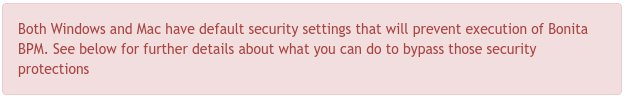

# Contributing to Bonita BPM documentation

The following is a set of guidelines for contributing to Bonita BPM documentation.


## Pull requests

Each minor version of Bonita BPM has its own Git branch to manage its related documentation. (Minor version means X.Y, for example 7.3 or 7.4).  
For instance, the **7.3** branch is where you have to open pull requests when your contribution applies to all 7.3 versions of Bonita BPM.

A branch should be name in kebab case prefixed by the type of the feature the branch has been created for (feat, fix, style, tr, chore, howto,...).  
For instance, for a branch fixing a typo in the User REST API, its name should be `fix/user-delete-rest-api-typo`.

If your contribution applies to multiple minor versions of Bonita BPM, then open a pull request on the lowest applicable version branch. Then add all applicable minor versions in your pull request comment and we will do the rest :-)

<u>Example</u>: Your contribution applies to versions 7.3 and 7.4. Therefore submit your pull request on branch 7.3 with a comment like:
```
My awesome contribution to Bonita BPM documentation.
Versions: 7.3, 7.4
```

Ideally, a pull request, at first, should contain a single commit containing the changes you want to suggest. Other commits may be added after reviews.
Having a single commit allows GitHub to use the commit title as pull request name.

The commit message format should be the following :
```
# Commit title / format: <type>(<scope>): <subject> 
# type in (feat, fix, style, howto, tr, ...)
 
 
# Explain why this change is being made
 
 
# Provide links to any relevant tickets, articles or other resources
```

For instance, when adding an warning alert inside the User DELETE REST API method
```
fix(api): add alert on the User REST API DELETE action

Allows users to be warned about the consequences to DELETE a user
instead of deactivating it.
```

## How to update an existing page?

In this case, edit the appropriate _.md_ file and the build process will do the rest.

<u>Example</u>: To edit the **actors.html** page in version 7.3, edit the `md/actors.md` file and submit a pull request on **7.3** branch.


## How to add a new page?

### Create a new page

Checkout a branch from the version you want this page to be available in and create the _.md_ file in the **md** folder.

<u>Example</u>: To add a new _Manage form control/validation_ tutorial in 7.3, checkout a new branch from the **7.3** branch and create a new _manage-control-in-forms.md_ file in the **md** folder.

You can check its content once committed on the GitHub site ([Simple view](README.md#simple-view)) or using the web server ([Advanced view](README.md#advanced-view)).

### Add page to taxonomy (navigation)

Your new page is not yet referenced in documentation site's taxonomy. So you will not be able to find your new page in the navigation tree unless you know the URL.
Therefore you need to add your new page to the taxonomy to be able to find it the navigation tree.

The taxonomy is created from the `taxonomy.md` file.
In our case, we also want to add a _Howto_ section in the taxonomy tree. So we first create a new item inside the `taxonomy.md`. Then we create a entry point for our new tutorial inside the _Howto_ section:

    * [Howtos](_howtos.md)
      * [Manage form control/validation](manage-control-in-forms.md)

<u>Note</u>: We need to reference a *_howtos.md* page with the list of items of this section. However **you don't need to create the *_howtos.md* file** as it is automatically generated at build time.

Now starting from the visualization of the _taxonomy.md_ page, we can browse to the _manage-control-in-forms.md_ page.

### Variables

During markdown to HTML conversion, some predefined variables located in the [variables.json file](scripts/variables.json) are replaced.

For instance, the `varVersion` variable matches the current documentation version.
To reference this variable, use the `${varVersion}` notation in _.md_ files.

#### Markdown titles

In markdown, lines starting with `#` are converted to `<hx>` tags where _x_ is the number of `#` : 
* use `#` for `h1` tag
* use `##` for `h2` tag
* use `###` for `h3` tag
* etc... up to `h6`

Checkout [the markdown cheatsheet](https://github.com/adam-p/markdown-here/wiki/Markdown-Cheatsheet) for more information.

### Table of content

A table of content (ToC) is automatically generated on each page from `##` and `###` titles (converted as `h2` and `h3` html tags).  

It will be placed right before the first `h2` title.  

### Quick note on "howtos"

When you create **howtos** make sure that:
  - In the taxonomy, their titles start with verbs, so it finishes the sentence "how to...", like "Manage multiple references in Business Objects".
  - In the file itself, the title includes the "how to" phrase, like "How to manage multiple references in Business Objects".
  - You reference the how to page in other descriptive pages of the existing taxonomy, to optimize its discoverability.
  - Howtos are a step by step guide to manage a use case. This use case should be described briefly as an introduction (following the page title but without its own title) for the user to understand the goal of the howto.

## Markdown syntax

Current conversion to html is done with `markdown-it` with the [Github-flavored Markdown](https://help.github.com/categories/writing-on-github/). Checkout [the cheatsheet](https://github.com/adam-p/markdown-here/wiki/Markdown-Cheatsheet) for more information.

## How to add images?

All images must be added to the **md/images** folder.


### Images

Use exclusively the Markdown syntax to insert images. Using the HTML `` syntax is **not supported** by the build process.

<u>Example</u>:

    

### Anchors

In the page to navigate to, add the following:
```html
<a id="section-Name" />
```

In the page to navigate from, use the following:

    [textToDescribeTheLink](pageName.md#section-Name)

If anchor is in the same page , use the following:

    [textToDescribeTheLink](#section-Name)

### Font Awesome

The markdown-it-fontawesome plugin has been activated and you can use [Font Awesome](http://fontawesome.io/icons/) icons with their name surrounded by colons.

<u>Example</u>:

    :fa-flag:
will produce
```html
<i class="fa fa-flag"></i>
```

### Bootstrap alerts

In order to reproduce [Bootstrap alerts](http://getbootstrap.com/components/#alerts) that were present in former documentation site, we introduced **markdown-it-alerts**.
It allows to recreate a `div` block with custom classes.

We added 5 types of container :
* danger: used to highlight error prone use cases
* warning: used to alert the user of aftermath
* info: used to highlight short relevant information
* success: used to validate good pratices

To use them create a block surrounded with 3 colons.

<u>Example</u>:

```
::: danger
Both Windows and Mac have default security settings that will prevent execution of Bonita BPM. See below for further details about what you can do to bypass those security protections
:::
```
will be rendered as :



### Decorate

If you want to decorate the md elements with html attributes like classes or title, we added the [**markdown-it-decorator**](https://www.npmjs.com/package/markdown-it-decorate) to do so.
Using `<!--{}-->` pattern at the end of a block will convert the content of `{}` to html attributes. Use CSS notation to decorate with classes.

<u>Example</u>:
```
This is some text.
<!--{.center}-->
```
will be converted to
```html
<p class='center'>This is some text.</p>
```

### Smart arrows

We added the use of the [**markdown-it-smart-arrows**](https://www.npmjs.com/package/markdown-it-smartarrows) plugin to convert arrows to html entities :
```
--> →
<-- ←
<--> ↔
==> ⇒
<== ⇐
<==> ⇔
```
