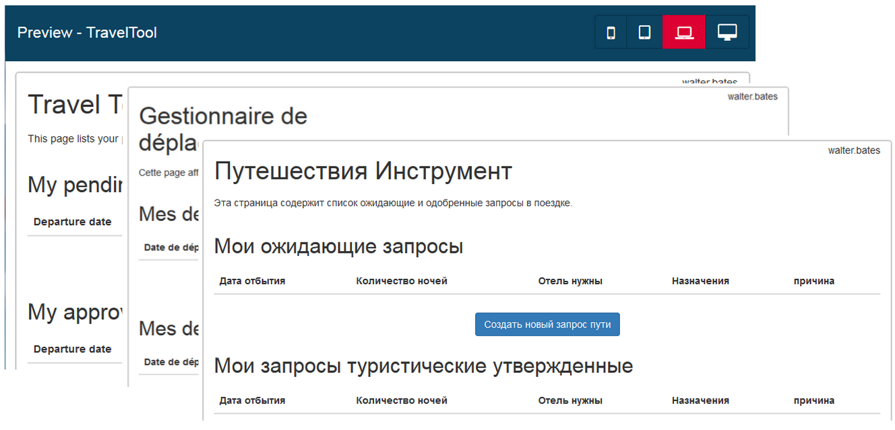

# Multi-language pages
In the Bonita BPM Subscription editions, the UI designer includes a mechanism to add translations for page elements, to support multi-language pages. 
The text displayed in the preview and at runtime adapts to the locale or browser language automatically. The UI designer itself is displayed in the language of your Bonita BPM Studio.
The Preview window is displayed in the language set for Bonita BPM Portal.

You can translate all the text displayed on a page or form: the labels, the placeholders, the available values of a list, and the date format of the DatePicker widget. 
The phrases in the base language are used as the keys to the translated phrases. 

## How it works

Each page has a [localization asset](assets.md) that contains the keys and the translations for all phrases and all languages that the page supports. 
The asset is a file, `localization.json`. Each language is identified by the ISO 639 language attribute (for example, fr-FR, es-ES). 
Open the default `localization.json` asset to see how this file must be formatted. You can modify the default asset for your page, or import a new asset to replace the default one.

In production, a page is displayed in the language specified by the BOS\_locale cookie value. This value must match exactly one of the language codes in the `localization.json` asset.
The BOS\_locale value is set by selecting a language in Bonita BPM Portal or in a custom widget.
If BOS\_locale is not set or its value does not match a language code, the browser language is used. 
If neither the BOS\_locole nor the browser language matches a language code in `localization.json`, the untranslated keys are displayed in the page.

To use a localization asset, replace the default `localization.json` file with a file of the same format containing all the keys in the page and the translations into the target languages. The localisation asset is at page level. 
The format of file must be:
```json
{
"ISO 639-1 code for language-A": 
  {
    "english key":"translated key for language-A",
    "english key2":"translated key2 for language-A",
     ...
   },
"ISO 639-1 code for language-B ": 
  {
    "english key":"translated key for language-B",
    "english key2":"translated key2 for language-B",

     ...
   }
  ...
```

The code that specifies a language in `localization.json` must be the same as the code in the `.po` files used to [add the language to the Portal](languages.md).

## Tutorial: creating a multi-language page

This tutorial explains how to create a multi-language version of the Travel Tool application page from the [getting started tutorial](getting-started-tutorial.md), adding French and Russian text to the page. 
It assumes that you have already created the Travel Tool page following the instructions in the [getting started tutorial](getting-started-tutorial.md).

### Translate the text

Translation is done outside the Bonita BPM, in any suitable translation editor. The only requirement is that you provide the translated text as a localization asset in the format required by the UI designer.

The first step is to create a list of all the text strings used in the page. These strings are the keys that are used to serve the relevant translated string in the translated versions of page. 
For this simple page, you could create the key list by hand from the text that is visible in the Page editor. 
However, to be sure that you identify all the items that need to be translated, export the page zip file, and edit the `page.json` file to retrieve all the text strings. 
In addition to the text strings, look for any date format strings and URLs that could contain a locale attribute.

For the Travel Tool application page, this is the set of text strings to translate:
```
Travel Tool
This page lists your pending and approved travel requests.
My pending requests
Departure date
Number of nights
Hotel needed
Destination
Reason
Create new travel request
My approved travel requests
yes
no
```

These strings are the keys used to identify the text to display in each translation. Translate these strings into the languages that you want to support. For this tutorial, the additional languages are French and Russian.

### Add languages to Bonita BPM Portal

Before you can view a page in a language, that language must be supported for Bonita BPM web applications. 
French is one of the default languages supported, so you just need to support for Russian. 
To do this, [add Russian from the Community translations to your Bonita BPM Portal](languages.md). 
Make sure that you add both the Community and Subscription files. Then restart your Bonita BPM Studio, start the Portal, and change the language to Russian to check that it is available.

### Add a localization asset to the page

Create a `localization.json` file in the format shown above, containing the French and Russian translations of the page text. 
The language identifier must match the language identifier in the `.po` files containing the Portal translations.
Use an online Json checker to make sure there are no format errors in the file. The file will look something like this:

```json
{
  "ru_RU": {
    "Travel Tool": "Путешествия Инструмент",
    "This page lists your pending and approved travel requests.": "Эта страница содержит список ожидающие и одобренные запросы в поездке.",
    "My pending requests": "Мои ожидающие запросы",
    "Departure date": "Дата отбытия",
    "Number of nights": "Количество ночей",
    "Hotel needed": "Отель нужны",
    "Destination": "Hазначения",
    "Reason": "причина",
    "d/M/yyyy": "dd/MM/yyyy",
    "Create new travel request": "Создать новый запрос пути",
    "My approved travel requests": "Мои запросы туристические утвержденные",
    "yes": "Да",
    "no": "Нет"
  },
    "fr-FR": {
    "Travel Tool": "Gestionnaire de déplacements",
    "This page lists your pending and approved travel requests.": "Cette page affiche la liste de vos demandes de déplacements en attente et de celles qui ont été approuvées.",
    "My pending requests": "Mes demandes en attente",
    "Departure date": "Date de départ",
    "Number of nights": "Nombre de nuits",
    "Hotel needed": "Besoin d'une réservation d'hôtel",
    "Destination": "Destination",
    "Reason": "Motif",
    "d/M/yyyy": "dd/MM/yyyy",
    "Create new travel request": "Créer une nouvelle demande de déplacement",
    "My approved travel requests": "Mes demandes approuvées ",
    "yes": "oui",
    "no": "non"
  }
```

You can [download a copy of this `localization.json` file](../images/special_code/localization.json) for testing.

In the UI designer, import this file as an asset of the travel tool page. This will replace any existing `localization.json` file. Save the page.

### Translate contents in custom widgets

In the custom widget editor, use the the _uiTranslate_ filter or the _ui-translate_ directive to indicate content to translate. See [Custom widgets section](custom-widgets.md) for more information.

### Preview the page

Now preview the page in each language. To do this, you need to modify the language used for Bonita BPM web applications, which you do by setting the Portal language from the Portal Settings menu.



Check the translated versions of the page, and update the translated text if necessary. To update the translations, edit your `localization.json` file and then upload it again.
Adjust the page layout if necessary to allow for language differences. Your multi-language page is now complete, ready to be included in an application and deployed.

### Deploy

To put a multi-language page into production in an application, follow the same steps as for a single-language page: [upload the page to the Portal](resource-management.md) and then [add it to the application](applications.md). You can follow the steps for [building the application](getting-started-tutorial.md) from the getting started tutorial.

After deployment, an application user will see the page in the language configured for their Bonita BPM web applications. A user can set this by selecting the language in Bonita BPM Portal.
If the selected language is not supported in the page, the untranslated key text is displayed.

## Sharing translations

Depending on the applications and processes you have, there could be some phrases that are common to many pages or forms. 
If this is the case, consider using a single `localization.json` for all pages. 
You still need to attach it as an asset to each page, but it could make your translation process more efficient by removing duplication. 
Alternatively, your translation management tools might provide a mechanism for sharing the translations required for various pages, which would enable you to extract the keys and translations required for a page and construct the .json file.
