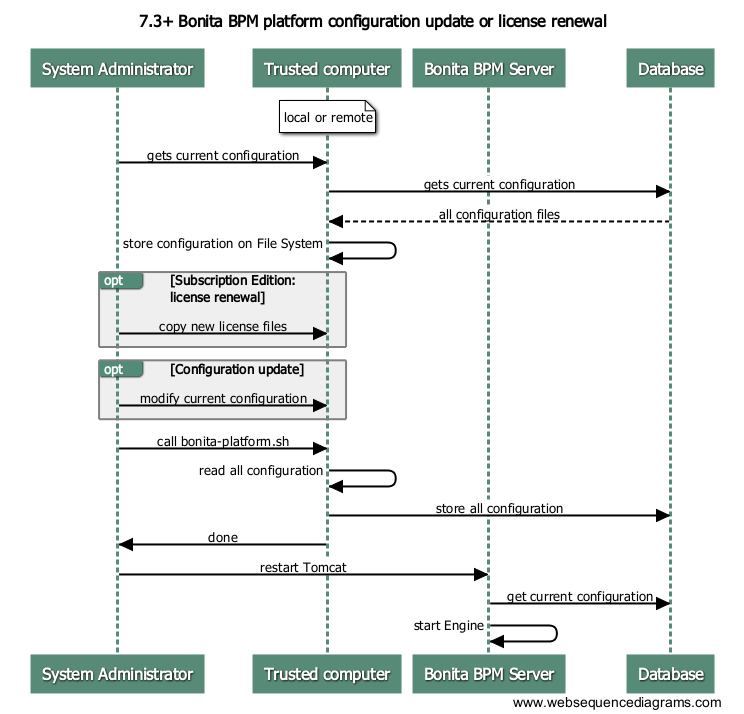

# How to install a Bonita BPM Tomcat Bundle (subscription)


## Download and unzip the Tomcat bundle

### Download

For the Community edition:
* Go to the [Bonitasoft website](http://www.bonitasoft.com/how-we-do-it/downloads) and get the Bonita BPM Community edition Tomcat bundle.

For a Subscription edition:
* Go to the [Customer Portal](https://customer.bonitasoft.com/download/request) and download the Bonita BPM Subscription Pack edition Tomcat bundle.

### Unzip

The fully qualified folder path (including the BonitaBPM-x.y.z-Tomcat-7.0.67 folder) to the folder where you unzip the Tomcat bundle is referred to as `[TOMCAT_BUNDLE_DIR]`. We recommend the following locations: 

* Windows: `C:\BonitaBPM`. If you want to unzip the bundle to another folder, avoid spaces in the folder name. 
* Linux: in `/opt/BonitaBPM`. Make sure that Linux user account used to execute Tomcat is the owner of the folders and files.

**Important note**: Do not leave any blank spaces in the path to the directory containing the Tomcat installation.

## Install your license file
If you are installing a Subscription edition, you need to [request a license](licenses.md). 
Copy your Subscription license file into `[TOMCAT_BUNDLE_DIR]`/setup/platform_conf/licenses/


<a name="configuring_tomcat"/>

## Configure your tomcat installation

If you just want to try BonitaBPM platform with the embedded H2 database (not for production), you can skip this entire paragraph.

* edit file `[TOMCAT_BUNDLE_DIR]`/conf/ **server.xml** and remove (or comment out) the following line to deactivate embedded H2 database:

```
<Listener className="org.bonitasoft.tomcat.H2Listener" tcpPort="9091" baseDir="${org.bonitasoft.h2.database.dir}" start="true" />
```

* drop your database vendor-specific drivers in `[TOMCAT_BUNDLE_DIR]`/lib/bonita (you can copy the provided open-source drivers: PostgreSQL, MySQL) from `[TOMCAT_BUNDLE_DIR]/setup/lib`
* edit file `[TOMCAT_BUNDLE_DIR]`/conf/ **bitronix-resources.properties**
    * comment the default embedded H2 database configuration (preceding the lines with a #)
    * uncomment the configuration for your database vendor (PostgreSQL, Oracle, SQL Server, or MySQL)
    * change the default values for your database configuration to point to an existing database instance and valid credentials
    * Warning: this must be done for 2 different datasources in the file: **resource.ds1.*** and **resource.ds2.***
* edit file `[TOMCAT_BUNDLE_DIR]`/conf/Catalina/localhost/ **bonita.xml**
    * comment the default embedded H2 database configuration (with `<!-- and -->` around the lines to comment)
    * uncomment the configuration for your database vendor (PostgreSQL, Oracle, SQL Server, or MySQL)
    * change the default values for your database configuration to point to an existing database instance and valid credentials
    * Warning: this must be done for 2 different datasources in the file: **bonitaSequenceManagerDS** and **NotManagedBizDataDS**
* edit file sentenv.sh (Unix system) or setenv.bat (Windows system)
    * change property **DB_OPTS** and change default **h2** value for the one corresponding to your database vendor (Bonita BPM internal database)
    * change property **BDM_DB_OPTS** and change default **h2** value for the one corresponding to your database vendor (Bonita BPM database specific to the "Business Data" feature)

## Edition specification
If you are installing the **Performance** Subscription edition, you need to edit `[TOMCAT_BUNDLE_DIR]/setup/platform_conf/initial/platform_init_engine/bonita-platform-init-community.properties`
and change the value of the `activeProfiles` key to **`community,performance`** instead of **`community`**. No change is needed for other editions.


## Start Bonita BPM Platform
* run `[TOMCAT_BUNDLE_DIR]`/bonita-start.sh (Unix) or bonita-start.bat (Windows)


<a name="configuration_files"/>

# Description of the configuration files

[Platform Setup Tool](deploy-bundle.md#platform_setup_tool) serves to install Bonita BPM Platform initial configuration, so that a Bonita BPM server can run.
It initializes the Bonita BPM database on the specified database instance (creates the database tables and populates the minimum data), and pushes the platform
configuration into that database. In **subscription** editions, it also stores the license files into the database.

The Platform Setup Tool is composed of the following structure:
* platform_conf/
    * initial/ => default configuration, only use the first time the Bonita BPM platform is setup and run 
    * licenses/ (Subscription only) => folder where you must drop your license file to allow the Bonita BPM platform to start without error
    * sql/ => SQL scripts that are used to create the Bonita BPM database tables
* setup.sh => Unix / Mac script to run
* setup.bat => Windows script to run


The content of the platform_conf/initial folder is the following:

* platform_engine/
    * **bonita-platform-community-custom.properties**
    * bonita-platform-custom.xml => Here you can add custom Spring bean used at platform-level, to add custom feature to Bonita BPM Engine (experts only)
    * bonita-platform-hibernate-cache.xml (Subscription only)
    * **bonita-platform-sp-cluster-custom.properties** (Subscription only)
    * **bonita-platform-sp-custom.properties** (Subscription only)
    * bonita-platform-sp-custom.xml (Subscription only)
    * bonita-tenant-hibernate-cache.xml (Subscription only)
* platform_init_engine/
    * **bonita-platform-init-community-custom.properties**
    * bonita-platform-init-custom.xml => Here you can add custom Spring bean used at platform initialization-level, to add custom feature to Bonita BPM Engine (experts only)
* platform_portal/
    * cache-config.xml
    * jaas-standard.cfg
    * platform-tenant-config.properties
    * security-config.properties
* tenant_template_engine/
    * **bonita-tenant-community-custom.properties**
    * bonita-tenants-custom.xml => Here you can add custom Spring bean used at tenant-level, to add custom feature to Bonita BPM Engine for all tenants (experts only)
    * **bonita-tenant-sp-cluster-custom.properties** (Subscription only)
    * **bonita-tenant-sp-custom.properties** (Subscription only)
    * bonita-tenant-sp-custom.xml (Subscription only)
* tenant_template_portal/
    * authenticationManager-config.properties
    * compound-permissions-mapping.properties
    * console-config.properties
    * custom-permissions-mapping.properties
    * dynamic-permissions-checks.properties
    * forms-config.properties
    * resources-permissions-mapping.properties
    * security-config.properties
* tenant_template_security_scripts/ => security rules used for [Rest API Authorization](rest-api-authorization.md)
    * ActorMemberPermissionRule.groovy
    * ActorPermissionRule.groovy
    * CaseContextPermissionRule.groovy
    * CasePermissionRule.groovy
    * CaseVariablePermissionRule.groovy
    * CommentPermissionRule.groovy
    * ConnectorInstancePermissionRule.groovy
    * DocumentPermissionRule.groovy
    * ProcessConfigurationPermissionRule.groovy
    * ProcessConnectorDependencyPermissionRule.groovy
    * ProcessInstantiationPermissionRule.groovy
    * ProcessPermissionRule.groovy
    * ProcessResolutionProblemPermissionRule.groovy
    * ProcessSupervisorPermissionRule.groovy
    * ProfileEntryPermissionRule.groovy
    * ProfilePermissionRule.groovy
    * TaskExecutionPermissionRule.groovy
    * TaskPermissionRule.groovy
    * UserPermissionRule.groovy

In **bold**, the files that you are most likely to modify.


<a name="updating_configuration"/>

## How do I modify my runtime configuration



* Download [Platform Setup Tool](deploy-bundle.md#platform_setup_tool) (inside Bonita BPM Deploy bundle) or use the one **embedded** inside `[TOMCAT_BUNDLE_DIR]`/setup or `[JBOSS_BUNDLE_DIR]`/setup
* Ensure the Bonita BPM Server is running.
* Go into the `setup/` folder (or `platform-setup/`).
* Configure the `database.properties` file to access to the database that Bonita BPM uses.
* Run **`./setup.sh pull`** (Unix / Mac) or **`setup.bat pull`** (Windows) to retrieve the currently used configuration.
* The current configuration is extracted inside **`platform_conf/current`** (inside [TOMCAT_BUNDLE_DIR]/setup/platform_conf/current inside Tomcat). The currently used licenses are extracted inside `platform_conf/licenses`.
* Modify the required [configuration files](#configuration_files) with custom values. To modify a configuration value:\
  Uncomment the required line in the `.properties` file (remove leading # character) if necessary and change the value.\
  Eg. in file **`bonita-platform-community-custom.properties`**
  ```
       # previous value:
       # platformAdminPassword=platform
       platformAdminPassword = mYCust0mV4lU3
  ```
* If you are updating your license file, put it inside `platform_conf/licenses`, along with the existing ones. If some retrieved license files are not valid anymore,
  you can remove them, so that they will be deleted from the database.
* Run **`./setup.sh push`** (Unix / Mac) or **`setup.bat push`** (Windows) to apply your modified configuration into the database.

::: alert alert-info
Note that the Platform Setup Tool does not need the Bonita BPM Server to be running for the configuration to be updated. However, the server needs to be restarted
for the changes to take effect.
:::

::: alert alert-warning
Keep in mind that the folder **`platform_conf/initial`** is not used anymore once the platform has been initialized for the first time. To update your configuration
only the folder **`platform_conf/current`** is taken into account.
:::


<a name="updating_license"/>

## How do I update my license

* After [requesting a new license](licenses.md) :
* Download [Platform Setup Tool](deploy-bundle.md#platform_setup_tool) (inside Bonita BPM Deploy bundle) or use the one **embedded** inside `[TOMCAT_BUNDLE_DIR]`/setup or `[JBOSS_BUNDLE_DIR]`/setup
* Ensure the Bonita BPM Server is running.
* Go into the `setup/` folder (or `platform-setup/`).
* Configure the `database.properties` file to access to the database that Bonita BPM uses.
* Run **`./setup.sh pull`** (Unix / Mac) or **`setup.bat pull`** (Windows) to retrieve the currently used configuration.
* The currently used licenses are extracted inside `platform_conf/licenses`.
* Put your new license file into **`platform_conf/licenses`**, along with the existing ones. If some retrieved license files are not valid anymore,
  you can remove them, so that they will be deleted from the database.
* Run **`./setup.sh push`** (Unix / Mac) or **`setup.bat push`** (Windows) to apply your modified configuration into the database.


