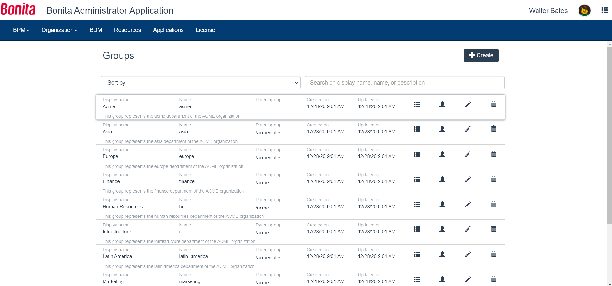

# Group list in Bonita Administrator Application

This page explains what a user with the _Administrator_ profile in Bonita Administrator Application can see and do about groups in the organization.  
To easily manipulate users with the same rights, it is possible to group them together.  
Groups can be defined in the organization, users can then be added to groups, and groups and used to map actors or profiles or other permissions in Bonita.

Here is a view of this page:
<!--{.img-responsive}-->

On this page, an Administrator can:
## View the sub-groups of a group
1. Go to _Organization_/_Groups_
2. In the row of the group, click on the _View sub-groups_ icon

## View the users directly mapped to a group
1. Go to _Organization_/_Groups_
2. In the row of the group, click on the _view users in the group_ icon
3. In the modal window, if you require more information about the user, go to the end of his row and click on the _View user details_ icon to navigate to the user details page.

## Live Update
You can [Live Update](live-update.md) a group:
 * create
 * delete
 * edit the name and parent group
 * modify users within
This is only in case of an issue to solve temporarily. We strongly encourage the modification of the organization to be conducted 
in Bonita Studio so it can be shared and versioned with the whole project, or through the [LDAP synchronizer](ldap-synchronizer.md) if the organization is located in an external system. 

### Create a group
1. Go to _Organization_/_Groups_
2. Click on _Create_.
3. In the modal window, enter the name (required, can be technical), the display name, the parent group, and a description. By default, the display name will be the (technical) name.
4. Click on _Create_.

::: info
**Note**: Bonita does not accept the '/' character in the group name field. A group name that contains a '/' may lead to unstable behaviour.
:::

### Delete a group
1. Go to _Organization_/_Groups_
2. In the row of the group, click on the _Delete group_ icon
3. In the confirmation modal window, after checking that the group has no subgroups , click on _Delete_

### Edit a group name and parent group
1. Go to _Organization_/_Groups_
2. In the row of the group, click on the _Edit group_ icon
3. In the modal window, update the group information
4. Click on _Save_.

### Modify users within a group
In the way we conceive the pertainance of a user to an organization, it is only possible to add both a role and a group (what we call a membership) to a user.  
For example, "Assistant"(role) of "Human Resources"(group)
1. Go to _Organization_/_Users_. You navigate to the [Users](admin-application-users-list.md) page.
2. In the row of a user, click on the _View user details_ icon
3. Click on _Profiles_ / _Memberships_
4. To delete a membership, click on the _Delete_ icon of an existing membership
or to add a membership, click on the _+_ button, select the role and the group for the user, and click on _Add_
