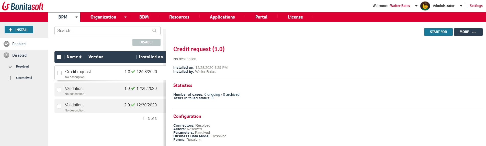

# Process list in Bonita Administrator Application

This page explains what a user with the _Administrator_ profile can see and do about processes in [Bonita Administrator Application](admin-application-overview).

Those users can: install, enable and edit processes, categories, forms, entities mapped to actors and process manager, parameters, and connectors.

Here is a view of the Process list page:
<!--{.img-responsive}-->

## Install a new process
This feature is only available for the _Administrator_ profile.
1. Go to _BPM_ > _Processes_ 
3. Click on the _Install_ button on the top right of the page
4. Click to browse to the .bar file to import
5. Click on _Install_

The .bar file is ready to be resolved and/or enabled.

You can only install a .bar file that was exported from a Bonita Studio of the same minor (7.x) version as your Bonita Portal and Bonita Engine.  
If you have a .bar file that was exported from an earlier version of Bonita Studio (7.x-1), it will not work with Bonita Engine.  
Export the process definition as a .bos file from your old Bonita Studio, import in into the new Studio, then export it as a .bar.  
This is necessary for a .bar that has not been deployed. A process that was developed in an older version of Bonita Studio and is already deployed is migrated automatically when you migrate your platform.  
However, for future maintenance of the process definition, you are recommended to update all your process .bar files to the latest version each time you update your platform.

## Resolve a process
Resolving a process means completing the configuration in the Administrator Application and making sure that all dependencies are met. A process has to be resolved before it can be enabled. 
To resolve a process, you must complete the configuration of the actor mappings, parameters, forms, and connectors defined for the process.

* **Actors**: Every actor in a process must be mapped to at least one user, group, role or membership.
* **Parameters**: Every parameter defined in a process must have a value.
* **Connectors**: Every connector definition in a process must have a corresponding implemenetation (Class name).
* **Forms**: Every form defined in a process must be mapped to a page or a URL.
* Also, every business variable used in the process should have a corresponding model. 

To resolve a process for actors, parameters, connectors, and forms:
1. Go to _BPM_>_Processes_
2. On the row of the process, click on _View process details_ icon.
3. A summary of configuration problems is displayed below the process name in a well and warning icons are displayed in the left navigation list.
4. Modify your configuration for each element displayed.

To resolve a process for business variables:
1. Logout
2. Login in Bonita Administrator Portal with the [technical user credentials](tenant_admin_credentials.md)
3. [Pause the BPM services](pause-and-resume-bpm-services.md)
4. [Update the BDM](bdm-management-in-bonita-bpm-portal.md)
5. Come back to the application _BPM_/_Processes_ and check the status.

## Enable a process
1. Go to _BPM_>_Processes_
2. Click on the "Disabled" tab
3. In the row of the process, click on the _Enable_ icon
4. In the confirmation modal window, click on _Enable_
The process moves to the "Enabled" tab.

::: info
**Note:** You can also enable a process in the "Details" view, by clicking on the _Enable_ button.
:::

## Disable a process
Disabling a process blocks the creation of new cases. This does not impact existing cases, where tasks can still be executed.
1. Go to _BPM_>_Processes_
2. Make sure you are on the "Enabled" tab
3. In the row of the process, click on the _Disable_ icon
4. In the confirmation modal window, click on _Disable_
The process disappears from "Enabled" tab and is located in the "Disabled" tab

::: info
**Note:** You can also disable a process in the "Details" view, by clicking on the _Disable_ button.
:::

## Delete a process
::: info
**Note:** A process must be disabled before it can be deleted.
:::

::: warning
**Warning:** **Beware! Data loss risk!**
Deleting a process will automatically delete all its cases (on-going and archived alike). Thus, the operation may take a long time, and fail if the transaction timeout is not large enough.
This feature should only be used on non-production environments.
**Proceed at your own risk.**
:::

1. Go to _BPM_>_Processes_
2. Find the process by clicking on the _Disabled_ tab
3. In the row of the process, click on the "View process details" icon
4. In the details view, click on the _Delete_ button
5. In the confirmation modal window, click on _Delete_

## Create a category for a process
1. Go to _BPM_>_Processes_ 
2. In the row of the process, click on the _View process details_ icon
3. In _General_, click the _Pencil_ next to _Categories_ label
4. In the opened modal window, type a new category name then press the _**Enter**_ key
5. Click on the _Save_ button.

After you created a category and added it to the process, you can add other processes to the category.

## Add a category to a process
1. Go to _BPM_>_Processes_ 
2. In the row of the process, click on the "View process details" icon
3. In _General_, click the _Pencil_ next to _Categories_ label
5. In the opened modal window, start typing the category name, and then select among the suggestions by using the arrow keys or mouse.
6. Press the _**Enter**_ key
6. Click on the _Save_ button

## Start a case for another user
This feature is available with the Enterprise, Performance, and Efficiency editions.  
To start a case for another user:
1. Go to _BPM_>_Processes_ 
2. In the row of the process, click on the "View more details" icon
3. Click on the _Start for_ button on the top right corner of the screen
4. In the popup, start typing the user for whom you are starting the case. Only valid users for the case are displayed.
5. Select the right user
6. Click on _OK_

The case is started as though the specified user had started it. 
For example, if you start a case for user A and a subsequent task is to be done by the manager of the user, it is assigned to user A's manager, not to your manager.

All of what follows belong to the [Live update feature](live-update.md) and are only available in for the Enterprise, Performance, and Efficiency editions.

## Edit the actor mapping
You need to map organization entities to an actor. To do so:
1. Go to _BPM_>_Processes_ 
2. In the row of the process, click on the "View more details" icon
3. Click on _Actors_ in the left menu.
To add entities:
4. Click the _+_ button in the user, group, role or membership column of the actor line.
5. In the opened modal window, click on the dropdown list to select one or several entities. The list displays the first five elements, then a number is displayed representing the other selected entities.
To remove entities:
6. In the opened modal window, there is a list of the entities already mapped with the actor. Click on the _X_ button next to an entity, or click on _Remove all_. A list appears filled with the entities you are about to remove. 
   You can **undo** a removal by clicking on the _X_ button next to the entity or by clicking _Enable all_ 
7. Click on the _Apply_ button.

::: info
**Note:** Only the first 200 actors are displayed in the dropdown.
::: 

## Define one or more Process managers
There are two stages to define a Process Manager:

1. Map organization entities to access the _Process Manager_ Portal to view information related to the processes they will be _Process Managers_ of.
   Only Administrators can do so.
    1. Go to _Organization_/_Profiles_ in the Administrator Application
    2. Choose the _Process manager_ profile. This will display the users, groups, roles, and memberships who already have this profile.
    3. Click on _More..._.
    4. Click on _Add a user_.
    5. Select a user by checking the box next to the user name.
    6. Click on _Add_. 
     The _Process manager_ profile is now assigned to the user.
     You can also assign a profile to a group, role, or membership.
     
2. Map the process to one or several entities that have the _Process Manager_ profile. 
    1. Go to _BPM_>_Processes_ 
    2. In the row of the process, click on the "View more details" icon. The Process managers currently assigned to the process are shown in the _Process manager mapping_ table.
    3. To add a user, click the _Plus_ sign or _Pencil_ button in the _User_ column. A popup shows a list of the users who are currently process managers for this process.
    5. Click _Select users_. A list of users with the Process manager profile is displayed.
    6. Select the user you want to be a Process manager for the process, and click on _Apply_. 
     The selected user is added as a Process manager for the process.
     You can also assign a process to a group, role, or memberships.

## Modify a parameter
1. Go to _BPM_>_Processes_ 
2. In the row of the process, click on the "View more details" icon
3. Click on _Parameters_ in the left menu
4. In the _Value_ column, click on the value you want to edit. A field appears.
5. Click on the _Tick_ button to validate your change or _X_ to dismiss your change.

## Edit a connector implementation
1. Go to _BPM_>_Processes_ 
2. In the row of the process, click on the "View more details" icon
3. Click on _Connectors_ in the left menu
4. In the connector definitions table, in the actions column, click on the _Pencil_ icon
5. Browse to a .zip file containing the new connector implementation
6. Click on _Save_ to import the new implementation.

## Upload a new form
1. Go to _BPM_>_Processes_ 
2. In the row of the process, click on the "View more details" icon
3. Click on _Forms_ in the left menu
4. Click on the _Form list_ tab. A list of form is displayed. These forms are only visible to the current process. 
5. Click the _plus_ button at the bottom of the list. A file selector popup is displayed. 
6. Browse to a .zip containing a form.
7. Click on _Next_, then if your form requires some authorization, it will be displayed.
8. Click on _Confirm_.

## Edit an existing form
1. Go to _BPM_>_Processes_ 
2. In the row of the process, click on the "View more details" icon
3. Click on _Forms_ in the left menu
4. Click on the _Form list_ tab. A list of forms is displayed. These forms are only visible to the current process.
5. Click the _Pencil_ button of a form line. A file selector popup is displayed.
6. Browse to a .zip containing a form
7. Click _Next_, then if your form requires some authorization, it will be displayed.
8. Click on _Confirm_.

## Update the form mapping with process instantiation, tasks, or case overview
1. Go to _BPM_>_Processes_ 
2. In the row of the process, click on the "View more details" icon
3. Click on _Forms_ in the left menu.
5. The tables are displayed which list available forms. Click on a red link. A field input appears.
6. Starting to type some text, and any matching names of installed forms will be proposed. If there is no match for the name you enter, it will be considered as a URL.
7. Click the _Tick_ button to validate your change or _X_ to dismiss your change.

::: info
**Note:** You can also upload a form in order to create a new mapping.
:::

## Edit a script content
1. Go to _BPM_>_Processes_ 
2. In the row of the process, click on the "View more details" icon
3. Click on _Scripts_ in the left menu. A script content tree is displayed.
4. You can search for a script by typing text in the dedicated field
5. Click on the _Pencil_ button next to a script name. A popup window is displayed
6. Edit your script content
7. Click on _Save_
