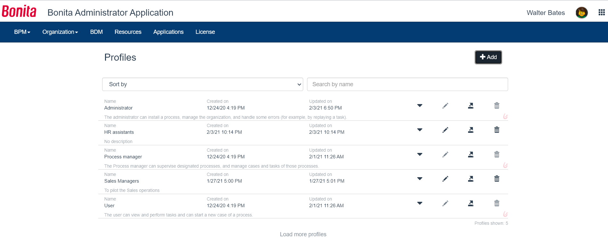

# Profiles management in Bonita Administration Application

This page explains what a user with the _Administrator_ profile can do with profiles in [Bonita Administrator Application](admin-application-overview).

In all Bonita editions, Administrators can change the mapping between a provided profile (User and Administrator) and the organization entities (user, groups, roles, and memberships).  
In Enterprise, Performance, Efficiency, and Teamwork editions, there is one more provided profile: Process Manager.
In Enterprise, Performance, and Efficiency editions, Administrators can also create new profiles and edit them.

Here is a view of this page:
<!--{.img-responsive}-->

## View profile and profile mappings
In _Organization_/_Profiles_, the list shows all profiles sorted by alphabetical order:
- Three provided profiles: "User", "Administrator", and for Enterprise, Performance, Efficiency, and Teamwork editions,"Process Manager"
  These profiles are marked in the list by a "Bonita" icon at the far right of the profile row. This means that they cannot be deleted nor renamed.
- All custom profiles created, for Enterprise, Performance, and Efficiency editions

To view the mapping of the profile with the entities of the organization, in the row of the profile, click on the _Show mapping with organization_ icon.  

## Export a profile
It may happen that the Administrator needs to export a profile, to reimport it in a Bonita Studio or install it on another Bonita Administrator Application.
To do so:
1. Go to _Organization_>_Profiles_
1. In the row of the profile to export, click on the _Export profile_ icon
1. Confirm the exportation in the file browser

## Live Update
The Administrator can [Live Update](live-update.md) a profile:
 * create a custom profile (not for Community or Teamwork)
 * delete a custom profile (same)
 * edit the name and description (only for custom profile)
 * edit the mapping (all editions, all profiles)
 
This is only in case of an issue to solve temporarily. We strongly encourage the modification of the organization and profiles to be conducted 
in Bonita Studio so it can be shared and versioned with the whole project. 

### Add a profile (import or create)
To do so:
1. Go to _Organization_>_Profiles_
1. Click on the _Add_ button
1. Select whether you want to "create" or "import" a profile
    To create: 
    1. Type the name and description, and click on the _Add_ button. 
    2. In the row of the profile, click on the _Show mapping with organization_ icon
    3. Create the mapping with the organization entities
 
    To import:
::: info
**Note**: It is possible to import a profile file made of several profiles. The file is imported and checked. If one profile is corrupted, none of the profiles will be added and an error message is displayed. 
**Note**: The default profiles defined in Bonita have the flag `isDefault` set to "True" in the XML file. If it is changed for any profile, an error message is displayed upon importation.
:::
    1. Click on the _Import profiles_ radio button
    2. Click in the "Profiles XML file" field
    3. Select the .xml file 
    4. Click on _Open_
    5. Click on _Add_.

### Delete a custom profile
Very rarely, the Administrator may have to delete a profile. It is not possible for Bonita default profiles.  
Deleting a profile will not delete the mapped entities. 
To do so:
1. Go to _Organization_>_Profiles_
1. In the row of the custom profile to delete, click on the _Delete profile_ icon
1. In the confirmation modal window, click on _Delete_

### Edit a custom profile name and description
In specific situations, the Administrator may need to edit the name and/or description of a custom profile.  
This is not allowed for default profiles.  
To do so:
1. Go to _Organization_>_Profiles_
1. In the row of the profile to edit, click on the _Edit profile_ icon
1. Edit the name and or description
1. Click on _Save_

### Edit the profile mapping with entities of the organization
In specific situations, the Administrator may need to add or remove entities to the profile mapping.  
1. Go to _Organization_>_Profiles_
1. In the row of the profile to edit, click on the _Show mapping with organization_ icon
1. In the mapping that needs to be edited, click on the _Edit [...] mapping_ icon
1. To add a mapping:
   1. In "Add a [...] to the mapping" field, start typing the name of the entity to add
   1. Select the right suggestion
   1. Click on _Add_
1. To remove a mapping:
  1. In "[...] mapped", search for the entity by using the search field if needed
  2. In the row of the profile to delete, click on the _remove [...] from mapping_ icon
   

