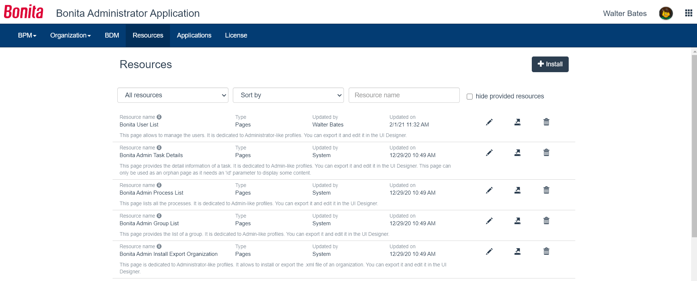

# Resources list in the Bonita Administrator Application

This page defines the term "Resources" and explains what a user with the _Administrator_ profile can see and do about resources in [Bonita Administrator Application](admin-application-overview).  

_Administrators_ can view a list of the resources filtered by type, search a resource by its name, install new resources, update existing resources, or delete resources.  

Here is a view of the page:
<!--{.img-responsive}-->


## Resource definition

A resource is deployed in the Bonita Administrator Application to create the User Interface of a Living Application: it can be a page, a layout, a theme, a REST API extension, or a form that will be used by several processes so it is better to store it at platform level than within the process .bar file.  

A resources is packaged as a .zip archive that contains a `page.properties` file, a resources directory and an index file.  
* The `page.properties` file contains the metadata for the page.

For example: 
```
#The name must start with 'custompage_'
name=custompage_layout
displayName=Application layout page
description=This is a layout page dedicated to new born living applications. It is created and editable using the UI designer. It allows to display an horizontal menu, and an iframe. The menu allows to target some pages and the iframe define the area to display those targeted pages.
resources=[GET|living/application,GET|living/application-page,GET|living/application-menu]
contentType=layout
```

* The `resources` directory contains all the public files of your resource (for example `index.md`, images, Javascript files, CSS files).  

* Except for REST API extensions, the zip archive must contain at least one of the following files:
   * An `index.html` file in the `resources` directory
   * An `Index.groovy` class at the root of the archive with, optionally, libraries
   * A `resources/theme.css` file for applications themes

If a resource contains both `Index.groovy` and `index.html`, the Groovy class takes precedence.  

## Permissions for resources

If your resource needs to perform requests to Bonita REST API, 
you need to specify the [REST API authorizations](rest-api-authorization.md) that a user needs to have in order to access those API. 
These permissions are defined in the `page.properties` file. If your resource is a page written in Groovy and uses the Bonita Engine Java APIs, you do not need to specify permissions.
For each REST resource accessed in other resources, specify the authorization needed for each method used. 
You can find examples of the default resources in [`resources-permissions-mapping.properties`](BonitaBPM_platform_setup.md).

When a user is given access to a page/layout because they are in a profile that contains it or that is mapped to an application that contains the page/layout, then this user is granted, upon login, the permissions associated to these REST resources (see [REST API authorizations](rest-api-authorization.md) for more details).  

The following example shows the permissions defined for a page that enables a user to view but not update organization information:
```
#The name must start with 'custompage_'
name=custompage_orgViewer
displayName=Organization viewer
description=Organization viewer page. You cannot modify the organization from this page.
resources=[GET|identity/user, GET|identity/personalcontactdata, GET|identity/professionalcontactdata, GET|identity/role, 
   GET|identity/group, GET|identity/membership, GET|customuserinfo/user, GET|customuserinfo/definition, GET|customuserinfo/value] 
contentType=page  
```

## View the resources 
The Administrator can filter by type and can hide the resources provided by Bonita as examples to develop from, so only the project resoures are displayed.   
They can also search the list by the name of the resource.

<a id="export"/>

## Export a resource
You can export a resource to install it in another Administrator Application. The page is exported as a .zip archive.  
To do so:
1. Go to _Resources_
2. In the row of the resource to export, click on the _Export_ icon
3. Specify the name and location for the exported .zip archive, and click on _OK_.

## Live Update
The Administrator can [Live Update](live-update.md) the resource list:
 * install
 * delete
 * update
 
This is only in case of an issue to solve temporarily. We strongly encourage the modification of the resources to be conducted 
in Bonita Studio so it can be shared and versioned with the whole project.

### Install a resource
To add a resource onto the Bonita Administrator Application, import a .zip archive that contains the resource definition.  
To do so:
1. Go to _Resources_
2. Click on _Install_
3. Click in the field
4. Find the .zip archive to be added
5. Click on _Install_. If a resource with the same name already exists, an error message is displayed. Updating the resource (see below) may be the option.

After a resource is installed, it can be used in an [application](applications.md).

::: warning
**Warning**: As the deployment of resources automatically creates the appropriate resource permissions mapping, be careful not to [push a configuration](BonitaBPM_platform_setup.md#update_platform_conf) that does not contain the latest permissions updates. This would overwrite the deployed configuration. To avoid doing so, pull the latest configuration, edit the needed elements and push it back to Bonita Runtime in a pretty short amount of time.
:::

### Delete a Resource
To delete a resource:
1. Go to _Resources_
2. In the row of the resource to delete, click on the _Delete_ icon
3. In the confirmation modal window, click on _Delete_

<a id="modify"/>

### Update a resource
To Update a resource, upload a .zip archive containing the new version.  
To do so:
1. Go to _Resources_
2. In the row of the resource you want to update, click on the _Update_ icon
3. Click in the field to select the new version of the resource
4. Click on _Update_
