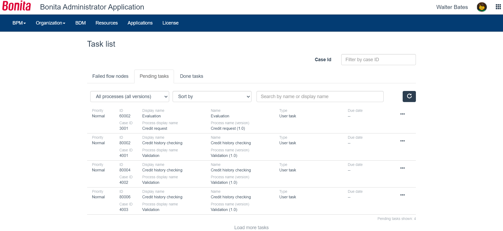

# Task list in Bonita Administrator Application

This page explains what a user with the _Administrator_ in the Bonita Administrator Application can see and do about tasks and more generally, flow nodes.  
A flow node is an element of a process. It defines an action to be performed (automatic or human). A taks is a flownode done by a person. 

Such users can view the list of flow nodes in error, pending tasks, done tasks, assign and unassign a task, do a task for someone else, skip a failed flow node, replay a failed flow node, and write a comment about the case.

Here is a view of the task list:
<!--{.img-responsive}-->

## View tasks and flow nodes
Tasks and flow nodes are showns in three tabs: _Failed flow nodes_, _Pending tasks_, and _Done tasks_.
In the "Failed flow nodes", as tasks and other automatic elements can fail, we chose to show them all.  
When they do not fail, they execute so fast that there is no need to show them in their pending state.  
Also, usually, the follow up of the execution of a case is mostly about human tasks.  
To view all flow nodes in a process or case, the "Process details" and "Case details" give access to a graphical view of the BPMN diagram to follow up on the status.  
In the "Pending tasks", for each human task, the priority and due date are shown in the list.

## Assign a task
A pending or failed task can be assigned and reassigned to another user if necessary.
1. Go to _BPM_>_Tasks_
2. Click on the _Pending tasks_ tab
3. In the row of the task, click on the _View task details_ icon
4. Click on the _Assign_ button
5. In the popup, start typing the name of the user to assign the task to.
6. Select the right suggestion
7. Click on _Assign_

## Unassign a task
1. Go to _BPM_>_Tasks_
2. Click on the _Pending tasks_ tab
3. In the row of the task, click on the _View task details_ icon
4. Click on _Unassign_
5. In the confirmation modal window, click on _Unassign_

## Do a task for another user
With the Enterprise, Performance, and Efficiency editions, an Administrator can do a task for another user.  
This is useful for unblocking a case if the assigned user cannot perform the task.

1. Go to _BPM_>_Tasks_
2. Click on the _Pending tasks_ tab
3. In the row of the task, click on the _View task details_ icon
4. If the task is not assigned, first assign it to the person who should do the task.
5. Click on _Do for_
6. In the confirmation modal window, click on _Do the task_

The task is done and traced in the BPM database as though you have done the task "on behalf" of the selected user.

## Skip a failed flow node
If a failed flow node does not impact subsequent flow nodes in a process, it can be skipped.  
This means that the flow node does not have to be done successfully for the following steps to become available.

1. Go to _BPM_>_Tasks_
2. In the row of the failed flow node, click on the _View task details_ icon
3. In "Connectors", one or several connectors show a red "Click here for more details" icon. You can click on the icon to view the stack trace of the issue
4. Click on the _Skip_ button
5. In the confirmation modal window, click on "Skip"

The task is moved from "Failed" to "Done", while the connector stays in the "Failed" state.

## Replay a failed flow node

This feature is available with the Enterprise or the Performance editions.
1. Go to _BPM_>_Tasks_
2. In the row of the failed flow node, click on the _View task details_ icon
3. In "Connectors", one or several connectors show a red "Click here for more details" icon. You can click on the icon to view the stack trace of the issue
4. In order for the result of the replay to be different than a new failure, fix any parameter causing the failure
5. Come back to the task details, and click on _Replay_
6. In the popup window, check the connectors you want to replay, and the ones that can be skipped
7. Click on _Replay_
8. Click on _Close_
9. Refresh the flow node details page to view its new state
