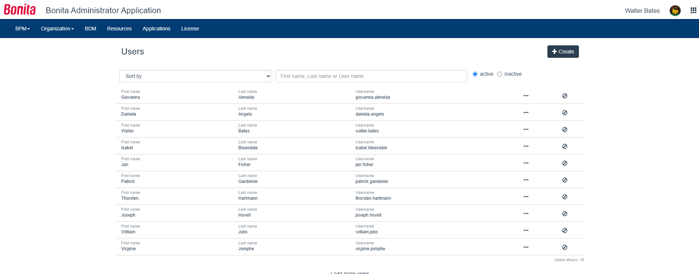

# User list in Bonita Administrator Application

This page explains what a user with the _Administrator_ profile can see and do about the users (of the organization) in [Bonita Administrator Application](admin-application-overview).

Here is a view of this page:
<!--{.img-responsive}-->

## View user's detailed information
In the user list, the Administrator can view the users currently active in the deployed organization.  
By clicking in the _Inactive_ radio button, they can also access the users who have been deactivated. "Inactive" means that they can no longer log in Bonita Portal nor any Bonita application.
To view the user's detailed information:
1. Go to _Organization_/_Users_
2. In the row of the user, click on the _View user details_ icon
3. Click on the sections in the menu on the left to read all the user's detailed information

## Live Update
The Administrator can [Live Update](live-update.md) a user:
 * create
 * deactivate
 * edit information
 * edit memberships
 * edit profiles
 
Live updating is only in case of an issue to solve temporarily. We strongly encourage the modification of the organization to be conducted 
in Bonita Studio so it can be shared and versioned with the whole project, or through the [LDAP synchronizer](ldap-synchronizer.md) if the organization is located in an external system. 
  
### Create a user

Reminder: do not create a user with the same login and password as the [platform administrator nor the technical user](first-steps-after-setup.md). 

1. Go to _Organization_/_Users_
2. Click on _Create_
3. In the modal window, enter the username, password (twice), first name and last name of the new user
4. Click _Create_ to confirm the creation

### Deactivate a user
1. Go to _Organization_/_Users_
2. In the row of the user, click on the _Deactivate user_ icon
3. In the confirmation modal window, check that this deactivation is safe, and click on _Deactivate_

Reactivating a user can be done through the same mechanism from the "Inactive" user list.

### Edit user's information
1. Go to _Organization_/_Users_
2. In the row of the user, click on the _View user details_ icon
3. Stay in the "General information" section, or click on one of the other sections in the menu on the left:
  * Password
  * Profiles/Memberships (see below)
  * Business card
  * Personal information
  * [Custom information](custom-user-information-in-bonita-bpm-portal.md)
4. Edit the information
5. Click on the _Update [...]_ button of the section

### Edit user's memberships
In the way we conceive how a user pertains to an organization, it is only possible to add both a role and a group (what we call a membership) to a user.    
For example, "Assistant"(role) of "Human Resources"(group).
1. Go to _Organization_/_Users_
2. In the row of the user, click on the _View user details_ icon
3. Click on _Profiles_/_Memberships_
4. To add a membership, click on _+_, select a role and a group, and click on _Add_
or to delete an existing membership, click on the _Delete_ icon, and in the confirmation modal window, confirm the deletion if it is safe

### Edit user profiles
The rights of a user are defined by mapping the user to a profile. 
To map a user to a profile:
1. Go to _Organization_/_Profiles_
2. In the row of a profile, click on the _Show mapping with organization_ icon
3. In the "Mapping with Users" section, click on the _Edit user mapping_ icon
4. Start typing the name of the user to add
5. Select the right suggestion
6. Click on _Add_
