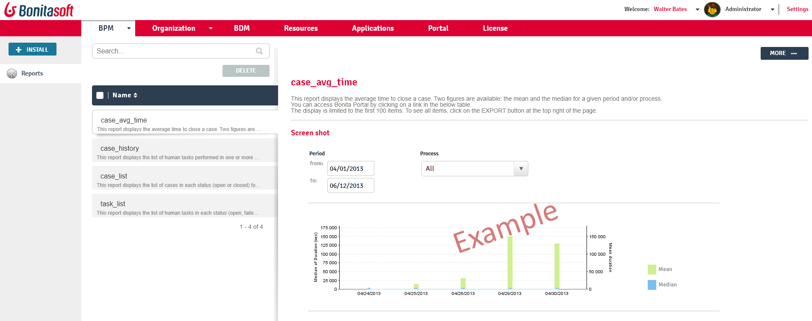

# Analytics and Reports in Bonita Portal

This page explains what a user with the _Administrator_ profile in Bonita Portal can see and do about reports.  

Those users can view statistics and reports of process execution in order to extract meaningful data and monitor how the process are performing, to pinpoints areas of improvements or satisfaction.  
A report presents the Administrator with data about the usage of cases and tasks in processes. 

::: info
**Note:** For Enterprise, Performance, Efficiency, and Teamwork editions only.
:::

Here is a view of the page:
<!--{.img-responsive}-->

## Provided reports
There are four reports available by default:

### Case average time
Choose a filter to display certain parameters:
* Case average time: period, processes
* Case list: period, state (all, archived, opened), processes (all)
* Task list: period, state (all, archived failed, opened)

### Case list
Choose a filter to display certain parameters:
* Case average time: period, process
* Case list: period, state (all, archived, opened), process (all)
* Task list: period, state (all, archived failed, opened)

### Task list time
Choose a filter to display certain parameters:
* Case average time: period, process
* Case list: period, state (all, archived, opened), process (all)
* Task list: period, state (all, archived failed, opened)

### Case history
This report lists human actions on cases. This enables you to analyse and standardize cases in processes.
In the case history report, the format of the exported file is a .csv file. This enables the data to be sorted and filtered.

#### Parameters

In the report, the **query** parameters are displayed in the **Parameters** section:
* Date range - Period with two fields **from** and **to** or select a **date**
* Process - Select **All** or a **specific process and version** 

If a selection is made in the **Process combo box**, the following combo box is displayed:
* Case ID list named "Cases" \> Select "All" or a specific case ID. This is only available when a process is selected.

#### Generated export display
The generated .csv export contains the following in order of display:
* Date
* Time
* Case ID
* Process name
* Process version
* First name
* Last name
* User name
* Action
  * Started
  * Skipped
  * Failed
  * Done
* Task or Subtask
* Parent task name (only filled if there is a subtask created for a task)
* Due date
* Due time
* Overdue - (only filled if the task is done after the due date)

Note: what is not exported in the .csv report
* Comments
* Human actions performed on "Parameters" and "variables"

## Custom reports
You can also [define](reporting-overview.md) and install a Jasper custom report.  
For example, you could define a report to track purchase order progress.
Custom reports are created externally using [Jaspersoft Studio](http://community.jaspersoft.com/project/jaspersoft-studio).

### Content of a .report archive (.zip), used in Jasper
The report archive (.zip) contains the Jasper file, a connection properties file and a .jar driver file.
Optionally, a properties file can be added if the report is localized in different languages.

### Installation
1. Go to _BPM_/_Analytics_.
2. Click on the _Install_ button in the top left corner of the screen.
3. Name the report.
4. Select to your Jasper file (.zip) on your disk drive.
5. Click on _Install_.

### Result
A report is displayed in Bonita Portal containing your data.

## Export a report
A provided or custom report in Bonita Portal can be exported as a .pdf file.
1. Go to _BPM_/_Analytics_.
2. Select the report that you want to export. 
3. Click on the _More_ button.
4. Click on the _Export_ button.
5. Specify where the report PDF file will be saved.
6. Click on _OK_.

## Manage Japanese PDF reports
Japanese language support for reports is not provided by default. 
In order to display the Japanese translations in the default PDF reports, you need to download the Japanese translation `my_report_ja_jp.properties` file from [Crowdin](http://translate.bonitasoft.org/). 
If the tenant is deployed and your report has been displayed, open the directory of the report in the Bonita Home folder
(`bonita/client/tenants/`_`yourTenantId`_`/work/reports/`_`yourReport`_). 
Then add your "ja\_jp.properties" translation files to this directory. 
If your report has never been displayed, go to your deployed war or ear \> `WEB-INF\classes` then edit your report zip file to add the Japanese properties file.
