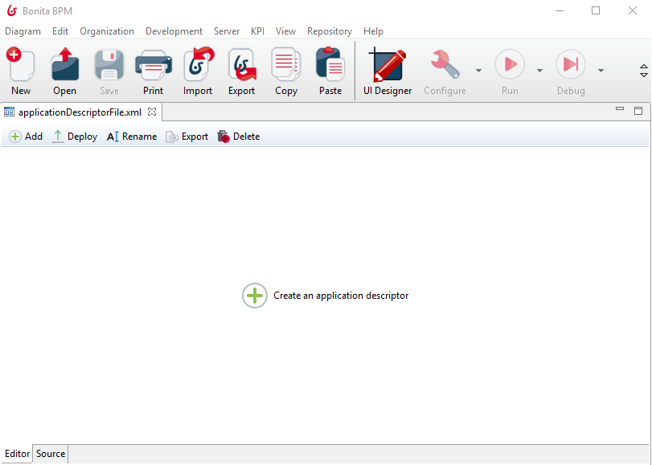
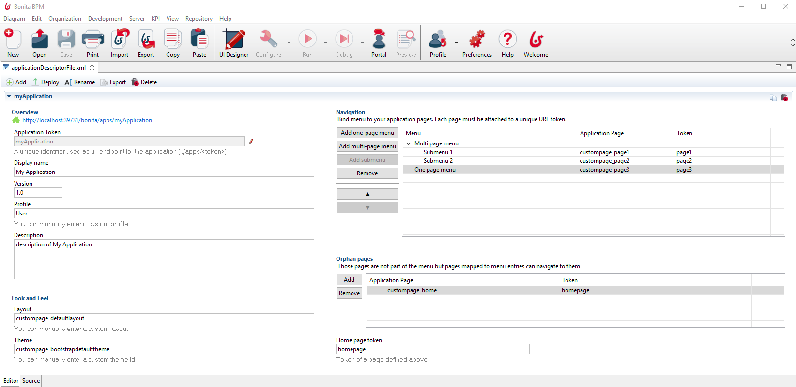

= Application descriptor
:description: == Overview

== Overview

In Bonita BPM 7.5, we introduced the possibility to manage application descriptors from the Studio. +
It accounts for an additional step to ease the management of xref:applications.adoc[Living Applications] in Bonita BPM, since our objective is to offer a unique application deployment artifact, managed from the Studio. +
Then, all resources used by applications will be centralized and shared by the Bonita BPM development suite: Bonita BPM Studio and the UI Designer.

== Definition

Basically, an *application descriptor* is an XML file. It represents the skeleton of an application, as it contains references to resources installed in Bonita BPM Portal and used by a given application. +
An application descriptor must be imported onto the portal (*Administrator* profile), in the *Applications* tab, to enable the application. +
Before Bonita BPM 7.5, this portal tab was the only way to create and manage applications. +
For development purposes, the Studio can *deploy* applications descriptors onto the portal for you (_only for Performance and Efficiency editions_).

Application descriptors are packaged in *application files*. +
An *application file* is an XML file containing one or more application descriptors.

  <!--  Application File -->
 <applications>
 	<application>
 		<!--  First Application Descriptor -->
 	</application>
 	<application>
 		<!--  Second Application Descriptor -->
 	</application>
 </applications>

However, application descriptors in a given application file are totally *independent*. +
The purpose of grouping application descriptors in one file is to manage together applications with the same company purpose, each of them dedicated to a different user profile. +
For example, the four leave management applications for employees, managers, Human Resources officers, and Administrators should be managed together, therefore grouped in the same application file.

== Create and build an Application Descriptor

[NOTE]
====

All Bonita BPM editions come with an .xml editor for this feature. Only Performance and Efficiency editions also come with a graphical UI.
====

From Bonita BPM Studio, click on *Development* \-> *Application Descriptor* \-> *New...* +
It will create an empty application file with a default name and open an editor. You can *rename* this application file from the graphical UI or from the menu *Open*.

 +
Here is the application descriptor graphical UI provided. It is bound to the XML source, so you can use it to build your application descriptor without writing xml. +
You can switch from the graphical UI to the xml source at any moment, using the tabs _Editor_ and _Source_ at the bottom of the editor. +
A toolbar is embedded to the editor, use it to:

* *Add* an application descriptor to this application file
* *Deploy* this application file (i.e all the application descriptors in this file). +
 ⚠  For _development_ purposes, it also deploys their referenced pages and layout, but if those resources use REST API Extensions, you have to deploy those manually. In _production_ environment, you still need to deploy pages, layouts and REST API Extensions manually *before* to deploy the application descriptor.
* *Rename* this application file
* *Export* this application file (download the .xml)
* *Delete* this application file from your current workspace

The application *Token* is the identifier of your Application Descriptor; it has to be unique. It is used to define the URL root of your Application:  _../apps/APPLICATIONTOKEN/.._

the fields _Profile_, _Layout_, _Theme_, _Application Page_ and _Home page token_ come with an auto complete feature. +
Be aware that for the moment, we can only suggest choices known by the Studio and the UI designer. +
It means that custom profiles, custom themes or custom pages / layouts only known by the portal (not created with the UI Designer) won't be suggested. You can still reference an unknown resource, but you will have to write the exact identifier by yourself, and make sure the resource is imported onto the portal *before* you deploy/import the application descriptor.

There are two ways to reference pages used by your application. In the _Navigation_ table or in the _Orphan pages_ table. +
Use the _Navigation_ table to create the application menus/submenus, and bind those menus to pages. +
A page needs a unique token (unique in the context of the application descriptor). It will be use to define the URL to reach this page: _../apps/applicationToken/PAGETOKEN_ +
Use the _Orphan pages_ table to reference pages that will be accessed using the associated URL, but won't be attached to a menu. It can be the application home page, or pages accessible from other pages but not from a menu. +
⚠ You don't need to define your pages twice. If a page is accessed both from a menu and from another page, you only need to reference it in the _Navigation_ table: pages defined in the Navigation table will be accessible in the whole application.

A preview link is also provided, at the top of the _Overview_ section. Clicking on the link will first deploy the selected application descriptor, and then open the application home page in your browser.
