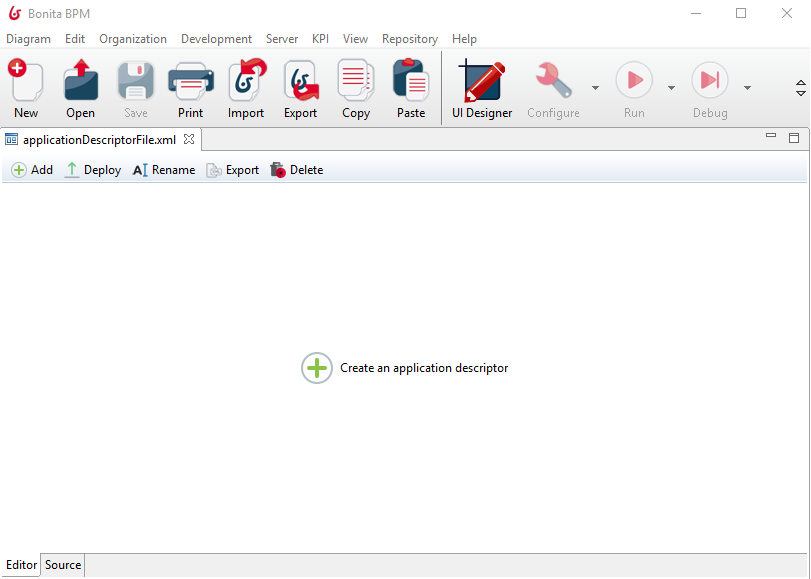
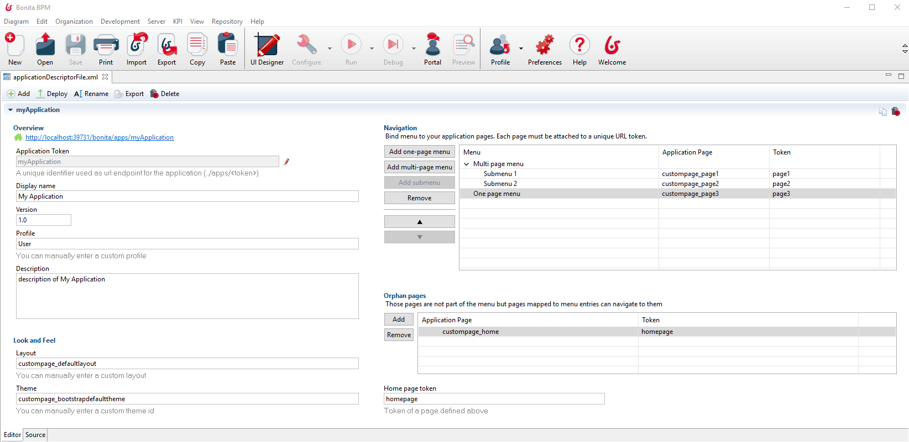

#Application Descriptor Creation

::: info
**Note:** We provide a custom editor for Performance and Efficiency editions only. A xml editor is available for all editions
:::

##Overview
In Bonita 7.5, we introduced the possibility to manage Application Descriptors from the Studio. 
It is a step in our objective to have an unique deployment artifact.
Thus, all resources used by [Applications](applications.md) are centralized, shared by the Studio and the UIdesigner. 
Those resources are used to create Application Descriptors from the Studio. Application Descriptors can be deployed in the Portal to create Applications.

##What's an Application Descriptor ? 
Basically, an **Application Descriptor** is a XML file. It represents the skeleton of an Application, it contains all the references used by the Portal to build an Application.
An **Application File** is a XML file containing several Application Descriptors. 

	 <!--  Application File -->
    <applications>
		<application>
			<!--  First Application Descriptor -->
		</application>
		<application>
			<!--  Second Application Descriptor -->
		</application>
	</applications>
	
Application Descriptors in a same Application File are totally **independent**.
It is interesting to have several Application Descriptors in a same file if the associated Applications are linked, but it is definitively not an obligation. 

##How to create and build an Application Descriptor
From the Studio, click on **_Development_** -> **_Application Descriptor_** -> **_New.._**
It will create an empty Application File with a default name and open an editor. You can rename this Application file from the editor or from the open menu. 

Here is an overview of the editor provided (_only for efficiency and performance editions_). 
You can switch from the editor to the xml source at any moment, using the tabs _Editor_ and _Source_ at the bottom of the editor. 
A toolbar is embedded to the editor, use it to:

 - **Add** an application descriptor to this Application File
 - **Deploy** this application File (i.e all the Application Descriptors contained in this Application File) and the referenced resources (pages, layout..) in the portal. /!\ If your pages use Rest API Extensions, you have to deploy those API manually.   
 - **Rename** this Application File
 - **Export** this Application File
 - **Delete** this Application File from your current workspace

To create the first Application Descriptor of an Application File, use the button in the middle of the editor or the add button in the toolbar (same effect). 

Here is the Application Descriptor Editor provided. It is bonded to the XML source, you can use it to build your Application Descriptor without to code!

The Application Token is the identifier of your Application Descriptor, it has to be unique. It is used to define the URL root of your Application:  _../apps/APPLICATIONTOKEN/.._ 
 When you update the application token, if the Application Descriptor with the old token was deployed on the portal, we propose you to re-deploy your application descriptor. Re-deploy means here that we replace the old deployed instance with the old token by a new deployed instance with the new token. If you refuse, then the deployed instance with the old token won't be replaced by the new one when you will deploy again, because tokens are different. Your will have two deployed instances. 

We provide an auto complete tool for fields _Profile_, _Layout_, _Theme_, _Application Page_ and _Home page token_.  
Be aware that we can only propose choices known by the Studio and the UI designer at the moment.
It means that custom profiles, custom themes or custom pages / layouts only known by the portal (not created with the UID) won't be proposed. You can still reference an unknown resource, but you will have to write the exact identifier by yourself. 

There is two ways to reference pages used by your Application. In the _Navigation_ table or in the _Orphan pages_ table. 
Pages referenced in the Navigation table will be accessible by a menu. Use this table to create all your menu/submenu, and bind those menu to pages. A page needs an unique token (unique in this Application descriptor). It will be use to define the URL to reach this page : _../apps/applicationToken/PAGETOKEN_
Pages referenced in the Orphan page stable will be accessible using the associated URL, but won't be attached to a menu. It can be the home page of your application, or pages accessible from other pages but not from a menu. 
/!\ You don't need to define your pages twice, a page defined in the Navigation table will be accessible in the whole Application, you don't have to re-define it as an orphan page. 

A preview link is also provided, at the top of the _Overview_ section. Clicking on the link will first deploy the whole Application File, and then open the defined home page of the associated Application descriptor. 