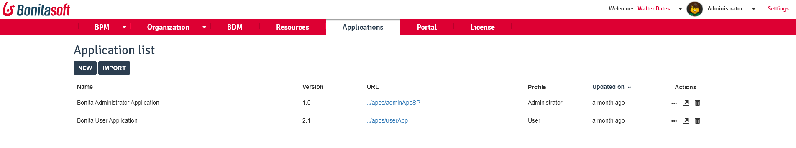

# Applications

This page defines the term "Application" and explains what a user with the Administrator profile in Bonita Portal can see and do about them.

Here is a view of the page:
<!--{.img-responsive}-->

## Application definition

Bonita allows companies to build business and process-centered web applications that provides access to operational dashboards and pages.  
An application is a collection of pages and processes that meets a business need. It contains some or all of the following:

* [Pages](pages.md) and [Forms](forms.md): the user interface components of the application. An application must contain at least one page.
* [Processes](processes.md): the logic execution components of the application. An application must contain at least one process. A process can contain [forms](forms.md), which are the user interface of the process.
* [Data](data-handling-overview.md): the business information created, transformed, and/or deleted by the processes, and presented in pages and forms.
* [REST API extensions](rest-api-extensions.md): called from pages or forms to retrieve data to be presented to the user.
* [Layout](layouts.md): the frame in which application pages are displayed.
* [Theme](themes.md): the appearance of application pages, including fonts and colors.

## Application prerequisites

An application requires the following to be available:

* The [Business Data Model](bdm-management-in-bonita-bpm-portal.md) (BDM) must be deployed
* The [organization](organization-in-bonita-bpm-portal-overview.md) data must be deployed, so that application users can log in.
* The access [authorizations](rest-api-authorization.md) that grant users access to the application resources must be defined.

## Application creation
Even though you can create applications from Bonita Portal, these would not be taken into account in Bonita Studio nor the project sources.  
So we strongly encourage your team to create applications in [Bonita Studio](applicationCreation.md).

## Application management
When a Bonita project is deployed on a Bonita Runtime, what you see in the Administrator _Applications_ section is the list of deployed applications, links to their URL, access to their details, as well as the option to export or delete them.

### URL of an application
When clicking on a URL, the application opens in another tab of your web browser.  
To access the application content, you must pertain to the [profile](profiles-portal-overview.md) mapped with the application.  
If this is the case, you will not be taken to the login page and will directly land on the application home page.  

### Details of an application
When navigating to this page, the Administrator can view what layout and theme a linked with the application, but also all pages used by the application as well as the navigation structure.  
There is no view of the processes used in the application, nor the Business Data Model, nor the organization.  
An Adminitrator must check that all these required elements are available in the Bonita Runtime so the application runs smoothly.  
To do so, click on _BPM_>_Processes_, _Organization_, and _BDM_.

### Export an application
Because the application has been modified in Live Update (see below), you may need to export in so it can be imported in Bonita Studio and contribute to a new project version to store in a Version Control System (Git), share, and eventually deploy, to ease the maintenance of the whole project.  
To do so, click on the _Export_ icon at the right of the row for the application to export.

### Delete an application
Deleting an application is a very critical operation to conduct on Non-Production or Production environments. So we advise not to do so from the Administrator Portal, but rather in Bonita Studio, so this major project edition is saved in a new version of the project and shared with the project team.
Still, to delete an application, click on the _Delete- icon

### Live update
In the details page of an application, you can [Live Update](live-update.md) the elements mapped with the application descriptor:
 * the layout
 * the theme
 * the list of pages used in the application
 * the navigation
 
 To map new resources, you need to make sure that they have been installed first. To do so, go to _Resources_ and add what needs to be.

<a id="layout"/>

#### Updating the layout

Each application is associated with a [layout](layouts.md) that defines the main frame of this application.
To change the application layout:
1. Click on the _Edit_ icon for the application you want to edit. The application details page is displayed.
2. In the "Look & Feel" zone, click on the name of the current layout.
3. Choose the new layout from the drop down list. 
4. Click on the "Tick" button.

<a id="theme"/>

#### Updating the theme

Each application is associated with a [theme](themes.md) that defines the application appearance. All pages developed with the [UI Designer](ui-designer-overview.md) will automatically benefit of application theme.  

To update the application theme:
1. Click on the _Edit_ icon for the application you want to edit. The application details page is displayed.
2. In the "Look & Feel" zone, click on the name of the current theme.
3. Choose the new theme from the drop down list.
4. Click on the "Tick" button.

<a id="specify-pages"/>

#### Updating the page list

To update the pages:
1. Click on the _Edit_ icon for the application you want to edit. The application details page is displayed.
2. In the "Pages" list, you can:
  * Add a page by clicking on _Add_ and choosing a page from the popup list, and define the URL token for this page.
  * Remove a page by clicking the _Delete_ icon for that page.
  * Change the home page: in the page list, click the _Home_ icon on the row of the relevant page.

**Note:** When you define the URL token for a page, you cannot use "API","content" or "theme" (case insensitive). Those words are reserved for internal use.

<a id="define-navigation"/>

#### Updating the navigation

The navigation defines the menu names and structure, and the pages that menu items point to. The menu hierarchy is limited to two levels, for usability.
At the top level, you can specify two types of items:
* A one-page menus is clickable and points to a page.
* A multi-page menu is not clickable but is the container for a collection of one-page menu items.

To update the navigation:
1. Click the _Edit_ icon for the application you want to edit. The application details page is displayed.
2. In the _Navigation_ zone, at top level, you can define one-page menus that point directly to pages (like Home in the illustration), or multi-page menus (like Holidays).

If you define a multi-page menu, you can add menu items (like Trekking and Safari).
  * To add a top-level one-page menu, click on _Add_, then in the popup, click _One-page menu_, specify the name for the menu, select the page, and click on _Add_.
  * To add a top-level multi-page menu, click on _Add_, then in the popup, click on _Multi-page menu_, specify the name for the menu, and click on _Add_.
  * To add an item to a multi-page menu, click the plus icon beside the menu name, specify the name for the menu item, choose the page from the popup, and click on _Add_.
  * To delete a menu or menu item, click the _Delete_ icon. If you delete a menu that has children, the child entries are automatically deleted from the navigation.
  * To reorder menu items, drag and drop them.

### Deploy an application

To deploy an application, import the following **in this order**:

1. Organization then profiles
2. API extensions then pages, layout, themes
3. Business Data Dodel then processes
4. Application descriptor

### Export an application

To export an application:
1. Select the application you want to export.
2. Click on the _Export_ icon.

An XML file, `Application_Data.xml`, is exported.  
When you export an application, it includes the following:
* The application metadata
* The layout name
* The theme name
* The navigation definition
* The mapping of pages to the navigation

It does not include the pages, layout, or theme themselves, the business data model, the profile definition, the processes, the organization, or the authorization settings. These must all be deployed separately.

### Import applications

When you import an application, you import the mapping of the application to pages. For the import to be successful, any pages, layout and theme must already be loaded.
If you are setting up a new production environment by importing all the data, import it in the following order:

* organization
* profiles
* API extensions
* pages
* layouts
* themes
* business data model
* processes (including forms)
* applications

You will also need to apply any [custom authorization](rest-api-authorization.md) definitions.

To import applications:

1. Go to the **Applications** page. The list of applications is displayed.
2. Click **_Import_**.
3. Specify the `Application_Data.xml` file to upload.
4. Click **_Import_**.

The file is imported and checked.
A popup reports the status of the import. It shows the number of applications successfully imported, partially imported, or with errors.
If the profile associated with an application is not defined, the application is created without any associated profile.
If a page associated with the application is not present, the application is created without this page or the related navigation elements.
If the specified layout and/or theme is not present, the application is created with the default layout and theme.
