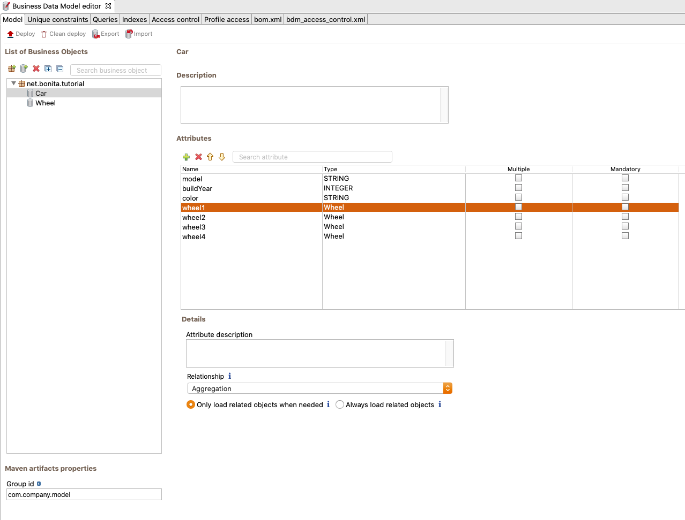

# How to manage BDM in REST API extensions

## Use case

This example demonstrates best practices when developing a [REST API Extension](rest-api-extensions.md) accessing [Business Data](define-and-deploy-the-bdm.md).  
Special attention is paid on performance matters.

Image below shows the BDM model used for the example use-case:



Note that the relations from car to wheel1, wheel2, wheel3, wheel4 are **[lazy](define-and-deploy-the-bdm.md#lazy_eager_loading) relations**.

## groovy code sample

Below is an example of a REST API extension groovy script that accesses the Business Data model.

```groovy

class CarManagement implements RestApiController {

    private static final Logger LOGGER = LoggerFactory.getLogger(CarManagement.class)
    
    @Override
    RestApiResponse doHandle(HttpServletRequest request, RestApiResponseBuilder responseBuilder, RestAPIContext context) {
        // To retrieve query parameters use the request.getParameter(..) method.
        // Be careful, parameter values are always returned as String values
        
        // Retrieve p parameter
        def p = request.getParameter "p"
        if (p == null) {
            return buildResponse(responseBuilder, HttpServletResponse.SC_BAD_REQUEST,"""{"error" : "the parameter p is missing"}""")
        }
        
        // Retrieve c parameter
        def c = request.getParameter "c"
        if (c == null) {
            return buildResponse(responseBuilder, HttpServletResponse.SC_BAD_REQUEST,"""{"error" : "the parameter c is missing"}""")
        }
        
        // use APIClient to retrieve the CarDAO class:
        def carDAO = context.apiClient.getDAO(CarDAO.class)
        
        def currentModel = "DeLorean"
        // Fetch the cars that match the search criteria:
        List<Car> cars = carDAO.findByModel(currentModel, p as int, c as int)
        
        // Prepare the Json result:
        // Do NOT return directly the list "cars", as all Wheel objects would be fetched one by one (lazy relation). 
        // Instead, ONLY select the fields that are necessary for your business logic:
        def carModels = [:]
        for (Car car : cars) {
            // return the fields "id", "buildYear", "color":
            carModels.put("id: ${car.persistenceId}", "${car.buildYear} - ${car.color}")
        }
        
        def result = [ "model" : currentModel, "number of cars" : cars.size(), "cars" : carModels ]
        
        // Attention: do not use "toPrettyString()" if your response is large, as the page "size" may be uselessly big:
        return buildResponse(responseBuilder, HttpServletResponse.SC_OK, new JsonBuilder(result).toString())
    }
}
```
::: warning
Since wheel1, wheel2, wheel3, wheel4 are lazy relations, they are **not retrieved** directly when retrieving a Car.
The retrieval of related Wheel objects is only performed **when accessing the fields** (via getWheel1(), ...), if necessary.

However, when building the response, the default Json parser **implicitly fetches** all lazy-relation fields.
So, if the number of Business Data returned is very large and if you have lazy relations in the returned objects, numerous queries are executed, leading to poor performance.

As a consequence, good practices are:
* If related objects are not necessary in the response, ONLY extract the information needed. This avoids costly loading of unnecessary objects.
* If related objects should always be returned in the response, consider changing the relation from ['eager' to 'lazy'](define-and-deploy-the-bdm.md#lazy_eager_loading) in the model.
:::

## Rest API Response content

Below is an example of the resulting response:

```json
{
"model": "DeLorean",
"number of cars": 30,
    "cars": {
        "id: 1": "1933 - Red",
        "id: 6": "1938 - Rainbow",
        "id: 20": "2002 - Green",
        "id: 24": "1940 - Yellow",
        "id: 33": "1954 - Purple",
        "id: 46": "1932 - Rainbow",
        "id: 50": "2008 - Teal",
        "id: 51": "1979 - Purple",
        "id: 53": "1942 - Purple",
        "id: 60": "1941 - Rainbow",
        "id: 71": "1987 - Orange",
        "id: 75": "1956 - Green",
        "id: 82": "1938 - Rainbow",
        "id: 92": "1955 - Rainbow",
        "id: 100": "1965 - Orange",
        "id: 119": "1992 - Blue",
        "id: 128": "2015 - Purple",
        "id: 130": "1932 - Yellow",
        "id: 142": "1951 - Grey",
        "id: 143": "1930 - White",
        "id: 146": "1937 - Teal",
        "id: 147": "1961 - Blue",
        "id: 152": "1939 - Purple",
        "id: 158": "1977 - Grey",
        "id: 159": "2013 - Rainbow",
        "id: 160": "1997 - Purple",
        "id: 163": "1973 - Rainbow",
        "id: 164": "1940 - Purple",
        "id: 165": "1933 - Teal",
        "id: 172": "1983 - Rainbow"
    }
}
```

::: info
Note that Wheels are not returned. Only necessary information is fetched, thus this example performance is efficient
:::