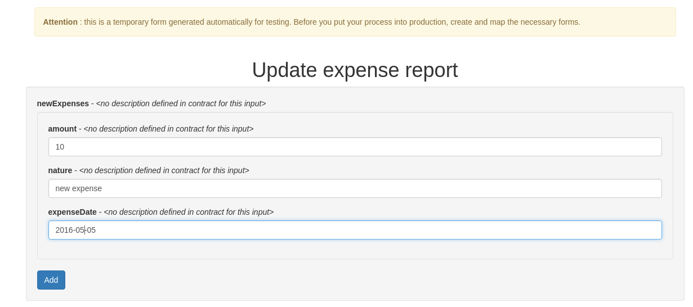
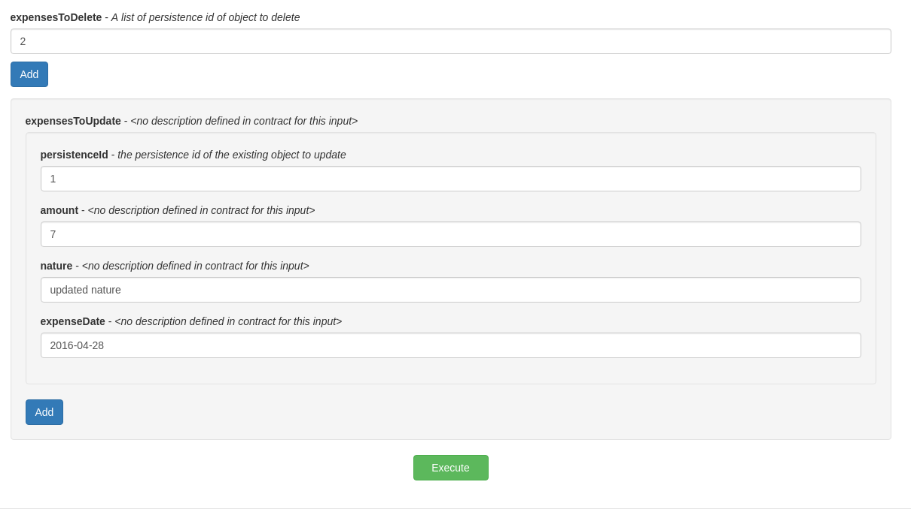

# How to manage multiple references in Business Objects

## Introduction


This tutorial explains how to create, update or delete a multiple reference in a Business Object. The tutorial can be used with Bonita BPM Community edition, and uses features that are available in all editions. The example uses an expense report as business object.


<!-- what is the following sentence goal? Its format and location are not standard -->
_Design a task contract and associated operations to update a business object with a multiple reference._

## Create the business object model

1. Create an _Expense_ business object like below.

<!--{.img-responsive}-->

2. Create _ExpenseReport_ business object referencing multiple expenses by composition.

<!--{.img-responsive}-->

## Design the expense report process

1. Create a new  process
2. Add a new _report_ business variable of type ExpenseReport initialized with the following groovy script

	```groovy
		def aDummyExpense = expenseDAO.newInstance();
		aDummyExpense.amount = 5
		aDummyExpense.nature = "A dummy expense"
		aDummyExpense.expenseDate = new Date()
	
		def anotherDummyExpense = expenseDAO.newInstance();
		anotherDummyExpense.amount = 55
		anotherDummyExpense.nature = "A another dummy expense"
		anotherDummyExpense.expenseDate = new Date()
	
		def report = expenseReportDAO.newInstance()
		report.expenses << aDummyExpense
		report.expenses << anotherDummyExpense
		return report
	```
3. Rename **Step1** to **Update expense report**

### Design the task contract to update expenses

1. Select the **Update expense report** task
2. Go to Execution > Contract property tab
3. Create a contract like below

<!--{.img-responsive}-->

 _newExpenses_ input is used to gather a list of new expenses to add to the report
 _expensesToDelete_ input is used to gather a list of *Expense* id to delete
 _expensesToUpdate_ input is used to gather a list of existing expenses to update in the report

In the contract we use TEXT input type for persistenceId instead of numeric type to support the whole java.lang.Long range.  
JSON number type range does not extend to _java.lang.Long.MAX_VALUE_. A conversion to long will be applied in scripts.

### Add operations to update the business data

1. Go to Execution > Operations property tab
2. Add an operation
3. Use the **report** business variable as left operand.
4. Change the operator and select _Use a java  method_, choose the _setExpenses_ method.
5. In the right operand, use the following script to _add_ new expenses in the report:

	```groovy
	def result = []
	result.addAll(report.getExpenses())
	newExpenses.each{
		def exp = expenseDAO.newInstance()
		exp.amount = it.amount
		exp.nature = it.nature
		exp.expenseDate = it.expenseDate
		result << exp
	}
	return result
	```
6. Add another operation
7. Use the **report** business variable as left operand.
8. Change the operator and select _Use a java  method_, choose the _setExpenses_ method.
9. In the right operand use the following script to **delete** expenses from the report:

	```groovy
		def result = []
		result.addAll(report.getExpenses())
		result.removeAll(result.findAll{expensesToDelete.contains(it.persistenceId.toString())})
		return result
	```
10. Add another operation
11. Use the **report** business variable as left operand.
12. Change the operator and select _Use a java  method_, choose the _setExpenses_ method.
13. In the right operand, use the following script to **update** expenses existing in the report:

	```groovy
		import com.company.model.Expense;
	
		def updatedExpenses = []
		updatedExpenses.addAll(report.getExpenses())
		expensesToUpdate.each{ exp ->
			def Expense expenseToUpdate = updatedExpenses.find{
				it.persistenceId == exp.persistenceId.toLong()
			}
			if(expenseToUpdate){
				expenseToUpdate.amount = exp.amount
				expenseToUpdate.expenseDate = exp.expenseDate
				expenseToUpdate.nature = exp.nature
			}else{
				throw new Exception("Expense with id $exp.persistenceId does not exists.")
			}
		}
		return updatedExpenses
	```
	
## Run the process
You may now run the process and validate the expected behavior using auto-generated forms.

1. Click on Run
2. Start the process instance form the auto-generated form
3. In a web browser, you can check the content of your report calling the following REST API:  http://localhost:8080/bonita/API/bdm/businessData/com.company.model.ExpenseReport/1/expenses

It should display this result according to the initialization of the report business variable.
	```json
	[
		{
		"persistenceId":1,
		"persistenceId_string":"1",
		"persistenceVersion":0,
		"persistenceVersion_string":"0",
		"amount":5.0,
		"amount_string":"5.0",
		"nature":"A dummy expense",
		"expenseDate":1461748727495
		},
		{
		"persistenceId":2,
		"persistenceId_string":"2",
		"persistenceVersion":0,
		"persistenceVersion_string":"0",
		"amount":55.0,
		"amount_string":"55.0",
		"nature":"A another dummy expense",
		"expenseDate":1461748727495
		}
	]
	```

4. Perform the **Update expense report** task like below

<!--{.img-responsive}-->
<!--{.img-responsive}-->

5. In a web browser, check the content of your report calling the following REST API:
http://localhost:8080/bonita/API/bdm/businessData/com.company.model.ExpenseReport/1/expenses

It should display the following result:
```json
[
	{
	"persistenceId":1,
	"persistenceId_string":"1",
	"persistenceVersion":1,
	"persistenceVersion_string":"1",
	"amount":7.0,
	"amount_string":"7.0",
	"nature":"updated nature",
	"expenseDate":1461801600000
	},
	{
	"persistenceId":3,
	"persistenceId_string":"3",
	"persistenceVersion":0,
	"persistenceVersion_string":"0",
	"amount":10.0,"amount_string":"10.0",
	"nature":"new expense",
	"expenseDate":1462406400000
	}
]
```

To conclude, when modifying a collection of Business objects in a script you must return new _java.util.List_ instances and **not** the list returned by an accessor (_eg: report.getExpenses()_) as it will return an _Hibernate_ specific implementation not compliant with our business objects.  
Do not forget to use the persistenceId (or another **unique** attribute of the object) in the contract if you need to access existing objects (update or delete use cases).
