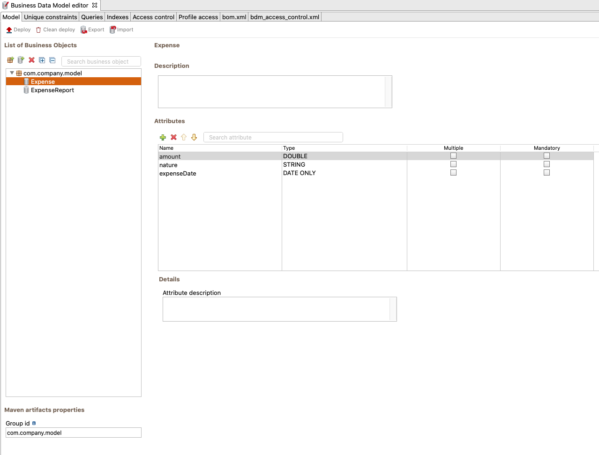
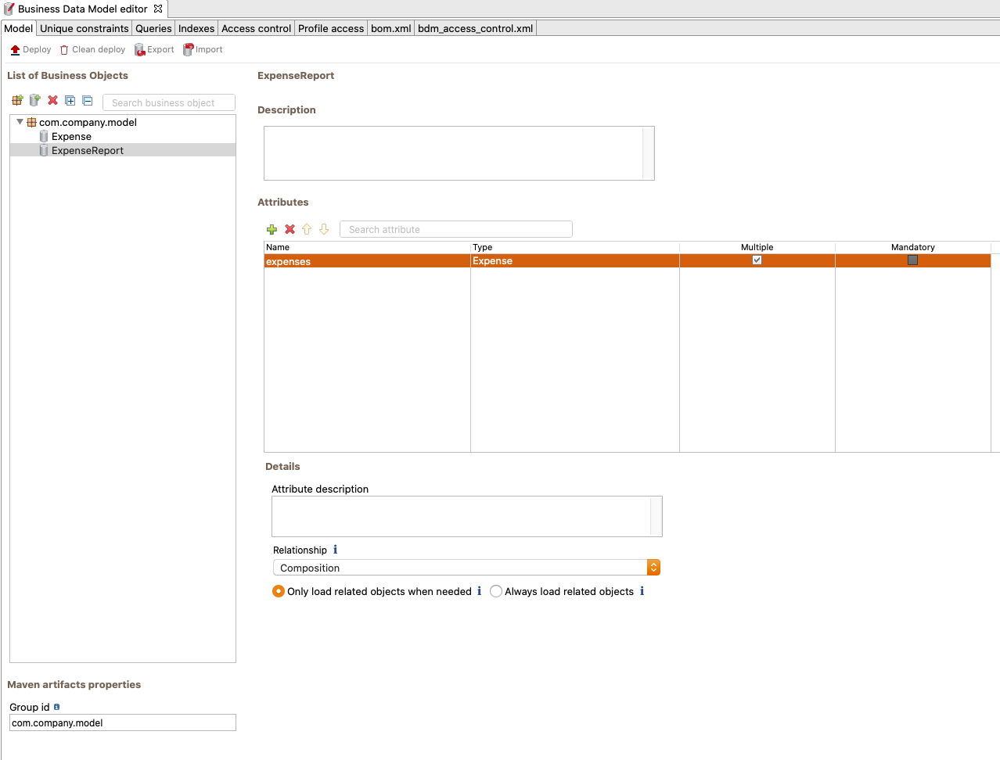

# Business Object multiple reference tutorial

## Introduction


This tutorial explains how to create, update or delete a multiple reference in a Business Object. The tutorial can be used with Bonita BPM Community edition, and uses features that are available in all editions. The example uses an expense report as business object.


_Design a task contract and associated operations to update a business object with a multiple reference._

  * [Create the business object model](#bdm)
  * [Design the expense report process](#process)
  	* [Design the task contract to update expenses](#contract)
  	* [Add operations to update the business data](#operations)
  * [Run the process](#run)


## <a name="bdm"></a>Create the business object model

Create an **Expense** business object like below.



Then create **ExpenseReport** business object referencing multiple expenses by composition.



##  <a name="process"></a>Design the expense report process

* Create a new  process
* Add a new **report** business variable of type ExpenseReport initialized with following groovy script

```groovy
	def aDummyExpense = expenseDAO.newInstance();
	aDummyExpense.amount = 5
	aDummyExpense.nature = "A dummy expense"
	aDummyExpense.expenseDate = new Date()

	def anotherDummyExpense = expenseDAO.newInstance();
	anotherDummyExpense.amount = 55
	anotherDummyExpense.nature = "A another dummy expense"
	anotherDummyExpense.expenseDate = new Date()

	def report = expenseReportDAO.newInstance()
	report.expenses << aDummyExpense
	report.expenses << anotherDummyExpense
	return report
```
* Rename **Step1** to **Update expense report**

###<a name="contract"></a> Design the task contract to update expenses

* Select the **Update expense report** task
* Go to Execution > Contract property tab
* Create a contract like below


 _newExpenses_ input is used to gather a list of new expenses to add to the report
 _expensesToDelete_ input is used to gather a list of *Expense* id to delete
 _expensesToUpdate_ input is used to gather a list of existing expenses to update in the report

In the contract we use TEXT input type for persistenceId instead of numeric type to support the whole java.lang.Long range.
JSON number type range does not extend to _java.lang.Long.MAX_VALUE_. A convertion to long will be applied in sciprts.

###<a name="operations"></a> Add operations to update the business data

* Go to Execution > Operations property tab
* Add an operation
* Use the **report** business varaible as left operand.
* Change the operator and select _Use a java  method_, choose the _setExpenses_ method.
* In the right operand use the following script to **add** new expenses in the report:
 
```groovy
	def result = []
	result.addAll(report.getExpenses())
	newExpenses.each{
		def exp = expenseDAO.newInstance()
		exp.amount = it.amount
		exp.nature = it.nature
		exp.expenseDate = it.expenseDate
		result << exp
	}
	return result
```
* Add another operation
* Use the **report** business varaible as left operand.
* Change the operator and select _Use a java  method_, choose the _setExpenses_ method.
* In the right operand use the following script to **delete** expenses from the report:

```groovy
	def result = []
	result.addAll(report.getExpenses())
	result.removeAll(result.findAll{expensesToDelete.contains(it.persistenceId.toString())})
	return result
```
* Add another operation
* Use the **report** business varaible as left operand.
* Change the operator and select _Use a java  method_, choose the _setExpenses_ method.
* In the right operand use the following script to **update** expenses existing in the report:

```groovy
	import com.company.model.Expense;

	def updatedExpenses = []
	updatedExpenses.addAll(report.getExpenses())
	expensesToUpdate.each{ exp ->
		def Expense expenseToUpdate = updatedExpenses.find{
			it.persistenceId == exp.persistenceId.toLong()
		}
		if(expenseToUpdate){
			expenseToUpdate.amount = exp.amount
			expenseToUpdate.expenseDate = exp.expenseDate
			expenseToUpdate.nature = exp.nature
		}else{
			throw new Exception("Expense with id $exp.persistenceId does not exists.")
		}
	}
	return updatedExpenses
```
##<a name="run"></a> Run the process
You may now run the process and validate the expected behavior using autogenerated forms.

* Click on Run
* Start the process instance form the autogenerated form
* In a web browser, you can check the content of your report calling the following Rest API:
http://localhost:8080/bonita/API/bdm/businessData/com.company.model.ExpenseReport/1/expenses

It should display this result according to the initialization of the report business variable.
```
[
	{
	"persistenceId":1,
	"persistenceId_string":"1",
	"persistenceVersion":0,
	"persistenceVersion_string":"0",
	"amount":5.0,
	"amount_string":"5.0",
	"nature":"A dummy expense",
	"expenseDate":1461748727495
	},
	{
	"persistenceId":2,
	"persistenceId_string":"2",
	"persistenceVersion":0,
	"persistenceVersion_string":"0",
	"amount":55.0,
	"amount_string":"55.0",
	"nature":"A another dummy expense",
	"expenseDate":1461748727495
	}
]
```

* Perform the Update expense report task like below
 
 
* In a web browser, check the content of your report calling the following Rest API: 
http://localhost:8080/bonita/API/bdm/businessData/com.company.model.ExpenseReport/1/expenses

It should display the following result:
```
[
	{
	"persistenceId":1,
	"persistenceId_string":"1",
	"persistenceVersion":1,
	"persistenceVersion_string":"1",
	"amount":7.0,
	"amount_string":"7.0",
	"nature":"updated nature",
	"expenseDate":1461801600000
	},
	{
	"persistenceId":3,
	"persistenceId_string":"3",
	"persistenceVersion":0,
	"persistenceVersion_string":"0",
	"amount":10.0,"amount_string":"10.0",
	"nature":"new expense",
	"expenseDate":1462406400000
	}
]
```

To conclude, when modifying a collection of Business objects in a script you must return new _java.util.List_ instances and **not** the list returned by an accessor (_eg: report.getExpenses()_) as it will return an _Hibernate_ specific implemetation not compliant with our business objects.
Do not forget to use the persistence id (or another **unique** attribute of the object) in the contract if you need to access existing object (update or delete usecases).


