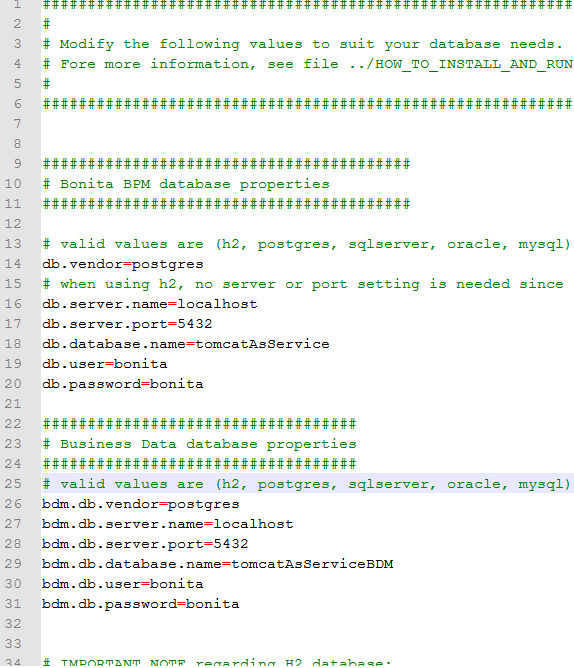
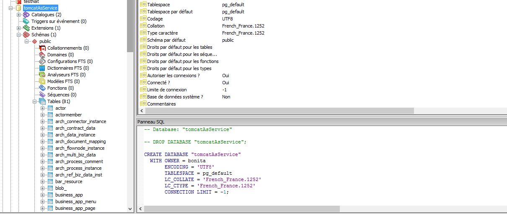
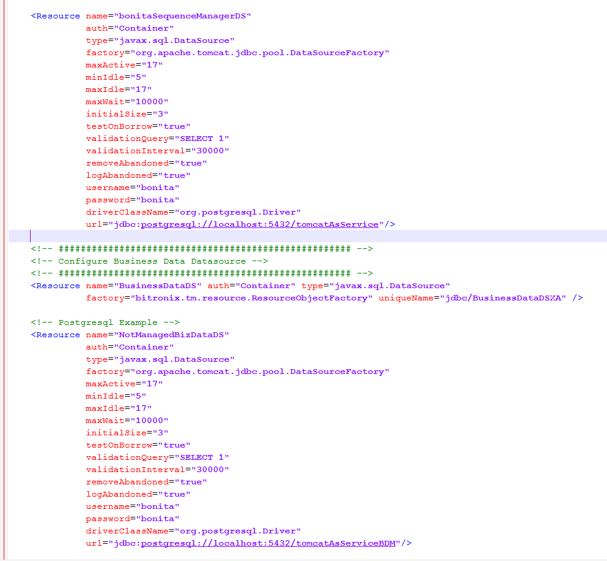
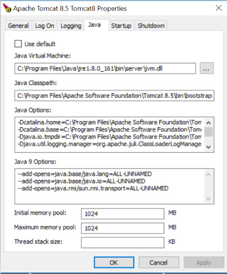
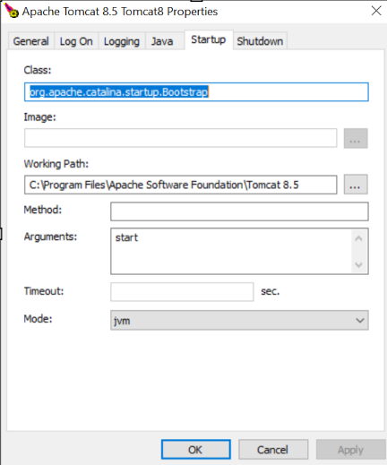

# Install Bonita as a service on Windows

If you are a Windows server administrator you know how useful can be to have softwares installed as a windows service.
In this tutorial we show how to install Tomcat with Bonita configured as a windows service.

## Software needed

For this tutorial you will need the following softwares:
* Tomcat
* Bonita deploy Bundle
* Postgresql Database (or another database supported by Bonita)
Please verify the version supported from the Support page

## Download and installation

* **_Download_** apache-tomcat-x.y.exe from Tomcat website: https://tomcat.apache.org/
* **_Install_** apache-tomcat-x.y.exe. From now on we'll call the installation path as %TOMCAT_INSTALL_FOLDER%
* **_Verify_** that Tomcat is well installed browsing the following URL: http://localhost:8080

* **_Download_** the bundle BonitaSubscription-x.y.z-deploy.zip (or BonitaCommunity-x.y.z-deploy.zip for the community edition)
* **_Unzip_** the bundle in a folder that we'll call: %BONITA_DEPLOY%
* **_Move_** the setup tool %BONITA_DEPLOY%/setup into another folder, for example %TOMCAT_INSTALL_FOLDER%/setup
This last step is not mandatory since the setup tool is independent from Tomcat, you can place it wherever you want.

## Get the license (In case of Subscription edition)

* **_Execute_** %BONITA_DEPLOY%/request_key_utils/generateRequestKey.bat
* **_Use_** the generated key to get a license from the customer portal. The license shouldn't be a development license.
* **_Move_** the license file into the folder %TOMCAT_INSTALL_FOLDER%/setup/platform_conf/licenses

## Database configuration

* **_Configure_** the file %TOMCAT_INSTALL_FOLDER%/setup/database.properties to point towards the suited database (engine and BDM)

* **_Add_** the database driver here: %TOMCAT_INSTALL_FOLDER%/setup/lib
Check your Database provider documentation in order to get the proper driver version. 
* **_Execute_** the command "%TOMCAT_INSTALL_FOLDER%/setup/setup.bat init" in order to initialize the Bonita database with the default configuration.
* **_Verify_** that the tables in the engine database are properly created.

## Server configuration

* **_Move_** the folder %BONITA_DEPLOY%/Tomcat-x.y.z/server/lib to %TOMCAT_INSTALL_FOLDER%/lib
* **_Add_** your database driver to %TOMCAT_INSTALL_FOLDER%/lib
* **_Move_** the folder %BONITA_DEPLOY%/Tomcat-x.y.z/server/conf to %TOMCAT_INSTALL_FOLDER%/conf
* **_Move_** the folder %BONITA_DEPLOY%/Tomcat-x.y.z/server/webapps to %TOMCAT_INSTALL_FOLDER%/webapps
* **_Configure_** %TOMCAT_INSTALL_FOLDER%/conf/bitronix-resources.properties

* **_Configure_** %TOMCAT_INSTALL_FOLDER%/conf/Catalina/localhost/bonita.xml

## Configure JVM properties

* The file %BONITA_DEPLOY%/Tomcat-x.y.z/server/bin/setenv.bat contains all JVM parameters to use in the new installation.
* Update this file to change the database provider (for example postgresql).
* In this file update all the references to %CATALINA_HOME% with %TOMCAT_INSTALL_FOLDER%
In this example %TOMCAT_INSTALL_FOLDER% = C:\Program Files\Apache Software Foundation\Tomcat x.y
* Extract all the JVM properties of the file %BONITA_DEPLOY%/Tomcat-x.y.z/server/bin/setenv.bat 

* The properties should be the following ones:

 * -Dorg.bonitasoft.platform.setup.folder=C:\Program Files\Apache Software Foundation\Tomcat x.y\setup
 * -Dorg.bonitasoft.engine.incident.folder=C:\Program Files\Apache Software Foundation\Tomcat x.y\logs
 * -Dsysprop.bonita.db.vendor=postgres
 * -Dsysprop.bonita.bdm.db.vendor=postgres
 * -Dbtm.root=C:\Program Files\Apache Software Foundation\Tomcat x.y
 * -Dbitronix.tm.configuration=C:\Program Files\Apache Software Foundation\Tomcat x.y\conf\bitronix-config.properties
 * -Dfile.encoding=UTF-8

All these configurations should be realized in the file %TOMCAT_INSTALL_FOLDER%/bin/TomcatXw.exe (Where X is the Tomcat major version), more precisely in the java tab.

* Setup %TOMCAT_INSTALL_FOLDER%/bin/Tomcat8w.exe -> Java -> "Initial memory" with a proper value based on your hardware and project requirements.
* Do the same with "Maximum Memory pool" property.
As an example, if your Operating system has 8 GB of ram you could setup Initial Memory Pool = Maximum Memory Pool = 4096.

* Verify that in the Startup tab the "Mode" property is set to "Jvm".

## System restart and test

* Restart the Tomcat service to take in account the new updates.
* Verify that the Bonita portal is available at the following address:
http://localhost:8080/bonita

* Connect with the technical user (default install/install) and do some tests:
  * Add an organization.
  * Assign profiles to users.
  * Deploy a simple process and test its execution.

