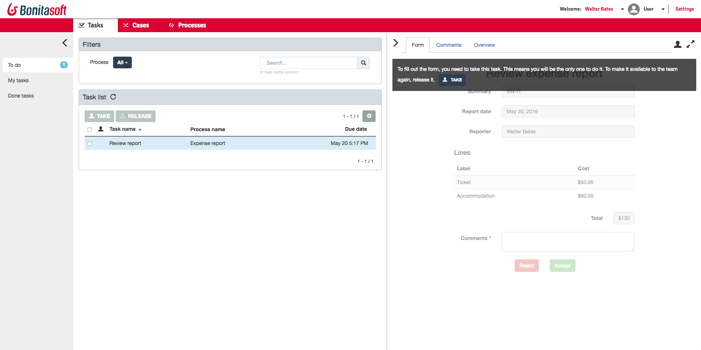

# Bonita BPM Portal overview

Most of the Bonita BPM Portal pages are divided into 3 main panes: left, middle and right.

The left pane is for filters, the middle one for lists and the right one for more details about the selected item.

## Default profiles

There are three default profiles available in the Portal: **User**, **Administrator**, and (in the Efficiency and Performance editions) **Process manager**. 

The **Administrator** is responsible for the administration of the Portal at tenant level, and particularly for the management of the processes, the organization, the reports, the custom profiles and the Look & Feel. 
(See example of the Administrator interface).

The **Process Manager** shares process management responsibilities with the Administrator for the processes he has been declared as the Process Manager.

The **User** is responsible of performing the tasks for which she is a candidate and also for starting new cases of the processes to which they have access.(See example of the User interface).

### Access to menus

Each profile has access to a diferent set of drop down menus, containing filters and action buttons corresponding to their user rights.

Note: The tenant administrator, logged as the Technical user, needs to map the Administrator profile with individuals in the company (or groups, or roles) to let the Administrator(s) manage the rest of the organization and other users. See [First steps after setup/Create an Administrator user](first-steps-after-setup.md).

See also [Profiles overview](profiles-overview.md).

See also [Custom profiles](custom-profiles.md).

Example of the Administrator profile interface

Example of the User profile interface

