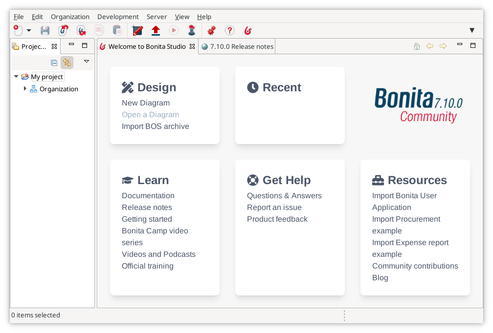
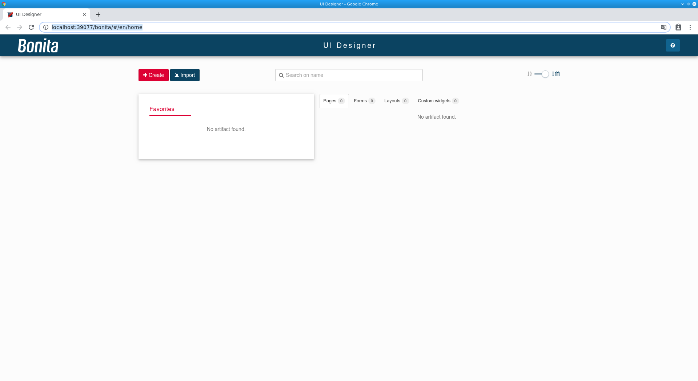

# Bonita Studio installation

The first step of this getting started tutorial is to set up your development environment. All you need to do is install Bonita Studio.

::: info
If you face any difficulties in this getting started tutorial, please [ask for help on the Bonita community](https://community.bonitasoft.com/questions-and-answers) and/or open an issue on the Bonita [Community issue tracker](https://bonita.atlassian.net/projects/BBPMC/issues).
:::

## Download Bonita Studio
To download the latest version of Bonita Studio, open the [download page](https://www.bonitasoft.com/downloads) and click on the **Download** button. This will start the download of Bonita Studio installer for your operating system.

{::comment}
update package name
{::comment}

When the download is finished, you should have one of the following files on your computer (x.y.z refers to the version of Bonita Studio, e.g. ${varVersion}.0):
- Windows: `BonitaStudioCommunity-x.y.z-x86_64.exe`
- macOS: `BonitaStudioCommunity-x.y.z-x86_64.dmg`
- Linux: `BonitaStudioCommunity-x.y.z-x86_64.run`

You are now ready to start the installation process.

## Install Bonita Studio

To run the installer for Windows, macOS or Linux, double-click on the file you downloaded.

The installer will guide you through a very basic installation configuration:
1. Select installation language: this will be used for the installation process
1. Welcome message: click on **Next** button
1. License agreement: you need to accept this to continue
1. Installation directory: the default one should be fine
1. Confirmation that installation is about to start: click on "Next" button
1. Actual installation: wait a little bit
1. You'll see a confirmation message that offers the option to start Bonita Studio. Choose to start Bonita Studio and click on **Finish** button
1. A "thank you for downloading" page will be displayed in your web browser. You can close it

<!--{.img-responsive .img-thumbnail}-->

{::comment}
update package name
{::comment}

Bonita Studio is now installed. Default installation folders are:
- Windows: `C:\BonitaStudioCommunity-x.y.z`
- macOS: `/Applications/BonitaStudioCommunity-x.y.z`
- Linux: `/home/<username>/BonitaStudioCommunity-x.y.z`

## First Bonita Studio execution

At this stage Bonita Studio should be running on your computer. If not, you can manually start it by using the installed shortcut or by using the Bonita Studio executable file from the installation folder.

You should get the Bonita Studio welcome page:

<!--{.img-responsive .img-thumbnail}-->

::: info
When Bonita Studio starts, various tasks are executed in the background, such as the embedded Bonita test server startup (including Bonita Engine initialization), Bonita test organization deployment, and more.
This might take a while and may be why some features are not immediately available. A pop-up window will appear to indicate you can update Bonita server configuration in the [preferences](https://documentation.bonitasoft.com/bonita//bonita-bpm-studio-preferences) 
:::

When Bonita engine is started, you will see a confirmation pop-up on your Studio welcome page.

## Installation validation

In order to make sure that everything is properly installed, click on the **Portal** button  in the toolbar. This should open the Bonita Portal home page in your web browser:

<!--{.img-responsive .img-thumbnail}-->

Also click on the **UI Designer** button  in the toolbar. This will display a pop-up window that you can ignore:

<!--{.img-responsive .img-thumbnail}-->

And then the UI Designer should be opened in your web browser:

<!--{.img-responsive .img-thumbnail}-->

## Ready to move on

Now Bonita Studio is successfully installed, and the tools and test environment are up and running.
You are ready to move to the next chapter to [start creating your first process](draw-bpmn-diagram.md).
