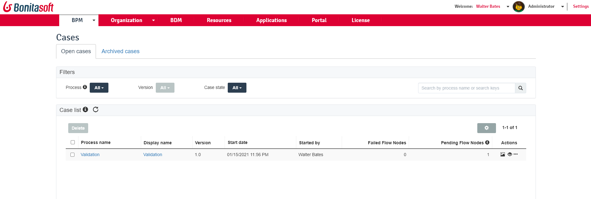

# Administrator Case list

This page explains what a user with the _Administrator_ or _Process Manager_ profiles in Bonita Portal, or an _Administrator_ in Bonita Administrator Application can see and do about cases (the process instances).  

Those users can view a list of open or archived cases, as well as cases with failures, access the case details and overview, the pending tasks for this case, the process definition of this case, and write a comment in open cases.

Here is a view of the page:
<!--{.img-responsive}-->

## View the status of cases

To view the open or archived cases, go to _BPM_>_Cases_. The case table is displayed, showing the open cases. 
To switch between _Open cases_ and _Archived cases_ cases, use the tabs.

To open the case details page, click on a case id or the _Ellipsis_ icon, or to open the process details page, click on the process name.
You can change the view to see only the information that you need:
- View the cases of a specified process, by selecting the process name, or name and version, from the dropdown lists.
- Search keys are also available as additional columns. In this way, you can use search keys for adding business information to your cases. It is also possible to search on search keys values.
- Filter the cases by state, by choosing "With failures" or "All" from the _State_ dropdown list. 
  The _Failed tasks_ column shows the number of failed tasks. A connector failure at a task is counted as a task failure.  
Connector failures on case start or end are shown by an exclamation point (!).
- Add or remove a column in the table, by selecting or deselecting it in the _Columns_ menu.
- Change the column order, by vertically dragging and dropping the column name in the _Columns_ menu.
- Sort the table in ascending or descending order of one of the columns, by clicking arrow beside the column header. 

If the table is already sorted by the column you select, the first click reverses the sort order.  
If the table is currently sorted by some other column, clicking the header sorts by this column in ascending order. 
You can then click on the arrow to reverse the sort order. 

These changes to the view are stored in your browser [Local Storage](https://en.wikipedia.org/wiki/Web_storage#Local_and_session_storage): If you navigate away from the page then go back, the view will be as you configured it.  
If you reload the page, or close and reopen the same browser, your stored changes will be reapplied.  
If you want to go back to the default view settings, clear your browser cache and local storage.

From this table, you can delete a case or several cases. Select the cases you want to delete, and click on _Delete_. Confirm in the popup that you want to delete the selected cases.

if you are using the Enterprise, Performance or Efficiency edition, you can also open the diagram of a case (case visualization), by clicking on the _Picture_ icon for the case. 
On the diagram, colored flags on the steps show the number of step instances in the possible states. Click on _Show key_ to see an explanation of the display. 
Remember that a failure at a step does not necessarily mean that the case has failed entirely, but it might indicate that some action is needed, perhaps to [replay a connector](tasks.md#toc5).

The process diagram is constructed from the deployed process definition. This means that some details visible in Bonita Studio, such as annotations, are not available.

::: info
**Note**: if a process was deployed from a .bar file created in Bonita Studio 6.3 or earlier, the diagram display is not available. This is because some details of the .bar structure have changed. 
To see the diagram for such a process, export the process definition from Bonita Studio 6.3 as a .bos file, import it into Bonita Studio 6.4 or later, generate a new .bar file, and deploy it.
:::

## Add a comment to a case
1. Go to _BPM_>_Cases_
2. Click a Case id or tyhe _Ellipsis_ icon.
3. Enter a comment in the _Comment_ field.
4. Click on _Add comment_

