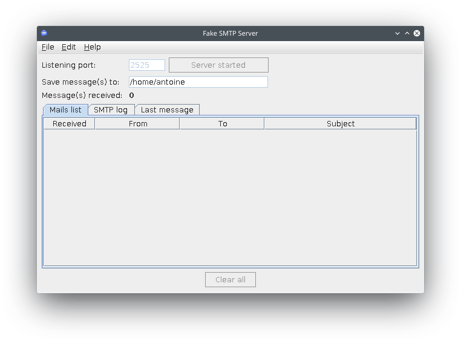

# Configure an email connector

In order for a process to interact with external systems such as publishing a document on a CMS, calling a REST API, or sending an email, Bonita provides connectors. In our example we will configure an email connector to notify the manager that a task _Deal with unsatisfied customer_ requires their attention.

::: info
A connector is a piece of code that is executed when starting or finishing a process or a task. It will process input data (for example business variable values) and generate (optionally) some outputs. Connector code might only transform inputs but can also perform interaction with external systems.
:::

In order to avoid settings that are specific to real email provider, we will use a tool for a fake email server "FakeSMTP":

1. Download FakeSMTP from this link: <http://nilhcem.github.com/FakeSMTP/downloads/fakeSMTP-latest.zip>
2. Unzip the file
3. Run FakeSMTP by double-clicking on the JAR file, or by running this shell command: `java -jar fakeSMTP-2.0.jar`
4. When the user interface is displayed, set the **listening port** to _2525_
5. Click on the **Start server** button.

   <!--{.img-responsive .img-thumbnail}-->

Now that we have a fake server running, let's configure the email connector on the _Deal with unsatisfied customer_ task:

1. Select the task _Deal with unsatisfied customer_
2. Go to **Execution > Connectors in**
3. Click on the **Add...** button
4. Select the _Email (SMTP)_ connector
5. Click on the **Next** button
6. Name the connector configuration _Send notification_
7. Click on the **Next** button
8. Set the following parameter values:
   - SMTP host: _localhost_
   - SMTP port: _2525_ (the port number specified in FakeSMTP)
   - SSL (in the **Security** section): _unchecked_
9. Click on the **Next** button
10. Enter [\_no-reply@acme.com\_](mailto:_no-reply@acme.com_) in the **From** field
11. Use the  icon to edit the expression of the **To** field
12. Set the **Expression type** to **Script**
13. Paste the following Groovy script into the code editing zone: `BonitaUsers.getUserProfessionalContactInfo(apiAccessor,taskAssigneeId).email`
14. Click on the **OK** button
15. Click on the **Next** button
16. Set _You have a pending task_ as the subject
17. Click on **Finish**

    <!--{.img-responsive .img-thumbnail}-->

If you run the process with the connector configured, you should see a new incoming email in the FakeSMTP user interface when task _Deal with unsatisfied customer_ becomes available.

You have now a process definition that uses a wide range of Bonita features. In the [next chapters](design-application-page.md), we will create an application on top of this process.
