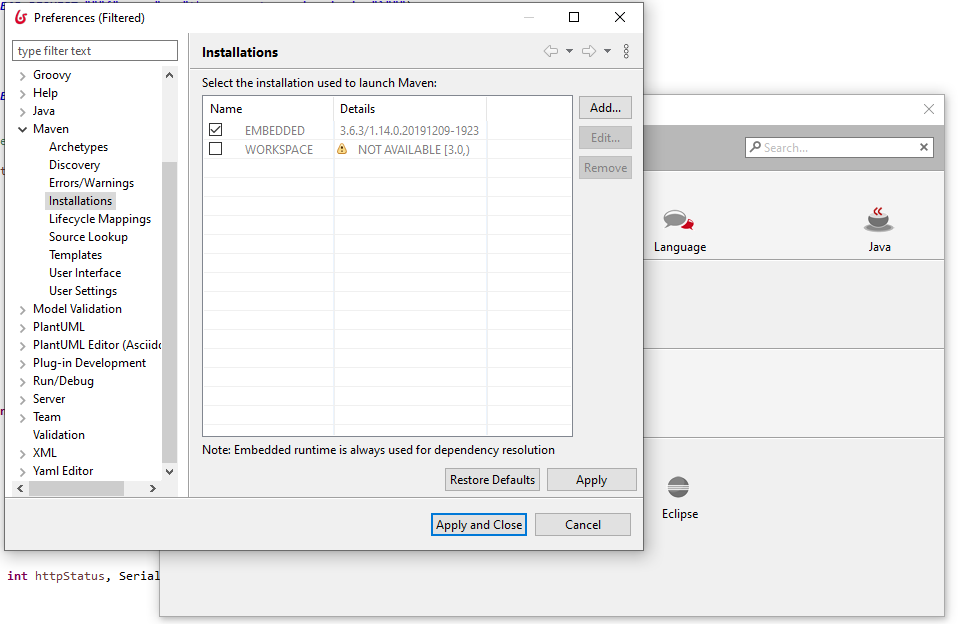

# How to configure Maven

::: info
**Note:** For Enterprise, Performance, Efficiency, and Teamwork editions only.
:::

This page explains how to configure Maven for developing REST API Extensions.
For more information on REST API Extensions, you can read the [reference documentation page](rest-api-extensions.md).

## Studio embedded Maven runtime

Bonita Studio uses [eclipse m2e](https://www.eclipse.org/m2e/) technology to interact with maven projects. It means that you don't need to install maven, it comes out of the box with the Studio.  
However, if you need to use a specific Maven version, you can change this settings in the preferences. Go to Edit > Preferences > Eclipse > Maven > Installations and **Add...** a new installation.

When starting Bonita Studio for the first time, Bonita dependencies will be installed in your maven local repository. By default, the local repository is located in `<USER_HOME>/.m2/repository`.

## Mirror configuration

Refer to the offical maven documentation if you need to configure a [mirror repository](https://maven.apache.org/guides/mini/guide-mirror-settings.html).

::: warning
**Mirror configuration:** When setting a mirror using a `<mirrorOf>*</mirrorOf>` redirection in `<USER_HOME>/.m2/settings.xml`, add an exception for the studio internal repository id like this: `<mirrorOf>*,!studio-internal-repository</mirrorOf>` in your `settings.xml` (do not put spaces in this String, otherwise the exclusion won't be considered by Maven)

The `studio-internal-repository` repository is used by the Studio to resolve some dependencies not available in public repositories.
Without this exclusion, the REST API Extension build fails because of some missing dependencies.
:::

## Proxy configuration

If your provider is restricting Internet access you may configure [proxy settings](https://maven.apache.org/guides/mini/guide-proxies.html) to access to external repositories.

## Authenticated HTTPS configuration

If you need to access a repository using authenticated https, check the offical documentation on how to [configure the SSL certificate](https://maven.apache.org/guides/mini/guide-repository-ssl.html).
