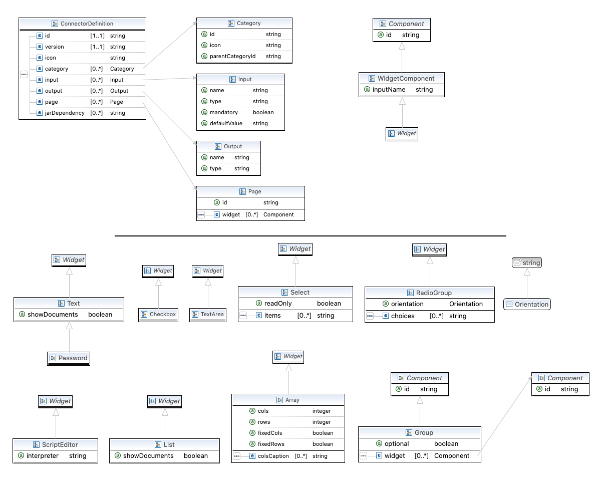

# Custom connector's development
A set of best of breed tools to develop and test custom connectors independently of the Bonita Studio. 

## Create a custom connector

Bonita offers the possibility to create and plug custom connectors, to allow you to connect with any external system you may need.  
We provide a maven archetype to help you to bootstrap a connector project. The source code of the archetype is available [here](https://github.com/bonitasoft/bonita-connector-archetype).

### Prerequisite

 1. Java 8 must be installed: [https://adoptopenjdk.net/index.html](https://adoptopenjdk.net/index.html)
 2. Maven must be installed: [https://maven.apache.org/install.html](https://maven.apache.org/install.html)
 3. Connector development requires some software development skills. The  archetype offers the possibility to develop the connector in _Java_, _Groovy_ or _Kotlin_. Make sure that you are comfortable with at least one of those three languages. 

### Generate the project using the maven archetype

A [maven archetype](https://maven.apache.org/archetype/index.html) is a maven project templating toolkit. This archetype allows you to bootstrap a Bonita connector project on your file system. A Bonita connector project is a maven project. It can be built, tested and then imported into a Bonita project using Bonita Studio.

To create your connector project, prompt a terminal and enter the following command: 
::: warning
**Warning:** Make sure that you are not executing the command from an existing maven project.
:::
```
mvn archetype:generate -DarchetypeGroupId=org.bonitasoft.archetypes -DarchetypeArtifactId=bonita-connector-archetype -DarchetypeVersion=1.0.0
```
You'll then have to specify interactively the properties of your project: 

- **groupId:** the group id of your connector.
- **artifactId:** the artifact id of your connector
- **version:** the version of your connector _(default value: 1.0-SNAPSHOT)_
Follow the [maven naming convention guide](http://maven.apache.org/guides/mini/guide-naming-conventions.html)
- **package** the package in which the connector source files will be created _(default value: the group id of the connector)_
- **bonitaVersion:** the targeted Bonita version
    - A Bonita connector project depends on _org.bonitasoft.engine:bonita-common_. To avoid potential conflicts / errors at runtime, you should use the Bonita version of your runtime environment.s
- **className:** the class name of your connector 
    - Must match the following regex: `^[a-zA-Z_$][a-zA-Z\d_$]+$` (A Java classname valid identifier)
    - Example: _MyConnector1_
- **connectorName:** the name of your connector
    - Must match the following regex: `^[a-zA-Z0-9\-]+$`
    - Example: _myConnector-1_
- **language**: the language used in the connector project. Available values:
    - java
    - groovy
    - kotlin

A folder named _[your artifact id]_ is created, with your Bonita connector project, ready to use.

⚠️ You can avoid the interactive mode by specifying all properties of your project directly in the command line, but by doing that you'll bypass the validation performed on the properties content.


### Connector developpment

In this section we'll look into the different components of a connector project, and how you should use them to develop your connector.

#### Connector definition
A connector is first defined by its **definition**.  It is an XML file located in _src/main/resources/[connector name].def_ by default.   
A connector definition defines the inputs and the outputs of a connector. It can be seen as a black box. The definition explicits what will be passed to the connector, and what is expected as output. Then, implementations of this definition can be created, they just need to respect the inputs / outputs contract of the definition.  

The connector definition XSD is available in _schemas/connector-definition-descriptor.xsd_, you can import it in a IDE to get completion. 





Example: 
```xml
<?xml version="1.0" encoding="UTF-8"?>
<definition:ConnectorDefinition xmlns:xsi="http://www.w3.org/2001/XMLSchema-instance" xmlns:definition="http://www.bonitasoft.org/ns/connector/definition/6.1">
    <id>myConnector</id> <!-- Id of the definition -->
    <version>1.0.0</version> <!-- Version of the definition -->
    <icon>connector.png</icon> <!-- The icon used in the Studio for this definition -->
    <category icon="connector.png" id="Custom"/> <!-- The category of this definition, used in the Studio (e.g: http, script ...) -->
  
    <!-- Connector inputs -->
    <input mandatory="true" name="defaultInput" type="java.lang.String"/>
    
    <!-- Connector outputs -->
    <output name="defaultOutput" type="java.lang.String"/>
    
    <!--
       Pages and widgets to use the connector in the Bonita Studio.
       - Each widget must be bound to an input
       - Page titles must be defined in the properties files
       - Widget labels must be defined in the properties files
       - Page and widget descriptions can be defined in the properties files (optional)
    -->
    <page id="defaultPage">
        <widget xsi:type="definition:Text" id="defaultInputWidget" inputName="defaultInput"/>
    </page>
  
</definition:ConnectorDefinition>
```

##### Connector Inputs

The inputs of a connector are defined in the definition. Those inputs are valued by processes, and are retrieved by the implementation classes of the connector to execute the business logic.  
A connector input: 

 - Has a name
 - Has a type
 - Has an optional default value
 - Can be mandatory 

##### Connector Outputs

The outputs of a connector are defined in the definition. Those outputs are valued by the implementation classes of the connector, and are used by processes.  
A connector output:

 - Has a name
 - Has a type

##### Pages and widgets

A connector definition includes _pages_ and _widgets_.  Those elements define the UI that will appear in the Bonita Studio to configure the connector.  

 - A widget is bound to an input
 - A page contains a set of widgets

The idea is to create pages for related inputs, so the person who will configure the connector will easily understand what he has to do. 

 All the available widgets are defined in the XSD. You must reference the widget type in the tag to create a specific widget: 

``` xml 
<widget  xsi:type="definition:[WIDGET TYPE]"  id="[WIDGET ID]"  inputName="[CORRESPONDING INPUT]"/>
```

The widget id is used in the _.properties_ files to define and translate the widget name and the widget description.  
The input name is used to bind this widget to one of the connector inputs.  

Some widgets can require additional informations. For example, if you want to create a select widget with a set of item to select, you will have to do something like that: 

``` xml
<widget xsi:type="definition:Select" id="choiceWidget" inputName="choice">
    <items>Choice 1</items>
    <items>Choice 2</items>
    <items>Choice 3</items>
</widget>
```

#### Connector implementation

A _connector implementation_ implements a connector definition. A definition defines a set on inputs / outputs, implementing a definition means use the provided inputs to create the expected outputs.  
Several implementations can be created for a given definition. A connector implementation can be updated at runtime in a Bonita bundle, as long as it implements the same definition.  

A connector implementation is made of two elements: 
- An xml file used to explicit the definition implemented, the dependencies required and the location of the implementation sources
- A set of Java based classes, constituting the implementation sources

##### Implementation XML file

The implementation XML file is located in _src/main/resources/[connector name].impl_ by default.  
The connector definition XSD is available in _schemas/connector-implementation-descriptor.xsd_, you can import it in a IDE to get completion. 


Example: 
```xml
<?xml version="1.0" encoding="UTF-8"?>
<implementation:connectorImplementation xmlns:implementation="http://www.bonitasoft.org/ns/connector/implementation/6.0">
  <implementationId>myConnector-impl</implementationId> <!-- Id of the implementation -->
  <implementationVersion>$implementation.version$</implementationVersion> <!-- Version of the implementation, retrieved from the pom.xml at build time -> ${project.version} -->
  <definitionId>myConnector</definitionId> <!-- Id of the definition implemented -->
  <definitionVersion>1.0.0</definitionVersion> <!-- Version of the definition implemented -->
  <implementationClassname>myGroupId.Connector</implementationClassname> <!-- Path to the main implementation class -->
  <hasSources>false</hasSources> <!-- true if you want to embbed the sources in the jar builded -->
  <description>Default connector implementation</description>

<!-- Implementation dependencies, retrieved from the pom.xml at build time -->
$Dependencies$

</implementation:connectorImplementation>
```

##### Implementation sources

The implementation sources contain all the logic of the connector:

 - The validation of the inputs
 - The connection / disconnection to any external system _(if required)_
 - The execution of the business logic and the  creation of the outputs

The archetype offers the possibility to generate the default sources in Java, Groovy or Kotlin. The build result will always be a Java archive (jar), no matters the langage selected.

The entry point of the implementation sources must extend the class _`org.bonitasoft.engine.connector.AbstractConnector`_.

Example (_Groovy_): 
```groovy
package myGroupId

import org.bonitasoft.engine.connector.AbstractConnector;
import org.bonitasoft.engine.connector.ConnectorException;
import org.bonitasoft.engine.connector.ConnectorValidationException;

class Connector extends AbstractConnector {
    
    def defaultInput = "defaultInput"
    def defaultOutput = "defaultOutput"
    
    /**
     * Perform validation on the inputs defined on the connector definition (src/main/resources/myConnector.def)
     * You should:
     * - validate that mandatory inputs are presents
     * - validate that the content of the inputs is coherent with your use case (e.g: validate that a date is / isn't in the past ...)
     */
    @Override
    def void validateInputParameters() throws ConnectorValidationException {
        checkMandatoryStringInput(defaultInput)
    }
    
    def checkMandatoryStringInput(inputName) throws ConnectorValidationException {
        def value = getInputParameter(inputName)
        if (value in String) {
            if (!value) {
                throw new ConnectorValidationException(this, "Mandatory parameter '$inputName' is missing.")
            }
        } else {
            throw new ConnectorValidationException(this, "'$inputName' parameter must be a String")
        }
    }
    
    /**
     * Core method:
     * - Execute all the business logic of your connector using the inputs (connect to an external service, compute some values ...).
     * - Set the output of the connector execution. If outputs are not set, connector fails.
     */
    @Override
    def void executeBusinessLogic() throws ConnectorException {
        def defaultInput = getInputParameter(defaultInput)
        setOutputParameter(defaultOutput, "$defaultInput - output".toString())
    }
    
    /**
     * [Optional] Open a connection to remote server
     */
    @Override
    def void connect() throws ConnectorException{}

    /**
     * [Optional] Close connection to remote server
     */
    @Override
    def void disconnect() throws ConnectorException{}
}
```

The methods _validateInputParameters_ and _executeBusinessLogic_ must be implemented, and are called by the Bonita engine when the connector is executed.  
The methods _connect_ and _disconnect_ can be used to open and close a connection to a remote server.  The life cycle of the connection will then be managed by the Bonita engine.

#### Build a connector project

A connector project is built using Maven, and especially the [maven assembly plugin](https://maven.apache.org/plugins/maven-assembly-plugin/).   
The root _pom.xml_ file has the following parent: 
```xml
<parent>
    <groupId>org.bonitasoft.connectors</groupId>
    <artifactId>bonita-connectors</artifactId>
    <version>1.0.0</version>
</parent>
```
This parent contains the logic that make the replacements in the implementation xml file at build time.

By default, two zip archives are built: 

 - One containing all the definitions and implementations found in the project (built using the file _connector-assembly.xml)_
 - One containing only the default implementation generated (built using the file _[connector name]-assembly.xml_

Those two assembly are here to help you to:

 - Build an _all in one_ zip archive for all the definitions and implementation created in this project. By importing this archive in a Bonita Studio you will import all the definitions and implementations created in the project
 - Build a single zip archive with only one implementation. This implementation zip archive can be imported in a Bonita Studio, but also in a Bonita Bundle to update a connector implementation at runtime.

To build the connector project, type the following command at the root of the project : 
```
./mvnw clean install
```
By default, maven wrapper is installed by the archetype. It helps to have a portable and reproductible build system. If you elected to disable the wrapper install at archetype generation, you can use your local maven install.

The two zip archives can be found in the folder _target_ after the build: 

 - **[artifact id]-[artifact version]-all.zip** for the _all in one_ archive
 - **[artifact id]-[artifact version]-[connector name].zip** for the implementation archive
