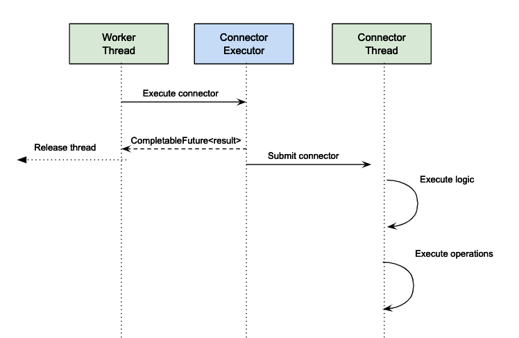
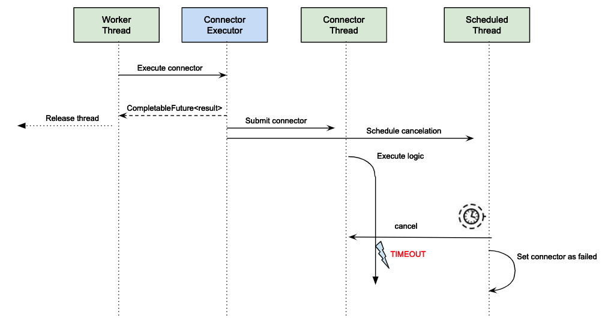

# Connectors execution

## What are connectors

Connectors are extension points that can be added to a process to extend Bonita Runtime capabilities. They are a piece of code having inputs defined as `Expressions` and outputs defined as `Operations`.

## Execution mechanism

### Diagram of the execution

Connectors execution are triggered by a `Work` and are executed in their own thread pool.

### Connector timeout

::: info
**Note:** For Enterprise, Performance, Efficiency, and Teamwork editions only.
:::

A timeout can be configured to cancel the connector execution if it takes more than a certain amount of time.

## Configuration

The size of the pool to execute connector and the timeout can be configured as described in [Connector service performance tunning page](performance-tunning.ms#connector_service)
