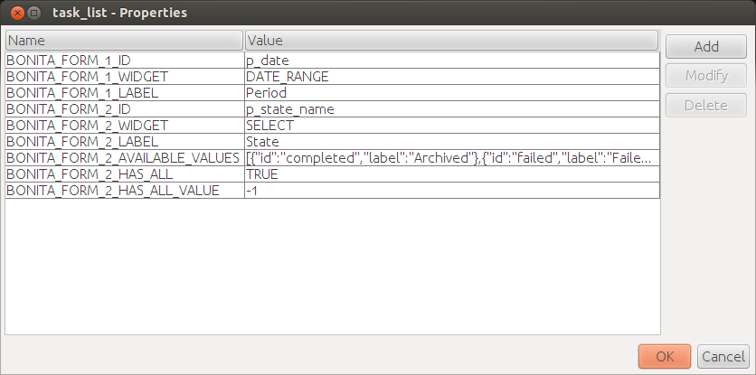

# Create a report

The final step when setting up reporting in Bonita is to create a report template using a Business Intelligence (BI) tool.

::: info
**Note:** For Enterprise, Performance, Efficiency, and Teamwork editions only.
:::

## Prerequisites

You are free to choose any BI tool to do so, but if you want to display reports inside the Bonita Portal you should design your reports using one of the following tools:

- [JasperReports iReport Designer](http://community.jaspersoft.com/project/ireport-designer) - Older stable tool in maintenance mode
- [Jaspersoft Studio](http://community.jaspersoft.com/project/jaspersoft-studio) - Newer tool

## Bonita integration guidelines and tips for Jasper reports

This documentation does not detail the use of Jaspersoft Studio but provides some guidelines for report integration in Bonita Portal. 
There are minor differences depending on which Japsersoft tool you are using, but these concern the user interface of the Japsersoft tools, not the Bonita behavior.
For details about the use of the Jaspersoft products, please refer to their documentation:

- [JasperReports iReport Designer documentation](http://community.jaspersoft.com/project/ireport-designer/resources)
- [Jaspersoft Studio documentation](http://community.jaspersoft.com/project/jaspersoft-studio/resources)

### Change the script language to Java

By default Jasper reports use Groovy as a script language. 
However, Bonita Portal does not provide Groovy dependencies to the report so you need to switch the report script language to Java.

This is how to do this for iReport:

1. In the **Report inspector** tree located on the left-hand side, select the root element.
2. In the properties table located on the right-hand side, locate the **Language** property and change it to **Java**.

### Access Bonita database

If you build a report that requires access to the Bonita database, you need to add the Bonita SQL Query Executor as a report dependency.
All queries that fetch Bonita Engine data must use this query executor.

This is how to add the query executor as a report dependency in iReport:

1. Open the **Tools** menu and select **Options**.
2. Make sure the **iReport** header is selected.
3. Select the **Query Executers** tab.
4. Click on the **_Add_** button.
5. Fill the form using the following values:

   | Field         | Value                                           |
   | :------------ | :---------------------------------------------- |
   | Language      | BONITASQL                                       |
   | Factory class | org.bonitasoft.JRBonitaJdbcQueryExecuterFactory |

    Fields Provider class (optional)com.jaspersoft.ireport.designer.data.fieldsproviders.SQLFieldsProvider

6. Click on **_OK_**.
7. Still in the **Options** window, select the **Classpath** tab.
8. Click on **_Add JAR_**.
9. Browse to your Bonita Studio installation directory and navigate to `workspace/tomcat/webapps/bonita/WEB-INF/lib/`.
10. Select the `console-server-sp-X.Y.Z.jar` file, where `X.Y.Z` is the Bonita version.
11. Click on **_Open_**.

### Add interactivity with Bonita Portal to your report

When creating a report you may need to enable Bonita Portal users to interact with it.
Bonita Portal integration of the Jasper report viewer makes interactivity possible by providing widgets that can control report parameters.
Widgets are configured directly in the Jasper report as properties.

Here is the sequence of events when an interactive Jasper report is displayed in Bonita Portal:

1. Bonita Portal reads the report properties and generates an HTML form containing the widgets.
2. The HTML code is injected as a report parameter by Bonita Portal.
3. The report renders the HTML code using the parameter.
4. The end-user can then interact with the widgets and the report is automatically re-generated if a value changes.

To enable interactivity, the first thing to do is to prepare the HTML form rendering parameter and component.

This is how to do this in iReport:

1. In the **Report Inspector** tree, right click on **Parameters** and select **Add Parameter**.
2. In the parameter properties, update the **Name** property to `BONITA_HTML_FORM`.
3. Drag and drop an **HTML** component from the **Palette** onto your report's **Title** section.
4. Select the **HTML** component that you have added.
5. In the component properties, set the **HTML Content Exp.** property to `$P{BONITA_HTML_FORM}`.

When the HTML form rendering parameter and component are ready, you need to set the report properties to configure the widgets that your report will integrate.

All widgets share the following mandatory properties (`XXX` is replaced by a number used to identify the widget):

<table>
        <tbody><tr>
                <td>Property</td>
                <td>Mandatory</td>
                <td>Description</td>
        </tr>
        <tr>
                <td>BONITA_FORM_<em>XXX</em>_ID</td>
                <td>Yes</td>
                <td>Base name of the report parameter that will be updated with the widget value.<br>
                        Special rules apply depending on the widget type (see next parameter):<br>
                        <ul>
                                <li>For a <strong>SELECT</strong> widget, the parameter name is the same as the base name.<br>
                                        Example: if <span><code>BONITA_FORM_1_ID</code></span> is set to <span><code>p_country</code></span> then, the report parameter should be named <span><code>p_country</code></span>.</li>
                                <li>For a <strong>DATE</strong> widget, the value will be saved to a parameter with the <strong>_from</strong> suffix.<br>
                                        Example: if <span><code>BONITA_FORM_2_ID</code></span> is set to <span><code>p_birthday</code></span>, then the report parameter should be named <span><code>p_birthday_from</code></span>.</li>
                                <li>For a <strong>DATE_RANGE</strong> widget, the values will be saved to two parameters: one with a <strong>_from</strong> suffix and one with a <strong>_to</strong> suffix.<br>
                                        Example: if <span><code>BONITA_FORM_3_ID</code></span> is set to <span><code>p_period</code></span>, then the two report parameters should be named <span><code>p_period_from</code></span> and <span><code>p_period_to</code></span>.</li>
                        </ul>
                </td>
        </tr>
        <tr>
                <td>BONITA_FORM_<em>XXX</em>_WIDGET</td>
                <td>Yes</td>
                <td>Widget type. Can be one of the following:
                        <ul>
                                <li><span><code>SELECT</code></span> for a drop down allowing a single selection</li>
                                <li><span><code>DATE</code></span> for a date picker</li>
                                <li><span><code>DATE_RANGE</code></span> for a date range picker with a start date and an end date</li>
                        </ul>
                </td>
        </tr>
        <tr>
                <td>BONITA_FORM_<em>XXX</em>_LABEL</td>
                <td>Yes</td>
                <td>Widget label</td>
        </tr>
</tbody></table>

The **SELECT** widget has the following extra properties:

<table>
  <tbody><tr>
    <td>Property</td>
    <td>Mandatory</td>
    <td>Description</td>
  </tr>
  <tr>
    <td>BONITA_FORM_<em>XXX</em>_AVAILABLE_VALUES</td>
    <td rowspan="2" style="vertical-align: middle;">Yes: one of these two properties is required</td>
    <td>Static list of available values defined in a JSON format.<br>
      Example: <span><code>[{"id":"FR","label":"France"}, {"id":"US","label":"United States of America"}, {"id":"ES","label":"Spain"}]</code></span>
    </td>
  </tr>
  <tr>
    <td>BONITA_FORM_<em>XXX</em>_QUERY</td>
    <td>Query that dynamically retrieves the list of available values from the Bonita database.</td>
  </tr>
  <tr>
    <td>BONITA_FORM_<em>XXX</em>_HAS_ALL</td>
    <td>No</td>
    <td>Set this to <span><code>TRUE</code></span> if you wish to dynamically add an "All" item to the list of available values. Otherwise, ignore this property.</td>
  </tr>
  <tr>
    <td>BONITA_FORM_<em>XXX</em>_HAS_ALL_VALUE</td>
    <td>Only if the "All" item is active</td>
    <td>Specifies the value returned when the "All" item is selected.</td>
  </tr>
</tbody></table>

Specifies the value returned when the "All" item is selected.

The **DATE** and **DATE_RANGE** widgets have the following extra properties:

<table>
  <tbody><tr>
    <td>Property</td>
    <td>Mandatory</td>
    <td>Description</td>
  </tr>
  <tr>
  </tr><tr>
    <td>BONITA_FORM_<em>XXX</em>_INITIAL_VALUE</td>
    <td rowspan="2" style="vertical-align: middle;">Yes:  one of these two properties is required</td>
    <td>Static initial value defined in the ISO format for the **DATE** widget<br>
        Example: <span><code>2015-01-28</code></span><br>
        Static initial values for `_from` and `_to` parameters in the ISO format separated by ` - ` for the **DATE\_RANGE** widget<br>
        Example: <span><code>2015-01-28 - 2015-02-28</code></span>
    </td>
  </tr>
  <tr>
    <td>BONITA_FORM_<em>XXX</em>_QUERY</td>
    <td>Query that dynamically retrieves the initial value from the Bonita database.</td>
  </tr>
</tbody></table>

For a **DATE_RANGE** widget, if you name the associated parameter `p_date` then `p_date_from` and `p_date_to` initial
value will automatically be set to `one week before today` and `today` respectively. Setting an initial value to this
parameter using BONITA_FORM_XXX_INITIAL_VALUE will not be taken in account.

Query that dynamically retrieves the initial value from the Bonita database.

Create the report properties using iReport as following:

1. In the **Report Inspector** tree, right click on the report's name and select **Properties**.
2. In the **More** section, configure **Properties** by clicking on **...**
3. Add the properties based on the widgets you need.

Here is an example of a report configuration containing a "Period" date range and a "State" select widget:


### Add style to HTML rendered report

To change style of your components in the HTML rendered reports, add CSS classes to them and update global Look'n'feel as described in [Bonita portal look'n'feel page](managing-look-feel.md).  

::: info  
**Note:** If a JRTX file has been packaged inside the imported zip file, it will not be used to style HTML generated reports.  
Using the global CSS look'n'feel of the Bonita Portal allows to have a consistent look'n'feel between HTML reports and Bonita Portal. 
:::

To add a CSS class to a component proceed as follow:

- In the Component properties pane, click the _Properties expression_ button
- Add a _Properties expressions_:
  - Set _Properties expressions_'s name to _net.sf.jasperreports.export.html.class_
  - Set _Properties expressions_'s value to the wanted CSS class.

Then, implement in Bonita Portal's look'n'feel the expected style for this CSS class.

Alternatively, you can also change the HTML tag name of a component by adding a new _Property_ in _Properties expressions_ named  _net.sf.jasperreports.export.html.tag_
(example: _name:_ net.sf.jasperreports.export.html.tag _value:_ h1)

### Package a report for Bonita Portal integration

In order to integrate a Jasper report in Bonita Portal, you need to prepare a ZIP archive.

The archive should contain at least the compiled Jasper report (a file with a .jasper extension).

If your report requires a connection to the reporting database, the archive must contain:

- The JDBC driver jar file used to connect to the reporting database. Do not include this file in the archive if the driver is already deployed at server level.
- A _connection.properties_ text file that contains the reporting database connection settings:

  | Property          | Description                               |
  | :---------------- | :---------------------------------------- |
  | dbUrl             | JDBC Url to access the reporting database |
  | dbDriverClassName | The JDBC driver's class name              |
  | dbUser            | The login of the database user            |
  | dbPassword        | The password of the database user         |

For example, connecting to a local MySQL database named _BonitaReport_ with a user _root_ and password _root_:

```properties
dbUrl=jdbc:mysql://localhost:3306/BonitaReport
dbDriverClassName=com.mysql.jdbc.Driver
dbUser=root
dbPassword=root
```

If your report contains sub reports, these should be placed in a directory named `sub`.

If your report uses a style sheet you may also provide a .jrtx file in the archive.

Once you have packaged the Jasper report as a ZIP archive, you can [install it in the Bonita Portal](analytics.md).
