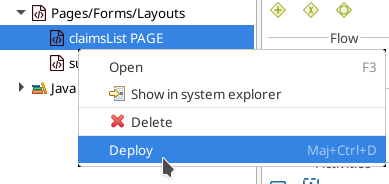
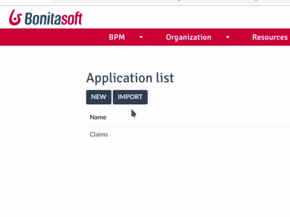

# Create an application

Creating the application is the final step of this Getting Started tutorial.

But before we actually create the application, we need to deploy our application page in the Bonita Portal:

1. In the Bonita Studio project explorer, go to **Pages/Forms/Layouts**
2. Select _claimsList_ page
3. Right click and select **Deploy**

   

Now we are ready to actually create the application. In the Bonita Community Edition, the easiest way to create an application is to use the Bonita Portal:

1. Click on the Portal icon  in the Bonita Studio tool bar
2. In the upper right corner of the window, click on the **User** drop down menu
3. Select **Administrator**
4. Click on the **Applications** tab
5. Click on the **New** button
6. Configure the application:
   - Display name: _Claims_
   - URL: _claims_
   - Version: _1.0_
   - Profile: _User_
   - Description: _Claims management application_
7. Click on the **Create** button
   

You now need to edit the application to add the previously created application page:

1. Click on the **...** icon in the **Actions** column
2. In the **Pages** section, click on the **Add** button
3. In the drop down list, select _custompage_claimsList - claimsList_
4. In **URL** type: _claims-list_
5. Click on the **Add** button
6. In the pages list, click on the **home icon** to set claims-list as the home page and delete the default home
7. We've kept this application very simple, with only a single page, so we don't need to define a navigation menu

   

You can now click on the application URL, and you'll see the application page displayed in the default application layout.

Congratulations! You have successfully created your first process and application with Bonita. If you want to learn more about Bonita components and concepts we recommend the [Bonita Camp tutorial](https://www.youtube.com/playlist?list=PLvvoQatxaHOMHRiP7hFayNXTJNdxIEiYp). Of course [official documentation](https://documentation.bonitasoft.com) is also a great place to learn more about Bonita. And remember, you can always get help and [ask questions of the Bonita Community](https://community.bonitasoft.com/questions-and-answers/). 
