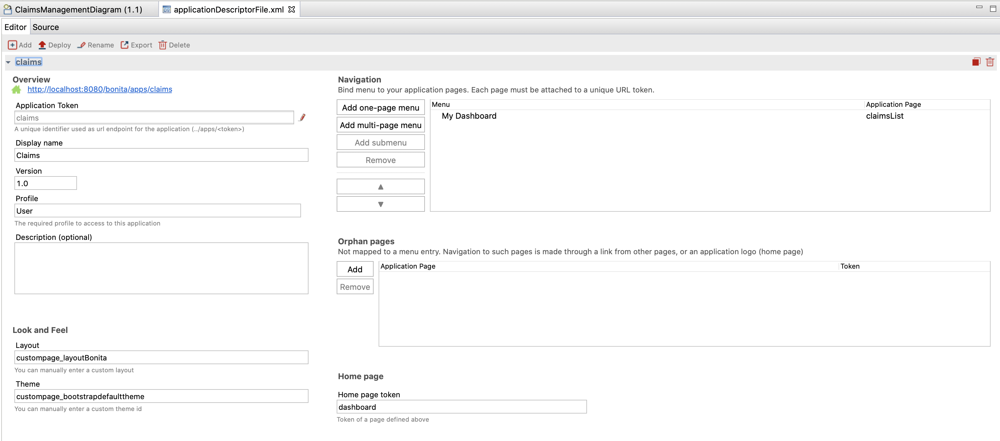
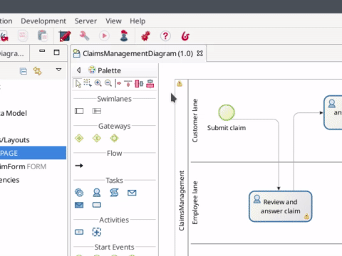
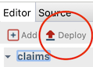

# Create an application

Creating the application is the final step of this Getting Started tutorial.

To create and deploy our first application in our local environment, the easiest way is to use the **[Application descriptor](applicationCreation.md)**. This editor helps you defining the skeleton of an application, as it contains references to resources installed in Bonita Portal and used by a given application. It will also help us deploying the application directly from Bonita Studio. 

The page you have created in the UI Designer as well as the forms have been automatically added to the project resources under **Pages/Forms/Layout**.

To create our application, we will add a new application descriptor:
1. In the Bonita Studio menu click on **Development > Application descriptors > New**
1. A guidance pop-up appears. Click on **OK** 
1. Click on **Add a new application descriptor**. In the pop-up window, type _claims_ in the **Application Token** field, and _Claims_ as **Display name**.

The `applicationDescriptorFile.xml` is initialized and the editor will help you create your application directly from Bonita Studio.

   <!--{.img-responsive .img-thumbnail}-->
   
To create an application, we will have to define: 
- The application token
- The application name
- Which profile will have access to the application
- The menu and pages of our application
- The homepage 

1. Click on the button **Add one-page menu** under **Navigation** section.
1. Type _My dashboard_ in the column **Menu**
1. Type the page name _claimsList_ in the column **Application page** 
1. Enter _dashboard_ in the column **Token**

   <!--{.img-responsive .img-thumbnail}-->

::: info
The look & Feel can be fully customized by modifying the [layout](layouts.md) and adding a custom [theme](customize-living-application-theme.md).
:::

The application is ready to be used. Now we need to deploy it in Bonita Portal:
1. Click on the icon **Deploy** 
1. Click on **Select all** button to make sure everything is deployed: test organization, business data model, process definition, application page
1. Make sure that **Clean BDM database before deployment** is not checked as we want to keep our data for testing
1. Click on **Deploy** button
1. In the **Deploy status** pop up window, click on **Close** button

   <!--{.img-responsive .img-thumbnail}-->
   
Congratulations! You have successfully created your first process and application with Bonita.

::: info
You can verify that the application has been created in Bonita Portal.
1. Click on the Portal icon  in the Bonita Studio tool bar.
1. In the upper right corner of the window, click on the **User** drop down menu
1. Select **Administrator**
1. Click on the **Applications** tab
You will see the application _Claims_ that you have just deployed listed in the **Applications list**. If you click on the URL, _My Dashboard_ page will be displayed in your brower.
:::

If you want to learn more about Bonita components and concepts we recommend the [Bonita Camp tutorial](https://www.youtube.com/playlist?list=PLvvoQatxaHOMHRiP7hFayNXTJNdxIEiYp). Of course [official documentation](https://documentation.bonitasoft.com) is also a great place to learn more about Bonita. If you prefer to learn from examples, you can find several on the [community website](https://community.bonitasoft.com/project?title=&field_type_tid=3869). And finally, remember that you can always get help and [ask questions of the Bonita Community](https://community.bonitasoft.com/questions-and-answers/).
