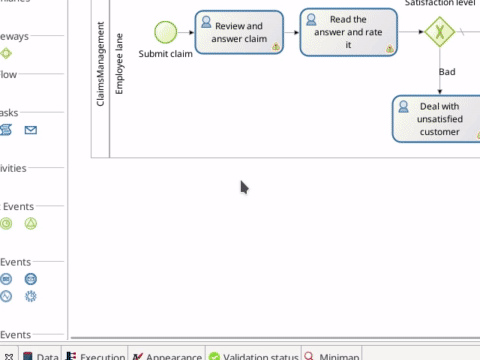
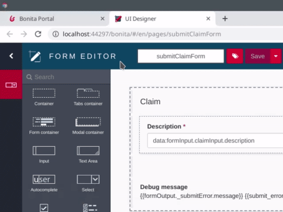

# Create web user interfaces (forms)

Generally, a user usually drives process execution using web interfaces. Bonita provides [the UI Designer](ui-designer-overview.md) to easily create such interfaces.

::: info
The standard workflow would be to:
- Create the Business Data Model
- Add business variables to the process definition
- Generate contracts based on business variables
- Generate Bonita forms based on contracts

If you have been following this Getting Started tutorial, you have already done the first three steps. Now it's time to create the forms.
:::

Start with the process instantiation form:
1. Select the process pool
1. Go to **Execution > Instantiation form**
1. Click on the pencil icon next to **Target form**. It will create a new form based on the contract (if the form does not already exist) and open the UI Designer in your web browser
1. Rename the form from _newForm_ to _submitClaimForm_
1. Click on **Save** to save the form with its new name

   <!--{.img-responsive .img-thumbnail}-->

Customize the form appearance. For example, you can switch from a one line text widget to a text area widget:
1. Select the _Description_ widget by clicking on it
1. In the **Widget properties**, on the right hand side of the window, click on the **...** icon and select **Switch...**
1. In the drop down list select **Text Area**
1. Click on **Show properties**
1. Click on **Switch**
1. Click on **Save** to save your modifications

   <!--{.img-responsive .img-thumbnail}-->

::: info
The [switch menu option](widgets.md) can be used to replace one widget with another one while keepiing the current configuration.
:::

You can now go back to Bonita Studio and create the form for the _Review and answer claim_ user task:
1. Select the task
1. Go to **Execution > Form**
1. Click on the pencil icon next to **Target form**. It will create a new form based on the contract (if the form does not already exist) and open the UI Designer in your web browser
1. Answer **Yes** to the question presented. This will add widgets to view all the attributes of the business variable in the form
1. Rename the form from _newForm_ to _reviewAndAnswerForm_
1. Select the _Satisfaction Level_ widget and use the delete key to remove it as you don't want it in this form
1. Click on **Save** to save your modifications

Do the same set of operations with the form for _Read the answer and rate it_ task:
1. Set the form name to _readAnswerAndRateItForm_
1. Leave all widgets as is, as you want to display both the claim description and the answer, and allow the user to provide a satisfaction level

Execute this new process version and see that the form still offers the option to capture the data required by the contract, but now also displays the data provided at the process start and in previous steps.

In the [next chapter](define-who-can-do-what.md) you'll assure that individual tasks can only be performed by appropriate users.
