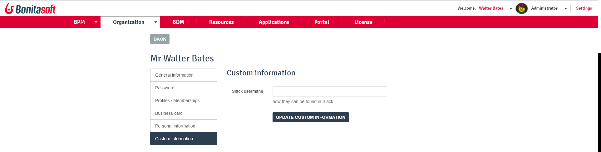

# Custom User Information Management

This page explains what a user with the _Administrator_ profile in Bonita Portal or in the [Bonita Administrator Application](admin-application-overview.md) can see and do with custom information [created at development time](custom-user-information-in-bonita-bpm-studio.md) about the users.  

Administrators can view and update Custom User Information.

Here is a view of this page:
<!--{.img-responsive}-->

## Overview
Custom User Information -CUI) account for additional information than the provided information defined in Bonita Studio to describe users. This may be needed to define the right actors for a human task. 
Each CUI is defined in Bonita Studio organization, and used in the specific _Users with custom information_ provided actor filter in Bonita Studio.  
CUIs are also displayed in Bonita Portal, in the _More_ page of a user.  
This allows the Administrator to edit the values of a CUI for a given user, and by this means change the actor mapping.  
The Administrator cannot create a CUI nor edit a CUI definition.

::: info
**Note**: if no customer user definitions are set in Bonita Studio, then no information will be displayed in Bonita Portal.  
However, definitions can be created and edited using the [Web REST API](customuserinfo-api.md).  
The Organization .xml file can also be exported from Bonita Portal, modified by hand externally, and then re-imported back into Bonita Portal, although we strongly advise to always modify resources from the development environment and then deploy iteratively on the test environments until the Production environment.
:::

See [Custom User Information in Bonita Studio](custom-user-information-in-bonita-bpm-studio.md)

## View / Edit custom information for a user

1. Go to _Organization_/_Users_.
1. Click on a user.
1. Click on _More_.
1. Click on _Custom information_.
1. In the information to edit, enter a value for the definition (defined in Bonita Studio), which will only be added to this user.
1. Click _Update custom information_.

Note that changing the value will modify the filtering and may map the user to different tasks.
