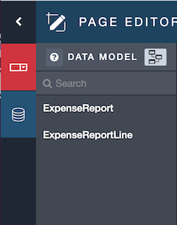
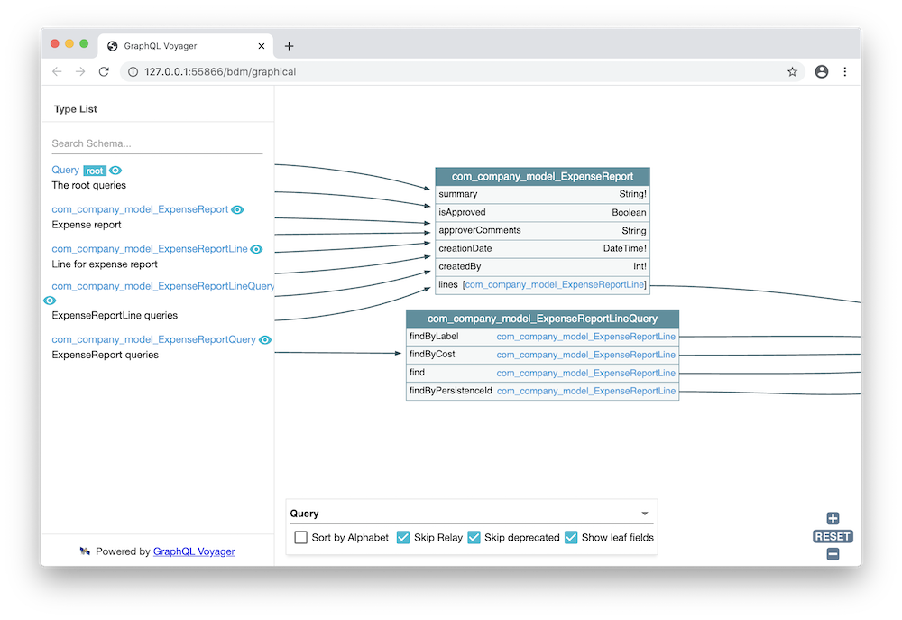
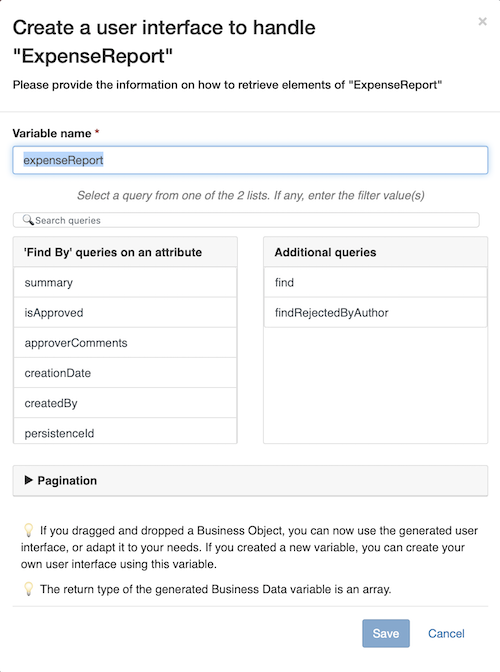

# Data Management in the UI Designer

Discover how to explore [Business Data Model](define-business-data-model.md) (BDM) objects in the UI Designer, and use it to create user interfaces and variables.

A **Data Model** tab is available from the Palette of the Page editor:

## Exploring the BDM
From the Data Model tab, the graph icon allows you to visualize and explore the BDM.
A graphical view of the relationships between business objects (with their attributes) is displayed in a new tab of your browser.
The left part provides a way to explore the BDM tree, or search a specific object or attribute.
You can use also the graphical view to explore the model.

Once you know which business object you want to use, you can either:
 - Generate a user interface,
 - Create a Business data variable and create yourself your user interface

## Create a user interface from a Business Object
Drag and drop a Business Object in the whiteboard.
A configuration wizard appears: provide information on how to retrieve elements of this Business Object.
You can find information on how to use this wizard from the [Business Data Variables](variables.md) page.

A user interface is generated. It follows the master/details pattern: a Table widget is displayed with all the object instances, and the details are shown when a line is selected.
The details section map each Business Object attribute to a corresponding widget (for instance, an Input widget for an attribute of type String).
If you need another widget for an attribute, you can [switch the widget](widgets.md).
A set of variables are generated as well, to allow the user interface to operate.

::: info
Notes:
- All the widgets are in read-only mode since the purpose here is to visualize data
- The pagination is not handled by the generated interface
:::

You can try it with the Preview, and modify it as needed.

## Create a variable from a Business Object
Create a new variable from the Variables panel and select BusinessData as a type.
A configuration wizard appears (see the instructions just above).
Once the variable is created, you can create your own user interface using this variable.

