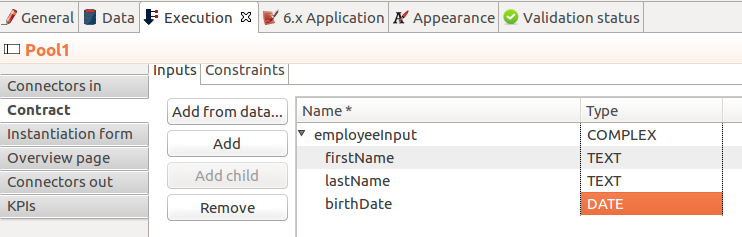
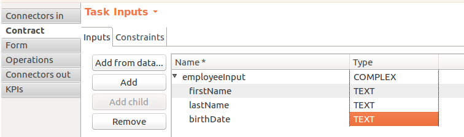

# Manage dates in BDM and User Interfaces

::: info
This howto applies to Bonita BPM versions prior to 7.5.0
:::

Up to versions 7.4.x, only date selection is supported natively in the UI Designer using the **Date picker** widget. So this page will only focus on date management (not date and time).

::: warning
If you only use the API to retrieve dates, and you do not need to query the business data database directly, you can safely use the type **DATE** for your business objects.

If you need to query the database directly, use the type **STRING** instead of **DATE**. Otherwise the time zone of the server will be used when converting the java Date in an SQL **TIMESTAMP** and, unless your server is configured in UTC, an offset will be applied. Therefore, the value stored in the database will not reflect the date entered by the user.
:::

The following sections show how to create, update, and display an *Employee* object with a birth date stored either as a DATE or a STRING in the BDM.

## Business object with DATE attributes

#### Define the business data

1. In the studio, open the Business Data Model editor (in menu **Development** > **Business Data Model** > **Manage...**)
1. Create a **business object** *Employee* with an attribute *birthdate* of type **DATE**. (It uses  `java.util.Date` as Java type)
1. Create a new process
1. In the process **Data** tab, create a new **business variable** *employee* of type *Employee*

#### Define the contract at pool level, as well as the script to initialize the business variable

1. In the process **Execution** tab > **Contract** section, define the contract inputs using the **Add from data...** button
1. Select the business variable *employee*
1. Follow the steps to generate a contract with a COMPLEX input *employeeInput* containing a *birthdate* attribute of type **DATE** (keep the option to generate the variable initialization script automatically)

 <!--{.img-responsive .img-thumbnail}-->

#### Generate the process instantiation form

1. In the process **Execution** tab, **Form** section, generate the form by clicking on the **pencil** icon
1. Since you have a **DATE** attribute in the contract inputs, a **Date picker** widget is automatically added to the form
The form is already configured correctly.

#### Define the contract at task level, as well as operations to update the business variable

1. Rename the first task to *Update birth date*
1. In the task **Execution** tab > **Contract** section, define the contract inputs using the **Add from data...** button
1. Select the business variable *employee*
1. Follow the steps to generate a contract with a COMPLEX input *employeeInput* containing a *birthdate* attribute of type **DATE** (keep the option to generate the operations automatically)

#### Generate the 'Update' task form

1. In the task **Execution** tab, **Form** section, generate the form by clicking on the **pencil** icon
1. Since you have a **DATE** attribute in the contract inputs, a **Date picker** widget is automatically added to the form
1. In the UI Designer, define a variable to retrieve the *Employee* currently stored using the context:
   1. In the **Variables** panel at the bottom of the editor, click on **Create a new variable**
   1. Enter the name *employee* for the new variable
   1. Select the **type** *external API*
   1. Set the **API URL** of the variable to  `../{{context.employee_ref.link\}}` 

FYI, The value returned by the REST API for the birth date will be a Long number value (Milliseconds since Unix Epoch).
 <!--{.img-responsive .img-thumbnail}-->
1. Set the **Value** of the **Date picker** widget to `employee.birthdate`
1. Update the variable *formOutput*  to change its value to:
`return {
	'employeeInput': $data.employee
};`
1. You can delete the variable *formInput*

::: info
The **Value** property of the **Date picker** supports the following input types:
* [ISO 8601](https://en.wikipedia.org/wiki/ISO_8601) string variables (with or without time information)
* Date objects
* Long number values (Milliseconds since Unix epoch)

However, the output **Value** is always a Javascript Date object. So it will change the type of the variable bound to the widget **Value** to a Date object when the user selects a date.

When sent in the JSON body of a request, the widget value is serialized into an ISO 8601 formatted String variable with the time set to midnight UTC (e.g., 2016-12-31T00:00:00.000Z).
And since the contract input is of type **DATE**, the ISO 8601 formatted string will be automatically converted into a `java.util.Date` by the task execution REST API.
:::

#### Retrieve the date from the database and display it

In another step form (or in any other page) you may want to retrieve the date and display it.
In order to do so:
1. Create a new task named *Review birth date* after the existing one
1. In the task **Execution** tab, **Form** section, generate the form by clicking on the **pencil** icon
1. In the UI Designer, define a variable to retrieve the *Employee* currently stored using the context.
In order to do so, proceed the same way as you did for the previous step form:
   1. In the **Variables** panel at the bottom of the editor, click on **Create a new variable**
   1. Enter the name *employee* for the new variable
   1. SSelect the **type** *external API*
   1. Set the **API URL** of the variable to  `../{{context.employee_ref.link\}}` 
1. From the **Form editor** palette, drop a **Date picker** widget on the whiteboard
1. Set the property **Read-only** to *yes*
1. Set its **Value** to  `employee.birthdate`

You may prefer to display it in some text. In order to do so:
1. Drop a **Text** widget on the whiteboard
1. Replace the default **Text** property value with an expression using a *[date](https://docs.angularjs.org/api/ng/filter/date)* filter to format the date the way you want. E.g.,  `{{employee.birthdate | date:'MM/dd/yyyy':'UTC'\}}` 

 <!--{.img-responsive .img-thumbnail}-->

You can now run your process and see that the date retrieved from the business data database is consistent with the date you chose in the previous step.

## Business object with STRING attributes

#### Define the business data

1. In the studio, open the Business Data Model editor (in menu **Development** > **Business Data Model** > **Manage...**)
1. Create a **business object** *Employee* with an attribute *birthdate* of type **STRING**
 <!--{.img-responsive .img-thumbnail}-->
1. Create a new process
1. In the process **Data** tab, create a new **business variable** *employee* of the type *Employee*

#### Define the contract at pool level, as well as the script to initialize the business variable

1. In the process **Execution** tab > **Contract** section, define the contract inputs using the **Add from data...** button
1. Select the business variable *employee*
1. Follow the steps to generate a contract with a COMPLEX input *employeeInput* containing a *birthdate* attribute of type **TEXT** (keep the option to generate the variable initialization script automatically)

 <!--{.img-responsive .img-thumbnail}-->

::: info
You can truncate the ISO 8601 formatted String received from the contract input to only keep the date and drop the time information that is not relevant.
To do so, apply a substring on the contract input in the process variable initialization script (e.g.,  `birthDate.substring(0, 10)`)
:::

#### Generate the process instantiation form

1. In the process **Execution** tab, **Form** section, generate the form by clicking on the **pencil** icon
1. Since you chose the type **TEXT** for the date contract input, a text **Input** widget will be added to the page for the contract input instead of a **Date picker** widget.
You will need to add and configure the **Date picker** widget yourself in order to replace the text input widget:
   1. From the **Form editor** palette, drop a **Date picker** widget on the whiteboard
   1. Set the **Date picker** widget **Value** property to the same **Value** as the text **Input** widget (`formInput.employee.birthdate`)
   1. Set the **Date picker** widget **Label** property to *Birth date*
   1. Remove the text **Input** widget

::: info
The **Value** property of the **Date picker** widget supports inputs of the following types:
* [ISO 8601](https://en.wikipedia.org/wiki/ISO_8601) String variables (with or without time information)
* Date objects
* Long number values (Milliseconds since epoch)

However, the output of the widget is always a Javascript Date object. So it will change the type of the variable bound to the widget **Value** to a Date object when the user selects a date.

When sent in the JSON body of a request, the widget value is serialized into an ISO 8601 formatted String variable with the time set to midnight UTC (e.g., 2016-12-31T00:00:00.000Z).
And if the contract input is of type **TEXT**, the ISO 8601 formatted string will remain unmodified by the process instantiation REST API.
:::

#### Define the contract at task level, as well as operations to update the business variable

1. Rename the first task to *Update birth date*
1. In the task **Execution** tab > **Contract** section, define the contract inputs using the **Add from data...** button
1. Select the business variable *employee*
1. Follow the steps to generate a contract with a COMPLEX input *employeeInput* containing a *birthdate* attribute of type **TEXT** (keep the option to generate the operations automatically)

::: info
You can truncate the ISO 8601 formatted String received from the contract input to only keep the date and drop the time information that is not relevant.
To do so, apply a substring on the contract input in the birth date setting operation script (e.g.,  `birthDate.substring(0, 10)`)
:::

 <!--{.img-responsive .img-thumbnail}-->

#### Generate the 'Update' task form

1. In the task **Execution** tab, **Form** section, generate the form by clicking on the **pencil** icon
1. Since you chose the type **TEXT** for the date contract input, a text **Input** widget will be added to the page for the contract input instead of a **Date picker** widget.
You will need to add and configure the **Date picker** widget yourself in order to replace the text input widget:
   1. From the **Form editor** palette, drop a **Date picker** widget on the whiteboard
   1. Set the **Date picker** widget **Label** property to *Birth date*
   1. Remove the text **Input** widget
1. In the UI Designer, define a variable to retrieve the *Employee* currently stored using the context:
   1. In the **Variables** panel at the bottom of the editor, click on **Create a new variable**
   1. Enter the name *employee* for the new variable
   1. Select the **type** *external API*
   1. Set the **API URL** of the variable to  `../{{context.employee_ref.link\}}` 
FYI, The value returned by the REST API for the birth date will be an ISO 8601 formatted String (e.g. "1983-01-13T00:00:00.000Z" or "1983-01-13" if you applied the substring to truncate the widget output).
 <!--{.img-responsive .img-thumbnail}-->
1. Set the **Value** of the **Date picker** widget to  `employee.birthdate`
1. Update the variable *formOutput*  to change its value to:
`return {
	'employeeInput': $data.employee
};`
1. You can delete the variable *formInput*

::: info
When sent in the JSON body of a request, the **Date picker** widget value is serialized into an ISO 8601 formatted String variable with the time set to midnight UTC (e.g., 2016-12-31T00:00:00.000Z).

The ISO 8601 formatted string will remain unmodified by the task execution REST API if the contract input is of type **TEXT**.
:::

#### Retrieve the date from the database and display it

In another step form (or in any other page) you may want to retrieve the date and display it.
In order to do so:
1. Create a new task named *Review birth date* after the existing one
1. In the task **Execution** tab, **Form** section, generate the form by clicking on the **pencil** icon
1. In the UI Designer, define a variable to retrieve the *Employee* currently stored using the context.
In order to do so, proceed the same way as you did for the previous step form:
   1. In the **Variables** panel at the bottom of the editor, click on **Create a new variable**
   1. Enter the name *employee* for the new variable
   1. Select the **type** *external API*
   1. Set the **API URL** of the variable to  `../{{context.employee_ref.link\}}` 
1. From the **Form editor** palette, drop a **Date picker** widget on the whiteboard
1. Set the property **Read-only** to *yes*
1. Set its **Value** to  `employee.birthdate`

You may prefer to display it in some text. In order to do so:
1. Drop a **Text** widget on the whiteboard
1. Replace the default **Text** property value with an expression using a *[date](https://docs.angularjs.org/api/ng/filter/date)* filter to format the date the way you want. E.g.,  `{{employee.birthdate | date:'MM/dd/yyyy':'UTC'\}}` 

 <!--{.img-responsive .img-thumbnail}-->

You can now run your process and see that the date retrieved from the business data database is consistent with the date you chose in the previous step.

:::info
Note about the date filter provided by Angular JS:

* If you chose to store the date with a DATE type, the value returned by the REST API will be a Long number value (Milliseconds since Unix Epoch).
* If you chose to store the date with a STRING type, the value returned by the REST API will be an ISO 8601 formatted String.

Whether you chose one solution or the other, you can use the [date filter](https://docs.angularjs.org/api/ng/filter/date) to format the date the way you want. It works the same way with a Long number value or an ISO 8601 String value. Make sure you set the time zone parameter to UTC so that the browser time zone is not used to format the date and you get the same date as the one that was selected with the date picker in the previous step. For example `{{employee.birthDate | date:'MM/dd/yyyy':'UTC'\}}` 
:::

