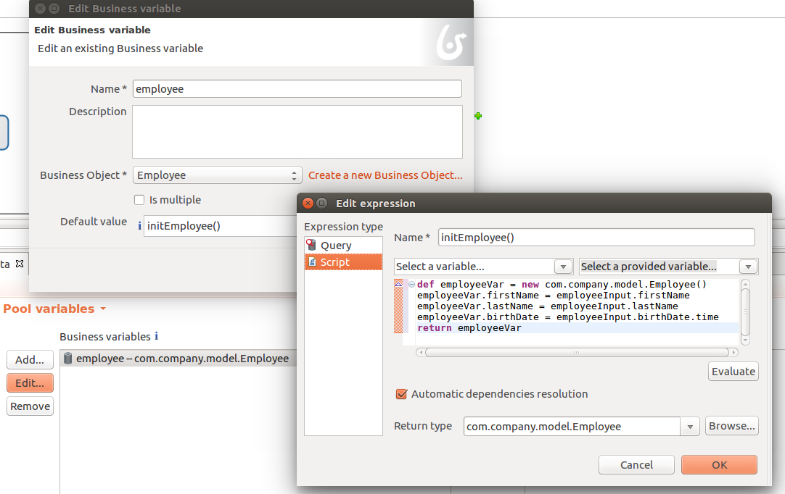

# How to work with dates in forms and BDM

Currently (until versions 7.4.x), only date selection is supported natively in the UI Designer date picker widget. So this page will only focus on date management (not date and time).

## Define your BDM data

Start by defining your business data model.

It is recommended that you define the date attributes of your business data Objects with a **LONG** type instead of DATE if you want the value stored in the database to reflect the date entered by the user. Otherwise the timezone of the server will be used when converting the java date in an SQL date and, unless your server is configured in UTC, an offset will be applied. This will not be an issue if you do not query the business data database directly and only use the API (as the same conversion will be performed the other way around when retrieving the value from the database). In this case, you can safely use a DATE attribute type.

 <!--{.img-responsive .img-thumbnail}-->

Then, in the process, create a new business variable of the type of you business object.

 <!--{.img-responsive .img-thumbnail}-->

## Define the contract and task operations or business variable initialization script

Now you need to define the *process instantiation* or *task execution* contract (depending on your use case).  
The date picker widget output is an ISO 8601 formatted String ("2017-01-13T00:00:00.000Z") that will be automatically formatted to a java.util.Date by process instantiation or task execution REST API if the contract input is of type **DATE**. The date/time received will be considered as UTC. The time is set to midnight by the widget as it doesn't handle time.  
The next steps depends on the way you store dates in the BDM:

### For LONG typed date attributes
In the process/task contract section, define the contract inputs using DATE inputs for the dates you want to retrieve from the form and store in the business data database.

 <!--{.img-responsive .img-thumbnail}-->

::: warning
If you prefer, you can use the "Add from data" feature to generate the contract and task operations/business variable initialization script.  
But if you used the **LONG** type instead of DATE type in the BDM for the date attribute, you will need to update the contract inputs to change their types from LONG to DATE and in the operations or in the business variable initialization script, you need to perform a `.getTime()` (or just `.time` in groovy) on the DATE contract inputs in order to obtain a Long value (Milliseconds since Unix Epoch) before calling the business variable setter method (which expects a Long).
:::

Then create the task operations or business variable initialization script if you didn't generate them.  
The business variable initialization script should look like this (notice the `.time` to convert from Date to Long):

 <!--{.img-responsive .img-thumbnail}-->

The task operations should look like this (notice the `.time` to convert from Date to Long):

 <!--{.img-responsive .img-thumbnail}-->

### For DATE typed date attributes
If you used the **DATE** type in the BDM for the date attributes you can directly use the "Add from data" in the contract definition section of the process/task to generate the contract and script/operations from the business variable. There is no conversion to perform.

## Generate the form from the contract

Once the contract is defined, you can generate the UI designer form by clicking on edit in the form section of the process/task execution tab.  
The date picker widgets will be automatically added to the page based on the contract. There is no other operation to perform.  
If you prefer to design your form manually, just keep in mind that the input expected in the contract for the dates is an ISO 8601 formatted String ("2017-01-13T00:00:00.000Z" or "2017-01-13T00:00:00Z" or "2017-01-13T00:00:00" or "2017-01-13").

## Retrieve the date from the database and display it

In another step form (or in any other page) you may want to retrieve the date and display it.  
In order to do that, you need first to define a new variable of type external API to retrieve the object containing the date attribute using the context:

 <!--{.img-responsive .img-thumbnail}-->

Whether you chose to store the date with a DATE type or a LONG type, the value returned by the REST API will be the same: Long value (Milliseconds since Unix Epoch).  
You can directly set it as the value of a date picker widget, but you may prefer to display it in some text. In that case, you can use the [date filter](https://docs.angularjs.org/api/ng/filter/date) to format the date the way you want. Make sure you set the timezone parameter to UTC so that the browser timezone is not used to format the date and you obtain the same date as the one that was selected with the date picker in the previous step. For example `{{employee.birthDate | date:'MM/dd/yyyy':'UTC'}}`

 <!--{.img-responsive .img-thumbnail}-->

You can now run your process and see that the date retrieved from the business data database is consistent with the date you chose in the previous step.

