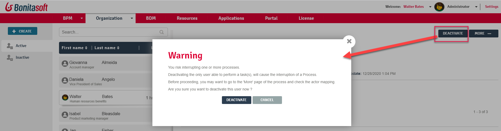

# Administrator User activation / deactivation in Bonita Portal

This page explains what a user with the _Administrator_ profile in Bonita Portal can see and do about the activation and deactivation of a user.  
Activation / deactivation of a user allows to revoke any access to the platform, without deleting the user.  
If a user is deactivated, they cannot log in to Bonita Portal. However, all their past actions are kept intact and can be displayed.

::: info
The Administrator cannot add a membership to a deactivated user.
In consequence, the _Add membership_ button is not displayed for an inactive user.
:::

Here is a view of this page:
<!--{.img-responsive}-->

## Deactivate a user
1. Go to_Organization_/_Users_.
2. Select a user in the _Active_ list.
3. Click on _Deactivate_.
4. Confirm the deactivation
The user is then moved from the Active list to the Inactive list.

## Reactivate a deactivated user
1. Go to_Organization_/_Users_.
2. Select a user in the _Inactive_ list.
4. Click on _Activate_.
The user is moved from the _Inactive_ list to the _Active_ list.
