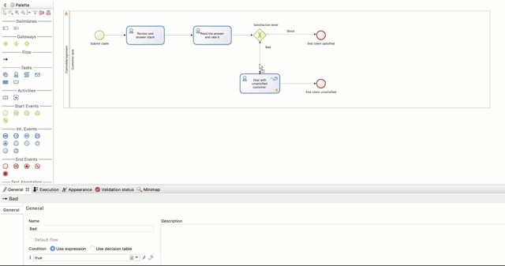

# Declare business variables

In order for your process to be able to perform operations on business data such as the classical create, read, update and delete operations, you need to include business variables in your process definition.

In our process we will deal with a single object: a claim. The claim object will store information about the claim itself (i.e. its description), the provided answer and a satisfaction level. To declare a business variable:

1. Select the process pool, the rectangle shape that includes start events and tasks.

   <!--{.img-responsive .img-thumbnail}--> 

2. At the bottom of the Bonita Studio screen, go to **Data > Pool variables**
3. Click on the **Add...** button next to **Business variables**
4. Type the name of the business variable: _claim_ (lower case)
5. Select the **Business Object**: _Claim_
6. Click on **Finish** button

   <!--{.img-responsive .img-thumbnail}-->

Now that a business variable is declared, we can use it in our transition condition definition:

1. Select the transition connecting the _Satisfaction level_ gateway with _Deal with unsatisfied customer_
2. Go into the **General > General** tab
3. In **condition** click on the pencil icon
4. Select **Script** in **Expression type** on the left hand side of the pop-up window
5. Type the Groovy script: `claim.satisfactionLevel < 3`
6. Click on **OK** button

   <!--{.img-responsive .img-thumbnail}-->

::: info
The script configured for the transition condition will return `true` if satisfaction level given is lower than 3, as the transition to _Deal with unsatisfied customer_ will be activated.
:::

::: info
Our business variable is never initialized so it will remain empty. They are several different options available to initialize a business variable:

- business variable default value
- operation on a task
- connector output

We will use the first and second options in the upcoming chapters.
:::

At this stage of the process definition, if you try to execute it, you will not see any difference in the process instantiation form and user task forms. Only the process overview form is different, now listing the business variable but with no associated value.

You are now ready to move to the [next chapter](declare-contracts.md) and start collecting user inputs from forms. They will go through [contracts](declare-contracts.md) and can finally be stored in business variables.
