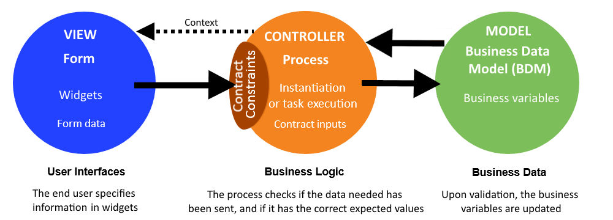
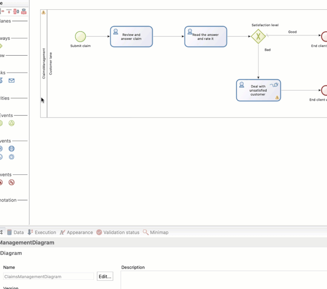
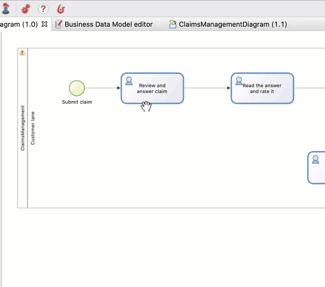
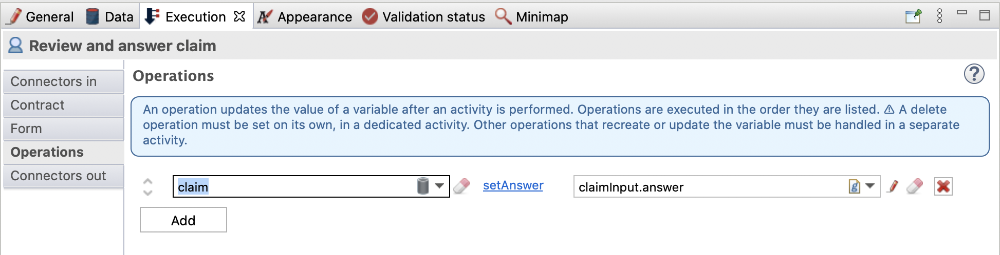

# Declare contracts

So far our process defines a sequences of events and tasks, and declares a business variable that it will instantiate and update when executed.  
We want to instantiate our `claim` business variable using the description provided by the customer when they start the process. We will also need to update the claim with the answer provided by the employee and with the satisfaction rating provided by the customer. We need a way to collect information from the user and store it in the business variable. This is achieved using the user interfaces (web forms by default in Bonita) and based on another concept: [contract](contracts-and-contexts.md).

A contract defines the data expected from the user to start a process (instantiation contract) or to execute a user task (task contract). By default Bonita offers a solution to easily build forms (_[see next chapter](create-web-user-interfaces.md)_) to allow the user to view and provide data. 
When submitted, forms will ask the Bonita Engine to start a process or execute a task using provided data that must match what is expected by the contract, as described on this diagram:

 

As our contract information will be used to set business variable values, we can use a wizard that will generate the contract based on the business variable. This wizard sets the business variable default value and generates task operations.

Create the contract for process instantiation:
1. Select the process pool
1. At the bottom of the Bonita Studio window go to the **Execution > Contract > Inputs** tab
1. Click on the **Add from data...** button
1. Leave the default options selected (_Business variable_, _Instantiate_, _claim_, _claimInput_)
1. Click on the **Next** button
1. Select only the _description_ (uncheck _answer_, _satisfactionLevel_)
1. Click on **Finish**
1. You can ignore the information message and click on **OK** button

   <!--{.img-responsive .img-thumbnail}-->

::: info
You now have a contract named _claimedInput_ of type "COMPLEX" with one attribute, _description_ of type "TEXT". 
:::

Also, as the description is mandatory, you can see in **Execution > Contract > Constraints** tab that a validation rule has been created to make sure that we get a value for the description. Finally, if you edit the _claim_ business variable, you can see that a script has been generated for you to set the variable default value. Setting this value will trigger an insert in the `CLAIM` table created for you in the business data database managed by Bonita.

Now let's create the contract for the user task _Review and answer claim_:
1. Select the task _Review and answer claim_
1. At the bottom of the Bonita Studio window go to **Execution > Contract > Inputs** tab
1. Click on the **Add from data...** button
1. Select Data: _Business variable_, Action: _Edit_, and leave other options with their default values
1. Click on the **Next** button
1. Select only the _answer_ (uncheck _description_, _satisfactionLevel_)
1. Click on the **Finish** button
1. You can ignore the information and warning messages and click on the **OK** button

   <!--{.img-responsive .img-thumbnail}-->

::: info
We now have a contract for the step. This contract does not create a new claim but rather updates an attribute of the claim (the claim is created when we start the process). 
The attribute update is performed by an operation (generated for you) on the task. Select **Execution > Operations** to view the operation that updates the _answer_ attribute, as you can see on the image below:

   <!--{.img-responsive .img-thumbnail}-->
:::

Create the contract for _Read the answer and rate it_ task:
1. Do exactly as you did for _Review and answer claim_ task 
1. Select _satisfactionLevel_ as the attribute to use in the contract

You can now click on the Bonita Studio **Run** button to deploy and execute this updated version. You will see that you get auto-generated forms based on the contract. In the overview form, you will see the data being stored in the business variable. Note that a form will not display previously captured data. We will address that in the [next chapter](create-web-user-interfaces.md).
