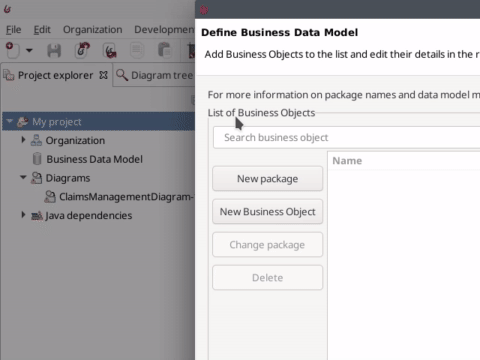

# Define business data model (BDM)

The Bonita platform provides a means to define, manipulate and store your business data. This data management service will create Java objects to allow data manipulation, database tables for storage, and all operations required to get the data from your process into the database and vice versa.

Data management involves several steps:
- Create the [Business Data Model (BDM)](define-and-deploy-the-bdm.md). This is the definition of the types of data you will deal with in your processes and applications.
- Declare [business variables](specify-data-in-a-process-definition#toc4) in the process definition. Variables are used to make the link between your process definition and the data it needs to create, read, update, and delete. Data can be created as part of process execution (on start or on a task) but processes can also read and update data created by other processes and of course can choose to delete data.
- Define process and task [contracts](contracts-and-contexts.md). Contracts define the information process accepts from the user submitting the form.

In this chapter we will focus on the creation of the Business Data Model (BDM) only. Declaration of business variables is part of the next chapter. 
You can read the chapter about [data handling](data-handling-overview.md) for more information on data management. 

In Bonita Studio, create a BDM:
1. Go to **Development > Business Data Model > Define...** menu

  <!--{.img-responsive .img-thumbnail}-->
  
1. Click on **Add** button
1. Type the object name _Claim_ (objects name must always start with an uppercase letter)
1. In the **Attributes** tab, click on **Add** button
1. Add 3 attributes (attributes name must always start with a lowercase letter):
  1. _description_ of type _STRING_ and _mandatory_ (check the checkbox in the **mandatory** column)
  1. _answer_ of type _STRING_, _optional_
  1. _satisfactionLevel_ of type _INTEGER_, _optional_
  
  <!--{.img-responsive .img-thumbnail}-->
  
1. Click on **Finish** button

::: info
**Mandatory** on a object attribute means that the object cannot be created with an empty value. If the **mandatory** option is not checked, it means that an object can be created with an empty value, for the attribute "not mandatory" (i.e. optional). In our example, the _answer_ attribute is optional because at process start it will be empty. Later in the process execution, an employee will provide an answer and doing so will be mandatory (but this will not be enforced by BDM definition).
:::

::: warning
When you edit the BDM in Bonita Studio, it is always recommended to reset the database after doing any modification on the model. Check the checkbox "Reset BDM database," available in the pop-up window display when you validate your modifications.
:::

::: info
When you click on the "Finish" button three different operations are performed:
- BDM definition is saved in your project (under **Business Data Model** category)
- Java classes are generated, compiled, packaged and the resulting jar file is added to your project (under **Java dependencies** category)
- Tables are created in the Bonita Studio embedded test database

:::

Now you have a fully functional business data management model. You are ready to move to the next chapter and [start populating the database with data collected by the process](declare-business-variables.md). 

::: info
Bonita Studio uses h2 to provide the database for testing. (We recommend you to use other types of databases such as Oracle, PostgreSQL, MySQL and SQL Server for production). Bonita Studio provides two database schemas: one for the Bonita Engine and one dedicated to BDM. 
You can view the tables created in the h2 BDM database by clicking on **Development > Business Data Model > Browse data (h2 console)...**. In the h2 console (a web interface) you can see that a table named "CLAIM" was created. You can run an SQL query such as `SELECT * FROM CLAIM` which should return an empty result as there is no data yet.  
You can also [explore the BDM database schema](data-management#toc0) by clicking in the Bonita Studio menu on **Development > Business Data Model > Explore model (GraphQL voyager)...**. 
:::
