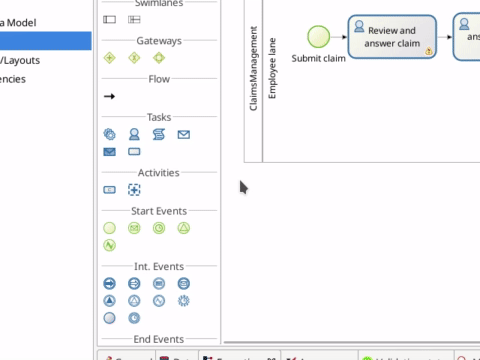
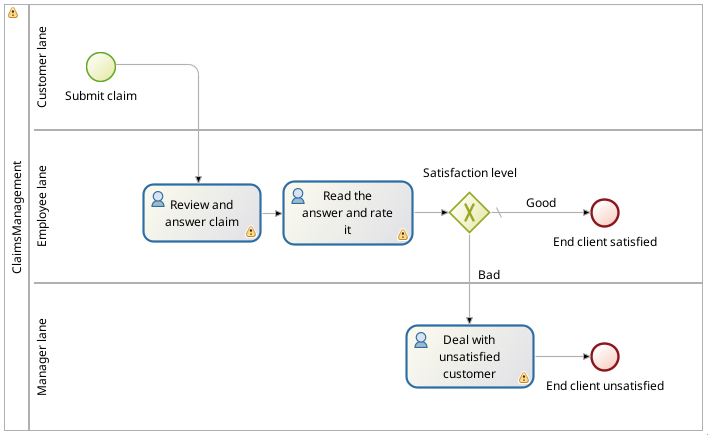
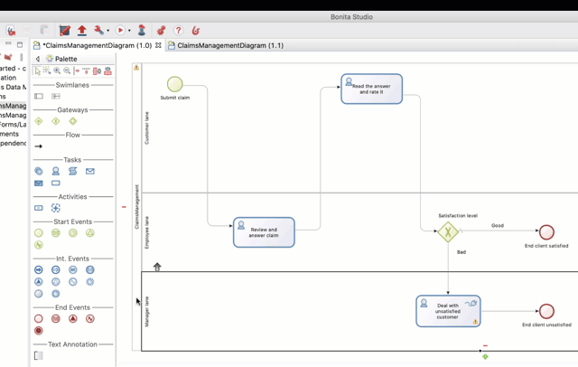
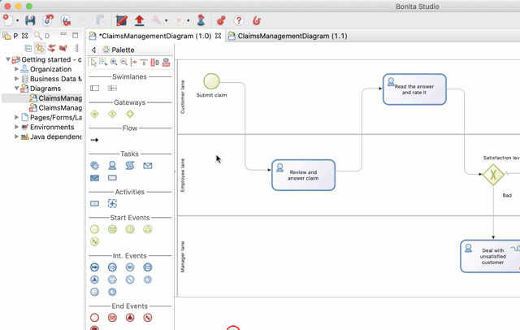
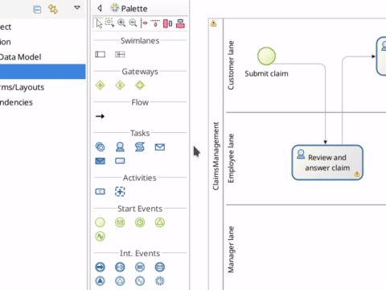
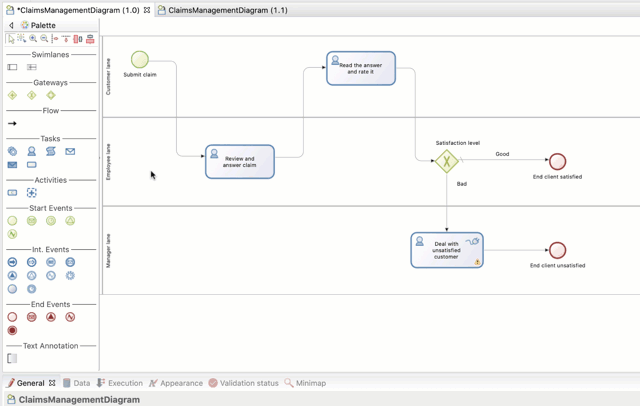
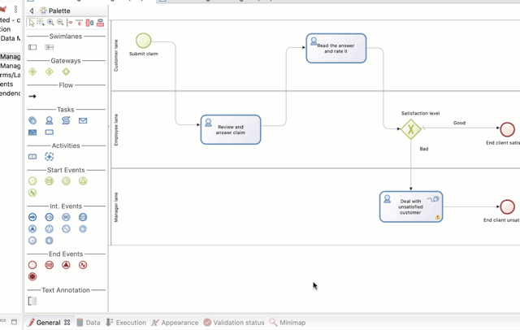

# Define who can do what

Up to this point, when you execute the process you are acting as a single user (username: _walter.bates_, password: _bpm_) who can perform all user tasks. In a scenario closer to a real life use case, there are different types of users: customers (who can submit claims), employees (who answer claims) and the manager of the user who provides the answer (who interacts with unsatisfied customers).

To define "who can do what," define the [actors](actors.md) who can start a process perform a task or and map them to the "real" users in the [organization](organization-overview.md).

The first step in the configuration of "who can do what" is to create [lanes](pools-and-lanes.md) within the pool. We already have one default lane for employees. Let's add another lane for customers, and another one for managers:
1. In Bonita Studio, from the palette on the left hand side of the diagram select the **lane** icon
2. Click inside the process pool to add the lane. Do this twice to have a total of three lanes
3. Select the _employee lane_ and click on the down arrow icon to move it, so it becomes the middle lane
   
   <!--{.img-responsive .img-thumbnail}-->

4. Select _Lane1_, go to the **General > Lane** tab, and rename it _Customer lane_
5. Select  _Lane2_, go to the **General > Lane** tab and rename it _Manager lane_
6. Select the start event _Submit claim_ and move it (via drag and drop) to the _Customer lane_. Do the same for the task _Read the answer and rate it_
7. Select the _Deal with unsatisfied customer_ task and move it to the _Manager lane_. Do the same with the end event _End client unsatisfied_

   <!--{.img-responsive .img-thumbnail}-->

::: info
A lane is used to group together user tasks that are to be done by the same set of users.
:::

Now we need to define "actors," one for each lane, and map them to the lane they belong to:

1. Select the pool
2. Go to **General > Actors**
3. Click on **Add**
4. Click on the default name of the actor (_Actor1_) and change it to: _Customer actor_
5. Repeat to create _Manager actor_
6. Select the _Customer actor_ and click on **Set as initiator**. This will add a flag on this actor, to mark it as the one who can start the process

   <!--{.img-responsive .img-thumbnail}-->

7. Select _Customer lane_ (click on the lane name)
8. Go to **General > Actors** and in the drop down list, select _Customer actor_
9. Do the same for the _Manager lane_ with the _Manager actor_

   <!--{.img-responsive .img-thumbnail}-->

"Actor" identifies a collection of users. To define the actual users, we need to configure the actors and map them with groups, roles, users, etc of an organization. We will use the Bonita Acme test organization for this example:
1. In the Bonita Studio menu, click on the **Server > Configure** 
2. Select _Employee actor_
3. Click on **Groups...**
4. Unselect _/acme_
5. Select _/acme/production/services_. We will identify this group of employee users as the support team in charge of answering claims. In the test organization, two users belong to this group: _mauro.zetticci_ and _thomas.wallis_. The manager of both users is: _michael.morrison_
6. Click on **Finish**

   <!--{.img-responsive .img-thumbnail}-->

7. Select **Customer actor**
8. Click on **Groups...**
9. Select _/acme/hr_. We will use this group of users to act as customers who can submit claims. In the test organization, three users belong to this group: _walter.bates_, _helen.kelly_ and _april.sanchez_
10. Click on the **Finish** button
11. Select _Manager actor_
12. Click on **Roles...**
13. Select the _member_ role. All users in the test organization have this role. (This is not important here, as this actor mapping will be overridden later in the configuration)
14. Click on **Finish**
15. Click on **Finish** to close the configuration window

::: info
At this stage, if you try to run the process, you will see that _walter.bates_ can no longer perform the task _Review and answer claim_. You'll have to go the the Bonita Portal and  log out (click on **Walter Bates** in top right corner and select **Logout**) and log in again as _mauro.zetticci_ or _thomas.wallis_ (password: _bpm_) to be able to view the task. You'll have to log out, and back in again with _walter.bates_'s account, to be able to view the task that lets you read the provided answer.
:::

Currently, the task _Read the answer and rate it_ is available to all users in the group _/acme/hr_, but it should only be available to the user who started the process (_walter.bates_). Similarly, the task _Deal with unsatisfied customer_ is available to everyone, when it should only be available to the manager of the user who completed the task _Review and answer claim_.  
To refine this, we will configure [actor filters](actor-filtering.md).

::: info
The actor filter produces a list of users based on input information and internal logic. It overrides the actor configuration.  
The actor filter will be executed when the process reaches a step to which the filter is mapped.
:::

First configure the **initiator** actor filter:

1. Select the _Customer lane_
2. Go to **General > Actors**
3. Click on **Set...** next to actor filter
4. From the list, select _Initiator_
5. Click on **Next**
6. Set the name: _User who submit the claim_
7. Click on **Finish**

   <!--{.img-responsive .img-thumbnail}-->

Now we will configure the **manager** actor filter:  

1. Select _Manager lane_
1. Follow the same steps as above, but this time select the _user-manager_ actor filter
1. Set the name: _Manager of the user who provided answer_
1. Click on **Next**
1. Click on the pencil icon
1. Select **Script** and paste the following Groovy script (it will search for the id of the user who performed the task _Review and answer claim_):

   ``` groovy
   import org.bonitasoft.engine.bpm.flownode.ArchivedHumanTaskInstance
   import org.bonitasoft.engine.bpm.flownode.ArchivedHumanTaskInstanceSearchDescriptor
   import org.bonitasoft.engine.search.SearchOptionsBuilder
   import org.bonitasoft.engine.search.SearchResult

    def taskName = 'Review and answer claim'

    final SearchOptionsBuilder searchOptionsBuilder = new SearchOptionsBuilder(0, 1)
    .filter(ArchivedHumanTaskInstanceSearchDescriptor.PARENT_PROCESS_INSTANCE_ID, processInstanceId)
    .filter(ArchivedHumanTaskInstanceSearchDescriptor.NAME, taskName).filter(ArchivedHumanTaskInstanceSearchDescriptor.TERMINAL, true)

    SearchResult<ArchivedHumanTaskInstance> searchResult = apiAccessor.processAPI.searchArchivedHumanTasks(searchOptionsBuilder.done())

    final List<ArchivedHumanTaskInstance> tasks = searchResult.result

    tasks.first().executedBy
    ```
14. Click on **OK**
15. Click on **Finish**

    <!--{.img-responsive .img-thumbnail}-->

Run the process again, and this time only _mauro.zetticci_ should have access to _Read the answer and rate it_ and only _michael.morrison_ should have access to _Deal with unsatisfied customer_ (as the manager of both users who can complete the task _Review and answer claim_).

Now we have a fully customized process that processes data and dispatches tasks to appropriate users. The [next step](configure-email-connector.md) will be to make this process interact with the outside world.
