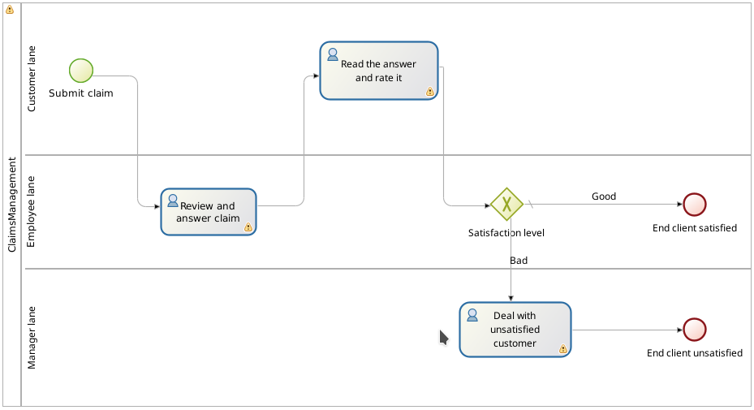
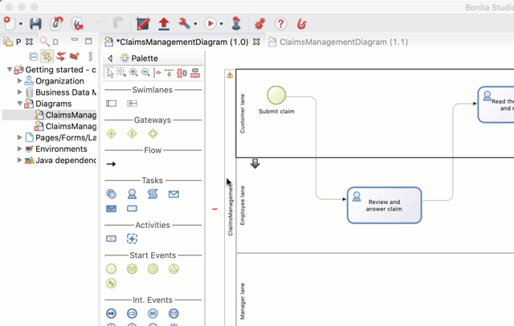

# Define who can do what

So far when you execute the process you were using a single user (username: _walter.bates_, password: _bpm_) that can perform all the user tasks. In a scenario closer to a real life use case, customers (who can submit claims), employees (who answer claims) and manager of the user who provide the answer (that need to deal with unsatisfied customers) are all different groups of users.

First step in the configuration of "who can do what" is to create lanes within our pool. We already have one default lane for the employees, let's add one for the customer and one for the manager:
1. In the Studio, in the palette on the left hand side of the diagram select the **lane** icon
1. Click inside the diagram to add the lane. Do this twice to have a total of three lane
1. Select the employee lane and click on the down arrow icon to move it as the central lane

   

1. Select the _Lane1_, go to **General > Lane** tab and rename it _Customer lane_
1. Select the _Lane2_, go to **General > Lane** and rename it _Manager lane_
1. Select the start event _Submit claim_ and move it (with a drag and drop) to the _Customer lane_. Do the same for the task _Read the answer and rate it_
1. Select the _Deal with unsatisfied customer_ task and move it to the _Manager lane_. Do the same with the end event _End client unsatisfied_

   

::: info
A lane is used to group together user tasks that should be done by a same set of users.
:::

Now we need to define "actors", one for each lane and map them to the lane they belong to:
1. Select the pool
1. Go to **General > Actors**
1. Click on **Add** button
1. Click on the default name of the actor (_Actor1_) and change it to: _Customer actor_
1. Do it again to create _Manager actor_
1. Select the _Customer actor_ and click on **Set as initiator** button. This will add a flag on this actor to mark it as the one who defined who can start the process

   

1. Select the _Customer lane_ (click on the lane name)
1. Go to **General > Actors** and in the drop down list select _Customer actor_
1. Do the same for the _Manager lane_ with the _Manager actor_

   

Actor are just identifiers, in order to define the actual user we need to configure the actors and map them with groups, roles , users... of the organization. We will use Bonita Acme test organization for this example:
1. In the Studio tool bar, click on the **Configure** button 
1. Select the _Employee actor_
1. Click on the **Groups...** button
1. Unselect _/acme_
1. Select _/acme/production/services_. We will use this group of users to act as support team in charge of answering to claims. In the test organization two users belong to this group: _mauro.zetticci_ and _thomas.wallis_. Manager of both user is: _michael.morrison_
1. Click on **Finish** button

   

1. Select **Customer actor**
1. Click on the **Groups...** button
1. Select _/acme/hr_. We will use this group of users to act as customers who can submit claims. In the test organization three users belong to this group: _walter.bates_, _helen.kelly_ and _april.sanchez_
1. Click on **Finish** button
1. Select _Manager actor_
1. Click on **Roles...** button
1. Select the _member_ role. All users in the test organization have this role. But this does not really maters as this actor mapping will be override later in our configuration
1. Click on **Finish** button
1. Click on **Finish** button to close the configuration window

At this stage if you try to run the process you will see that _walter.bates_ can no longer perform the task _Review and answer claim_. You need to logout from Bonita Portal (click on **Walter Bates** in top right corner and select **Logout**) and login with for example _thomas.wallis_ (password: _bpm_) to be able to view the task. And you need to login back with _walter.bates_ account to be able to view the task that let you read the provided answer.

Currently the task _Read the answer and rate it_ is available to all users in the group _/acme/hr_ whereas it should only be available to the user who start the process (_walter.bates_). In the same way, the task _Deal with unsatisfied customer_ will be available to every one when it should only be available to the manager of the user who did the task _Review and answer claim_. To address that we will configure actor filters:
1. Select the _Customer lane_
1. Go in **General > Actors**
1. Click on the **Set...** button next to actor filter
1. In the list select _Initiator_
1. Click on **Next** button
1. Set the name: _User who submit the claim_
1. Click on **Finish** button

   

1. Select the _Manager lane_
1. Follow the same steps but select the _user-manager_ actor filter
1. Set the name: _Manager of the user who provided answer_
1. Click on **Next** button
1. Click on the pencil icon
1. Select **Script** and paste the following script (it will search for the id of the user who performed the task _Review and answer claim_):

   ``` groovy
   import org.bonitasoft.engine.bpm.flownode.ArchivedHumanTaskInstance
   import org.bonitasoft.engine.bpm.flownode.ArchivedHumanTaskInstanceSearchDescriptor
   import org.bonitasoft.engine.search.SearchOptionsBuilder
   import org.bonitasoft.engine.search.SearchResult

   def taskName = 'Review and answer claim'

   final SearchOptionsBuilder searchOptionsBuilder = new SearchOptionsBuilder(0, 1)
   .filter(ArchivedHumanTaskInstanceSearchDescriptor.PARENT_PROCESS_INSTANCE_ID, processInstanceId)
   .filter(ArchivedHumanTaskInstanceSearchDescriptor.NAME, taskName).filter(ArchivedHumanTaskInstanceSearchDescriptor.TERMINAL, true)

   SearchResult<ArchivedHumanTaskInstance> searchResult = apiAccessor.processAPI.searchArchivedHumanTasks(searchOptionsBuilder.done())

   final List<ArchivedHumanTaskInstance> tasks = searchResult.result

   tasks.first().executedBy
   ```

1. Click on **OK**
1. Click on **Finish**

   


If you run the process again, only _walter.bates_ should have access to _Read the answer and rate it_ and only _michael.morrison_ should have access to _Deal with unsatisfied customer_ (as he is the manager of both user who can do the task _Review and answer claim_).

Now we have a fully customize process that processes data and dispatches tasks to appropriate users. The next step will be to make this process interact with the outside world.
