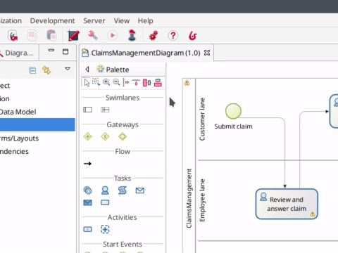
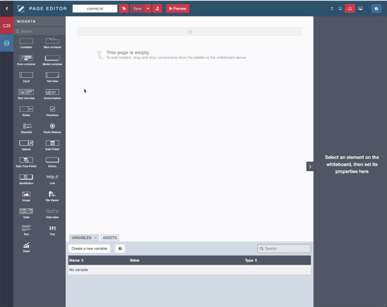
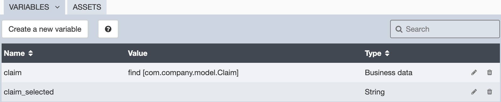
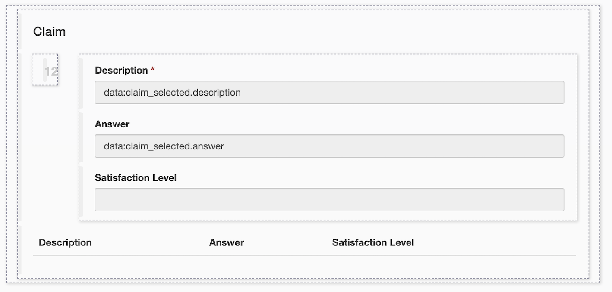
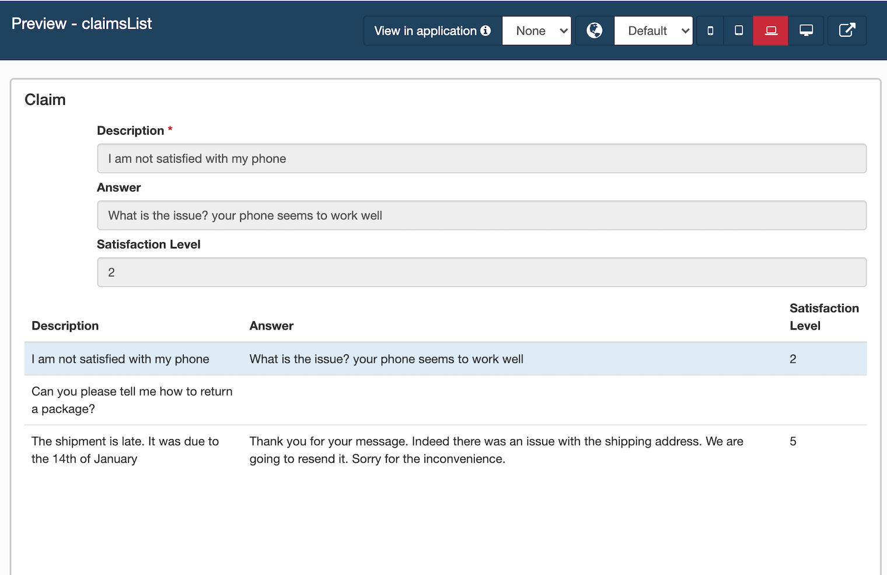

# Design an application page

So far, with a process, data, forms, and connectors, we've built a fully functional software solution to manage claims. But what if you need to have a dashboard showing all ongoing claims? Such a dashboard is not a process. You should not have to "start" it in order to view it. 

A Bonita application is the answer. The first step to build such an application is to create pages.

::: info
[Pages](ui-designer-overview.md) in Bonita are a lot like forms. They are created with the UI Designer with the same sets of widgets. The main difference is that they are not bound to a process definition (like instantiation forms and user tasks forms). An application page can display business data values, charts and even let the user start a process or execute a task by displaying the appropriate form.
:::

For this example, we will build a basic page that displays, in a table, all the claims that have been submitted. To create a new page:
1. Click on the **UI Designer** icon  in the Bonita Studio tool bar
1. Ignore the information message pop up window
1. Click on  **Create**
1. Make sure that **Application page** is selected
1. Type the name: _claimsList_
1. Click on **Create**

   <!--{.img-responsive .img-thumbnail}-->

On the new page, using the [data management](data-management.md) capabilities, the UI Designer can automatically create [variables](variables.md) to retrieve business data and generate the user interface:
1. At the top left corner of the UI Designer, click on  **Data model** 
1. In the list of business objects, select the _Claim_ object and drag and drop it into the empty space of the page
1. In the popup window, change **Variable name** from _claim_ to _claims_
1. In **Additionnal queries**, select _find_
1. Click on **Save**

   <!--{.img-responsive .img-thumbnail}-->

The UI Designer automatically created 2 variables which will be used to retrieve and display business data in the application page:
- ``claim`` of type **Business data**
- `claim_selected`` of type **String** which returns the list of claims

    <!--{.img-responsive .img-thumbnail}-->  

A dashboard page is also automatically generated in the whiteboard. It follows the master/details pattern using [containers](widgets.md): 
- A [Table widget](widgets.md) is displayed with all the instance objects, and the details are shown when a line is selected. 
- The details section maps each Business Object attribute to a corresponding widget (for instance, an Input widget for an attribute of type String)   

    <!--{.img-responsive .img-thumbnail}-->

1. Click on **Save** in the UI Designer
1. Click on **Preview** to get a preview of your page

::: warning
In order for preview to access the data, a user needs to be logged in to the Bonita Portal. You can click on **Portal** in the Bonita Studio tool bar to make sure a user is logged in.
:::

The preview should look like this:

   <!--{.img-responsive .img-thumbnail}-->

Now you have your first application page. It's time to move to the [next chapter](create-application.md) and create the [application](create-application.md) that will include the page.
