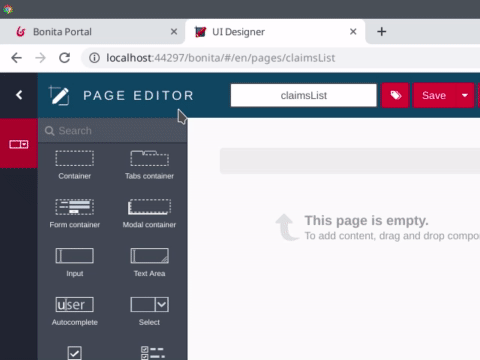

# Design an application page

So far, with a process, data, forms, and connectors, we've built a fully functional software solution to manage claims. But what if we want to have a dashboard showing all ongoing claims? Such a dashboard is not a process. You should not have to "start" it in order to view it. A Bonita application is the answer. And the first step to build an application is to create pages.

::: info
Pages in Bonita are a lot like forms. They are created with the UI Designer with the same sets of widgets. The main difference is that they are not bound with a process definition (like instantiation forms and user tasks forms). An application page can display business data values, charts and even let the user start a process or execute a task by displaying the appropriate form.
:::

For this example, we will build a basic page that displays all the claims submitted in a table. To create a new page:

1. Click on the **UI Designer** icon  in the Studio tool bar
2. Ignore the information message pop up window
3. Click on the **create** button
4. Make sure that **Application page** is selected
5. Type the name: _claimsList_
6. Click on the **Create** button

   <!--{.img-responsive .img-thumbnail}-->

On the new page, you can let the UI Designer automatically create variables to retrieve business data:

1. At the top left corner of the UI Designer, click on the **data model** button 
2. In the list of business objects, select the _Claim_ object and drag and drop it in the empty space of the page
1. In the pop up window, change **Variable name** from _claim_ to _claims_
1. In **Additionnal queries** section, select _find_
3. Click on the **Save** button

   <!--{.img-responsive .img-thumbnail}-->

Add and configure the table widget:

1. From the widget palette on the left, drag and drop a **Table** widget to the whiteboard
2. In the widget property on the right:
   - Set the **headers** name: _Description, Answer, Satisfaction level_
   - For **content**, click on the **fx** button
   - Enter _claims_ for the value
   - Set **Column keys** to: _description, answer, satisfactionLevel_
3. Click on the UI Designer **Save** button
4. Click on the **Preview** button to get a preview of your page

   <!--{.img-responsive .img-thumbnail}-->

::: warning
In order for preview to access the data, a user needs to be logged in to the Bonita Portal. You can click on the **Portal** button in the Bonita Studio tool bar to make sure a user is logged in.
:::

Now you have your first application page. It's time to move to the [next chapter](create-application.md) and create the [application](create-application.md) that will include the page.
