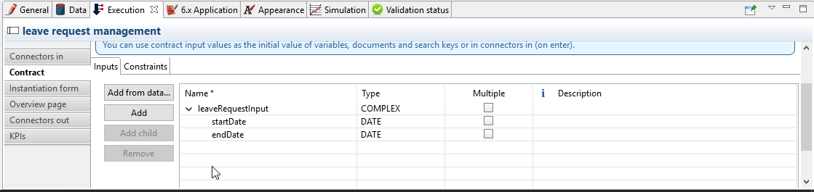
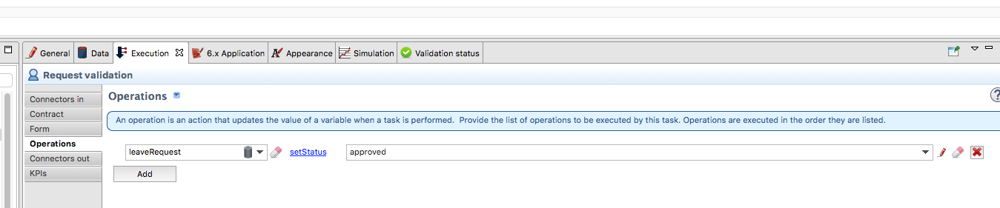
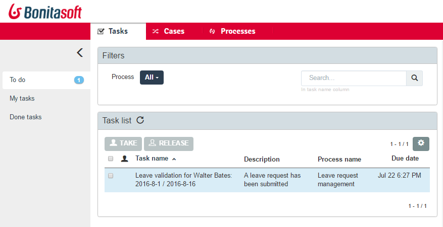
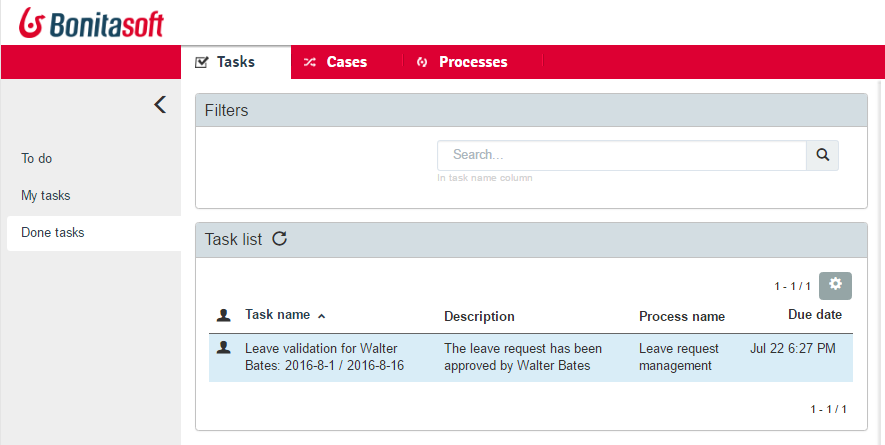

# Tasks

You can create tasks to define the process. These tasks can be performed by human or services. 

## Definition

A task is an activity in a process. There are several different kinds of task:

* A human task is carried out by a person using a form to enter data or to receive information.
* A service task is carried out automatically by the Bonita Engine and is invisible to users during normal operation.
* A call activity calls a subprocess. The sequence flow of the process passes from the call activity
to the subprocess. When the subprocess is complete, the flow returns to the call activity.
* A script task executes a script in the Bonita Engine.
* An abstract is a generic activity, usually used during diagram creation as a placeholder for a more specific type of task. 
An abstract task is treated as a service task when a process executes.
* A send task sends a message to another process in the same diagram. The message is caught by a catch message event or a receive task.
* A receive task receives a message from another process in the same diagram. The message was sent by a throw message event or a send task.

The items configured for a task depend on the task type, as shown in the following table:

| To configure... | Go to... | Applies to task types... |
|:-|:-|:-|
| Task name in diagram | Details panel, General tab, General pane | All |
| [Task name in Portal](#displayName) | Details panel, General tab, Portal pane | All |
| Task description in Studio | Details panel, General tab, General pane | All |
| [Task description in Portal](#displayName) | Details panel, General tab, Portal pane | All |
| [Task description after completion in Portal](#displayName) | Details panel, General tab, Portal pane | All |
| Task type | Details panel, General tab, General pane | All |
| Priority | Details panel, General tab, Portal pane | Human, abstract, call activity, service, script |
| Estimated duration | Details panel, General tab, General pane | Human, abstract, call activity, service, script |
| Actor | Details panel, General tab, Actors pane | Human |
| Variables | Details panel, Data tab, Local variable pane | Human, abstract, call activity, service, script |
| Iteration | Details panel, General tab, Iteration pane | All |
| Contract | Details panel, Execution tab, Contract pane | Human |
| Form | Details panel, Execution tab, Form pane | Human |
| Connectors | Details panel, Execution tab, Connectors in/out pane | Human, abstract, call activity, receive, service, script |
| Operations | Details panel, Execution tab, Operations pane | All |
| KPIs (Enterprise, Performance, Efficiency, and Teamwork editions only) | Details panel, Execution tab, KPIs pane | All |
| Appearance in diagram | Details panel, Appearance tab, color & font pane | All |
| Subprocess to execute | Details panel, General tab, General pane | Call activity |
| Message content handling | Details panel, General tab, Message content pane | Receive |
| Messages | Details panel, General tab, Messages pane | Send |
| Correlation keys | Details panel, General tab, Correlation pane | Receive |

To create a new task, select the relevant icon from the **BPMN elements** menu or from the context 
menu of the preceding element in the diagram, and drop it on the whiteboard. You can change the task type
of an task in the diagram.

## Setting a unique task name in the Portal 

When you define a task in Bonita Studio, by default the task name and description in Bonita Portal are the same as the task name and description on the diagram. 

Within a process instance (case), this task name must be contextualized with business information specific to the case so that, in the user task list, users efficiently pick the right task to do.
You can leverage Bonita Studio to optimize user comfort and efficiency by inserting case information in task name and task description.

:::info
**Note**: This howto applies to the legacy task list -Bonita 6.0 to 6.5.x versions- as well as the [new task list - from Bonita 7.3 and above](user-task-list.md).
:::

### Pre-requisites: create the process example

#### Pool 

First, create a new diagram. Then model the process in the first pool: 
1. Rename the diagram into "Request management" by clicking in the blanck space around the pool
2. Rename the pool into "Leave request management"
3. Rename the lane into "Manager"
4. Rename the start event into "New leave request"
5. Since the submission of a new leave request happens at pool level (process instantiation), no need for a **Submit request** task ; just rename the default _human task_ into "Validate request"
6. Add a _terminate end event_ that you can rename "Happy end"  

The pool is shown here:

<!--{.img-responsive .img-thumbnail}-->

#### Data model

Then, define a business object that will hold the leave requests data: 
1. Go to the **Development** > **Business Data Model** > **Manage** menu option
2. Add a business object named _LeaveRequest_ (with an upper case "L"), with 4 attributes:
  - _startDate_: as a DATE. Set it as mandatory
  - _endDate_: as a DATE, Set it as mandatory
  - _requesterName_: employee who submits the leave request, as a STRING
  - _status_: whether the request is "submitted" or "approved", as a STRING
3. Click **Finish**

##### Variables 

To allow this business object to be instantiated with each process instance, create a business variable at pool level:
1. In the **Data** pane of the pool, **Pool variables** tab, **Business variables** table, **Add** a business variable named _leaveRequest_ (with a lower case "l").
2. For **Business object**, choose **LeaveRequest** (the default value if you only have one object)
3. Click **Finish**

#### Process instantiation contract 

To make sure the process gets the information it needs to start a new instance, create a contract:
1. In the **Execution** pane > **Contract** tab, click on **Add from data...** to generate the contract inputs from the business variable
2. Choose the **Business variable** option, and then the **leaveRequest** variable
3. Click **Next**
4. Unselect **requesterName** and **status** as the process doesn't need this information from the form to instantiate  
   The default values of business data attributes mapped to contract inputs are automatically set thanks to a script generated along with the contract inputs themselves.  
5. Click **Finish**, carefully read the warnings, and press **OK** and **OK**.
6. In the **Execution** pane > **Contract** tab, a complex contract input is created, mapped to the selected attributes of the **leaveRequest** business variable, as shown here:

<!--{.img-responsive .img-thumbnail}-->

In actual BPM projects, we recommend you to also add a description to each contract input. It will be used as input field caption for end-users in the auto-generated form, if you decide to use such forms up to the User Acceptance Test phase of your project.  

When the leave request is submitted, _status_ and _requesterName_ default values must be set. To do so, edit the script:
 
1. Go back to the **Data** pane, **Pool variables** tab, **Business variables** table
2. Click on **leaveRequest** and on the **Edit...** button
3. Close to the **Default value** field, click on the pencil icon
4. In the script, add: `leaveRequestVar.status = "submitted"`, and  
   ``` groovy
   def initiator = BonitaUsers.getProcessInstanceInitiator(apiAccessor,processInstanceId);
   leaveRequestVar.requesterName = "$initiator.firstName $initiator.lastName"
   ```
   so it becomes: 
   ```groovy
   def leaveRequestVar = new com.company.model.LeaveRequest()
   leaveRequestVar.startDate = leaveRequestInput.startDate
   leaveRequestVar.endDate = leaveRequestInput.endDate
   leaveRequestVar.status = "submitted"
   def initiator = BonitaUsers.getProcessInstanceInitiator(apiAccessor,processInstanceId);
   leaveRequestVar.requesterName = "$initiator.firstName $initiator.lastName"
   return leaveRequestVar
   ```

5. Click **OK**, and **OK**.

#### Instantiation form

The Studio generates a form based on the contract requirements, for test purposes only. 
This is the form used in this howto, to save some time.

#### "Validate request" task 

For the sake of this howto, do not specify any contract or form on the task, but just create an operation to switch the request status from "submitted" to "validated" when the task is completed. 
1. Click on task "Validate request"
2. Go to the **Execution** pane > **Operations** tab
3. Click on **Add**
4. In the left operand, select _leaveRequest_
5. As operator, select **Use a Java method** and then **setStatus(String) - void**
6. Click **OK**
7. In the right operand, write _approved_

The operation is shown here:

<!--{.img-responsive .img-thumbnail}-->

There you go. The process is ready. So how can you set a unique name for tasks, to be displayed in the user task list?

### Configure the display options

For each case (request), the task should display the requester's name, the request start date, end date, and status. After the task is submitted, the status will change and the task can also display the validator's name.  

As a good practice, we advise to display static information that defines the task in the **Display name** field, and dynamic information that appears, disappears or changes over the life of the case in the **Display description** and **Description after completion** fields. Therefore: 
- Start date, end date, and requester's name will be managed in the task name
- Status and validator's name will be managed in the description

To configure the display options:
1. Select the **Validate request** task
2. Go to **General** pane > **Portal** tab.

#### Display name

The task display name will be made of the requester's first name, last name, and the leave start date and end date.
1. Next to the **Display name** field, click the **pencil** icon to display the expression editor.
2. Select the **Script** expression
3. Give it a name: **buildValidateRequestDisplayName()**
4. Type the script.

    ```groovy
    return "Validate leave: ${leaveRequest.requesterName}: ${leaveRequest.startDate.format('yyyy-M-d')} / ${leaveRequest.endDate.format('yyyy-M-d')}".toString()
    ```

5. Click **OK**.

#### Display description 

As a dynamic information, status is addressed here:
1. Next to the **Display description** field, click the **pencil** icon to display the expression editor.
2. Select the **Script** expression type
3. Give it a name: **buildValidateRequestDisplayDescription()**
4. Type the script. 

    ```groovy
    return "${leaveRequest.status}".toString()
    ```

5. Click **OK**.

#### Description after completion

The status of the request when it's validated as well as the validator's name are displayed in the **Done tasks** filter of the user task list. To define it:
1. Next to the **Description after completion** field, click the **pencil** icon to display the expression editor.
2. Select the **Script** expression type
3. Give it a name: **buildValidateRequestDescAfterCompletion()**
4. Type the script.

    ```groovy
    import com.bonitasoft.engine.api.APIAccessor;
    
    def executedBy = BonitaUsers.getUser(apiAccessor, apiAccessor.processAPI.getHumanTaskInstance(activityInstanceId).executedBy);
    return "${leaveRequest.status} by ${executedBy.firstName} ${executedBy.lastName}".toString()
    ```

5. Click **OK**

When reusing these features for your own projects, make sure that the result of your scripts do not exceed 255 characters.

### View it in the task list

1. Save the diagram
2. Run the pool. The default logged in user is Walter Bates
3. Fill out the default instantiation form with two dates
4. Click on **Start**  

Once you are sent to the task list, you can see that the task name is contextualized.  
It is computed once, when the task becomes ready. 

:::info
**Note:** The following set of instructions only applies to the task list in Bonita 7.3.0 and above. In earlier versions, the **Description** field is displayed by default.
:::

To display the **Description** column and view the _submitted_ status:
1. Click on the **settings wheel** icon on the top right of the list
2. Select **Description**
3. Click outside the settings box
The table settings have changed to display the **Description** column. It will be stored in the local storage of the browser

You can see the description field, showing the status: "submitted", as shown here:

<!--{.img-responsive .img-thumbnail}-->

1. Logout
2. Login with helen.kelly / bpm credentials (since Helen Kelly is Walter Bates' manager)
3. Perform the task
4. Go to the **Done tasks** filter

The **Description** column now shows the description after completion, with an edited status as well as the name of who performed the task, as shown here :

<!--{.img-responsive .img-thumbnail}-->

If you don't use the description after completion field, the **Description** column will still show the "display description" information.

Unlike the "technical" name and description of a task in the Studio, which are useful for development, information for each task as _display name_, _display description_ and _description after completion_ will be unique for each case in the task list, to make the task list more efficient for the users.

### Search a task name based on word-based search

Another feature you can use to improve end users efficiency and satisfaction is _word-based search_:  
To allow users to efficiently search by task name, you can configure the search option: from _starts by_ (the beginning of the whole task name string), you can switch to _word-based search_ (the beginning of every word in the task name).

To do so, go to [word-based search](using-list-and-search-methods.md#word_based_search).

:::info
**Note:** Setting the word-based search may result in lesser performance, with some delay experienced by users on the display of search results. Turning this feature on requires some testing on your environment.
:::
