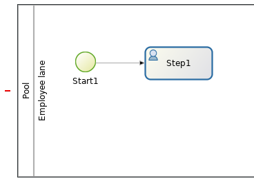
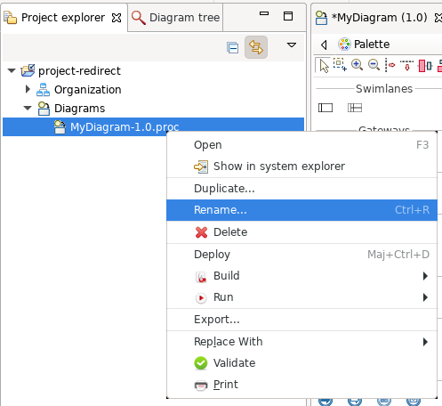

# Start building your application: draw a BPMN process diagram

Now that you have your development environment (i.e. Bonita Studio) up and running, you are ready to start building your first Bonita Living Application.

In this tutorial we will build a **claims management solution**. Making sure that claims are handled and answered in a timely manner by the appropriate employee(s) can be key to customer satisfaction. It is also a good fit for a process-based application that uses automation. We will of course drastically simplify the application in this tutorial so you can focus on learning about Bonita and not about claims management!

Here is an overview of process execution:
- The process will be started by a *customer* who submits a claim, which is a simple text description in our example
- Next, an *employee* will review the claim and provide an answer
- The *customer* will be able to review the *employee*'s answer and provide a satisfaction rating
- If the rating is equal to or greater than 3, the process will finish after the customer has read the answer
- If the rating is lower than 3 an extra task will be assigned to the manager of the employee to work with this customer who is not really satisfied. Once this task is done the process will be completed

{::comment}
Udpdate process steps to add a notification to the employee in case the rating is lower than 3?
{::comment}

::: info
To design this process we will use the Business Process Model and Notation (BPMN) standard. You don't need to learn everything about BPMN to follow this tutorial but, if you would like to know more, you can read the [Ultimate Guide to BPMN 2.0](https://www.bonitasoft.com/library/ultimate-guide-bpmn).
:::

::: warning
We will use an iterative approach in the process development. This means that in the first iteration, we will have a few limitations:
- a single user will perform all the tasks
- we won't collect data from the user
- the process will follow a single path - the one for an unsatisfied customer, which will be called "happy path"

As we introduce data in our process definition and configure actors, a user will be able to input data in web forms, the process will follow paths that depend on data values, and different users will be involved.
:::

## Create the process diagram

The first step is the design of the process "happy path". 

::: info
While drawing you are going to discover basic BPMN elements used in most of the process diagrams: 
- [Pool](https://documentation.bonitasoft.com/bonita//pools-and-lanes.md): a pool is a container for a process in a diagram.
- [Lanes](https://documentation.bonitasoft.com/bonita//pools-and-lanes.md): a lane is a division of a pool. Typically, a lane contains all the tasks assigned to an [actor](https://documentation.bonitasoft.com/bonita//actors).
- [Start and end events](https://documentation.bonitasoft.com/bonita//events.md): a start event is at the start of a process flow, and an end event is at the end of a flow.
- [Tasks](https://documentation.bonitasoft.com/bonita//diagram-tasks.md): a task is an activity in a process.
- [Gateways](https://documentation.bonitasoft.com/bonita//gateways.md): they are used to control how sequence flows interact within a process.
:::

Create a new diagram:
1. In the Bonita Studio menu, click on **File > New diagram**.

   <!--{.img-responsive .img-thumbnail}-->

The new diagram includes:
- One pool: one process definition
- One lane inside the pool: lane default name is _Employee lane_ (more about lanes in another chapter)
- A start event: the starting point of process execution
- A user task: a task (or step) that needs to be performed by a user

and it should look like this:

Before we continue, let's rename the diagram and the pool:
1. In the **Project explorer** on the left hand side of the Bonita Studio window, select the diagram _MyDiagram-1.0.proc_
1. Right click and select **Rename...**

   

1. In the pop-up window, enter the new name for the diagram: _ClaimsManagementDiagram_, and for the pool: _ClaimsManagement_

   

Now let's rename the start event (i.e. the green disc on the left hand side of the process):
1. Select the start event in the diagram
1. At the bottom of the Bonita Studio screen, go to the **General > General** tab
1. Edit the **Name** attribute and set the value: _Submit claim_

   

Also rename the default user task:
1. Select the user task _Step1_
1. At the bottom of the Bonita Studio screen go to the **General > General** tab
1. Edit the **Name** attribute and set the value: _Review and answer claim_

Now we will add another task to the process:
1. Select the _Review and answer claim_ task
1. At the border of the selected task, click on the task icon and drag and drop it onto the diagram
1. Make sure that the newly added task is selected
1. Click on the toolbox icon
1. Select the user icon
1. Rename the task to: _Read the answer and rate it_

   

In order to define another path in our process execution, we will add an exclusive gateway. This gateway will direct the process execution to a different path based on certain conditions. Adding an exclusive gateway is done quite the same as adding a task:
1. Select the user task _Read the answer and rate it_
1. Drag and drop the diamond-shaped gateway icon
1. Click on the toolbox icon
1. Change the gateway type from parallel (the one with the **+** sign) to exclusive (the one with the **x** sign)

   

1. Rename the gateway to: _Satisfaction level_

From the gateway, there are two possibles paths. The first one completes the process if the customer satisfaction level is good. The end of a process is identified by an end event, a red disc. Adding the end event is similar to how you added a task and a gateway:
1. Select the gateway
1. Drag and drop the event icon (the disc icon)
1. Select the end event type (red disc icon)

   

1. Rename the event to: _End client satisfied_

The second path from the gateway will lead to another user task:
1. Select the _Satisfaction level_ gateway
1. Drag and drop the task icon
1. Click on the toolbox icon
1. Select the user icon
1. Rename the task _Deal with unsatisfied customer_

And from this _Deal with unsatisfied customer_ task we need to go to a second end event:
1. Select the _Deal with unsatisfied customer_ user task
1. Drag and drop the event icon (the disc icon)
1. Select the end event type (red disc icon)
1. Rename the event to: _End client unsatisfied_
1. Refresh the diagram validation: at the bottom of the screen, select the **Validation status** tab and click on the **Refresh** button

Your process diagram should look like this:

::: info
Now you can see a validation error on the gateway. The error is displayed because we didn't define the conditions for process execution when it reaches the gateway. Trying to execute the process will fail because the process execution engine cannot determine which path to follow.
:::

We need to configure the conditions required to define the path to follow when executing the process. Conditions are defined on the gateway outgoing transitions (i.e. the arrows going out of the gateway):
1. Select the transition going to the end event
1. Name it to _Good_
1. Go to the **General > General** tab
1. Check the checkbox **Default flow**
   
   

::: info
**Default flow** means that the transition will be activated only if all other conditions configured on the gateway outgoing transitions are _false_ (boolean value).
:::

We need to configure the condition on the transition from the gateway to the _Deal with unsatisfied customer_ task:
1. Select the transition going into the task _Deal with unsatisfied customer_
1. Name the transition _Bad_
1. Go in **General > General** tab
1. In **Condition** type the value _true_
1. In the Bonita Studio menu, click on **File > Save**

::: warning
Due to the static value _true_, this version of the process will always go through the _Deal with unsatisfied customer_ task.
:::

::: info
In order to make the error go away, refresh the diagram validation: at the bottom of the screen, select the **Validation status** tab and click on the **Refresh** button. You should have only five warnings left.
:::

Congratulations! You have now your first valid BPMN process diagram!

## Run your process

You can now easily build, package, deploy and execute this process definition in the Bonita Studio embedded test environment:
1. Select the process pool, the rectangle shape that includes start events and tasks
1. Click on the **Run** button  in the toolbar at the top of the Bonita Studio window
1. On the instantiation form, click on the **Start** button. The process instance is started and you are redirected to the Bonita Portal task list
1. Move your mouse over the _Review and answer claim_ form on the right hand side of the Bonita Portal and click on the **Take** button to "claim" the task
1. Click on the **Execute** button to actually perform the task and move the process execution forward
1. Click on the **Refresh** button  at the top of the task list to update it
1. Click on the **Overview** tab on the right side to see the process execution overview form with information about process execution
1. Click on the **Form** tab to get back to the _Read the answer and rate it_ user task form
1. You can click on **Take** and execute for both tasks, _Read the answer and rate it_ and _Deal with unsatisfied customer_, to finish the process execution
1. In the Bonita Portal top menu, click on **Cases** 
1. Click on the **Archived cases** tab
1. Click on the **View case overview** action (i.e. the "eye" icon) to display the overview form with information about process execution
   
   <!--{.img-responsive .img-thumbnail}-->

::: info
When you click on the **Run** button, the process definition and its dependencies are built, packaged and deployed in the Bonita Studio test environment. A user is logged in by default (username: _walter.bates_, password: _bpm_) and the auto-generated start form for the process is opened in your web browser. If you submit the instantiation form, it will start a new process instance (or case) and load the user task list in the Bonita Portal. In the task list, you can't immediately submit a user task because, by default, all users (of the test organization) are candidates to perform the tasks of the process. In order to act on the task you need first to "claim" it, which then makes you the only one - among all the possible candidates - who can do perform an action on it.
 :::
 
::: info
You can view process instance information in the [**Cases**](cases.md) section of the Bonita Portal. You can switch between **Open cases** and **Archived cases** to either view the ongoing process instances or see completed ones. Note that if you want to start a second case (i.e. a process instance), you must go into the Bonita Portal **Processes** menu and click on the **Start a new case** button (i.e. the "play" icon in the **Action** column) next to the process definition name. If you click on the **Run** button from Bonita Studio, it will clean / overwrite any information related to any process with same name and version, including previous cases. Note that if you did any modifications to your project, you probably want to click on the **Run** button to be sure that the latest version is deployed.
:::

You successfully built and executed your first process. So far it is not very useful as it does not deal with any data and web forms, and  only includes a single submit button. In following chapters we will [define a business data model](define-business-data-model.md) and bind it to the process to save information related to the claim submitted by the user.
