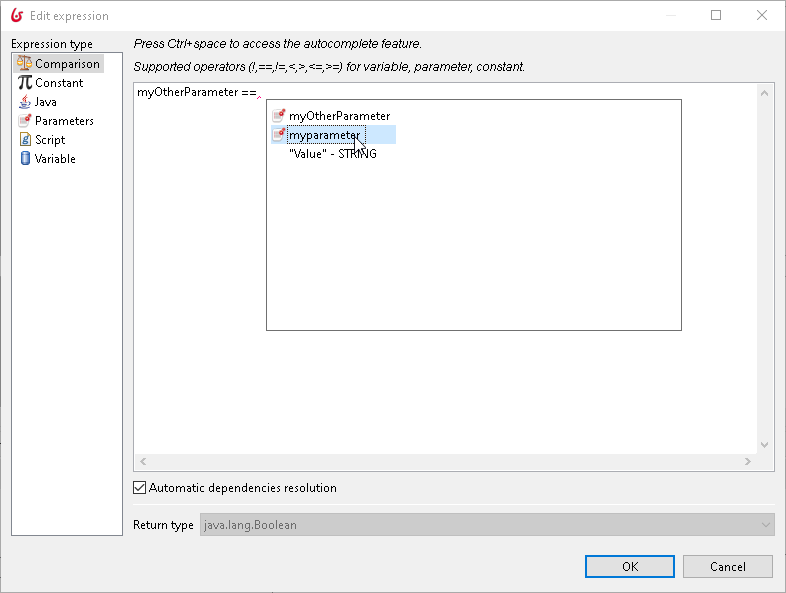
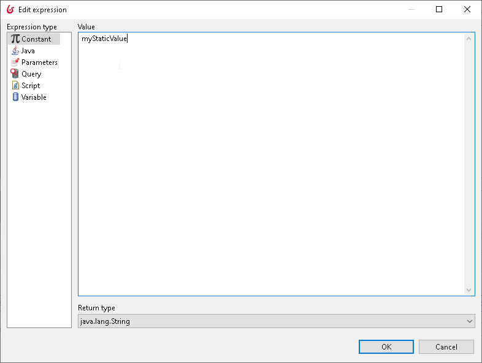
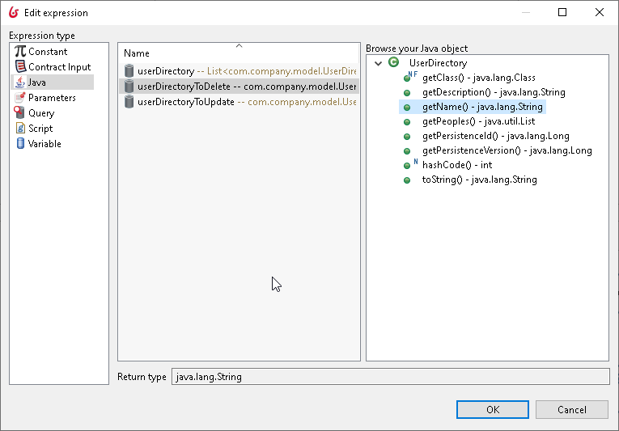
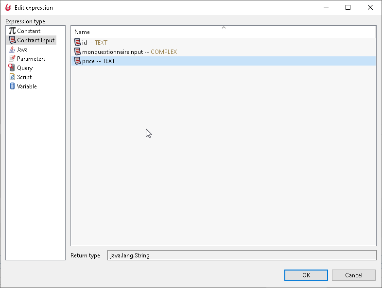
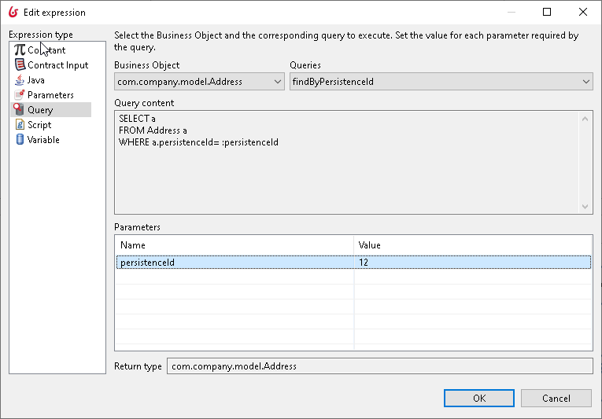
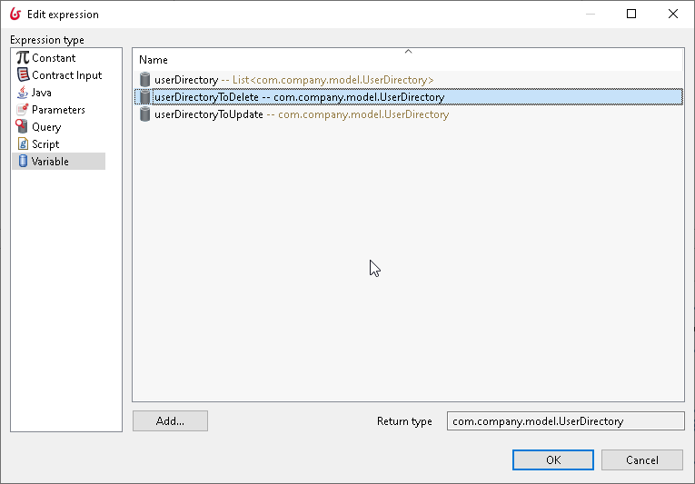
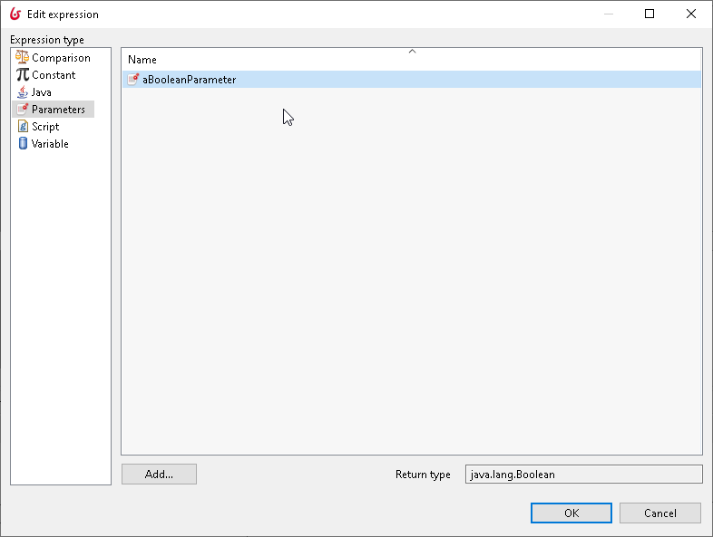

# Process Expressions and scripts

Learn how to define Expressions and script in Bonita Studio that will be executed in your processes.

Expressions and scripts are used in Bonita Studio for many purposes, including setting the initial or default value of a variable.
An expression is a simple statement; a script is a sequence of expressions, and has a program-like structure. 

This page explains the features of Bonita Studio that enable you to use expressions and scripts.

Note that the expression editor cannot be used in the UI Designer, which has a different concept model for [data](variables.md).

## Expression types

The expression editor is used throughout Bonita Studio to create and modify expressions or scripts.  
To start the expression editor, click the crayon icon next to the field where you want to enter an expression. 

There are different types of expression:

* _Comparison_: compares the value of a variable, parameter, or constant using the operators !, ==, !=, <, >:, <:= or >=.
* _Constant_: sets the expression to a constant (fixed) value.
* _Java_: Select Java methods to set the value of your expression
* _Contract Input_: Select a element of your contract.
* _Query_: Use a query from your BDM.
* _Parameter_: sets the expression to the value of the parameter at the time the expression is evaluated.
* _Script_: the result of the script sets the value of the expression.
* _Variable_: sets the expression to the value of the variable at the time the expression is evaluated.

The types available differ depending on the context of the expression. For example, comparison expressions are available only for transitions.

### Comparison

### Constant

### Java

### Contract Input

### Query

### Variable

### Parameters

