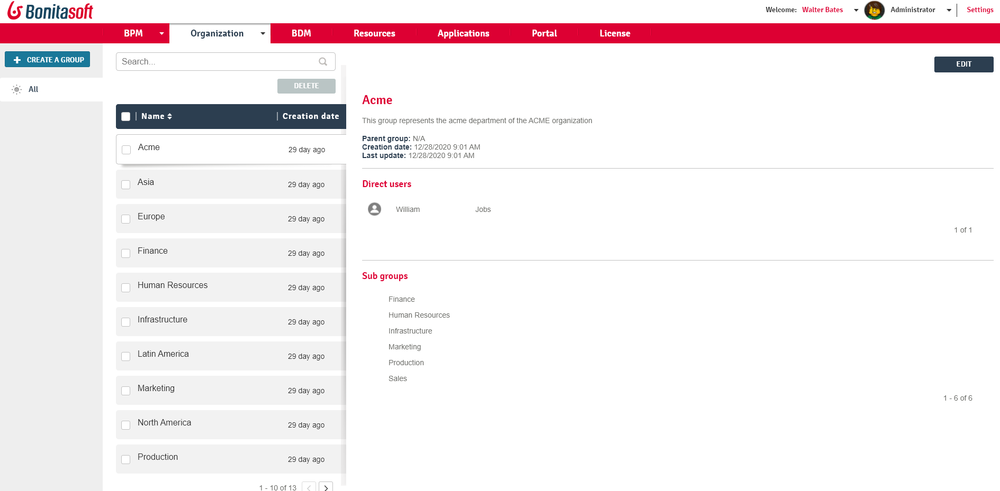

# Administrator Group list in Bonita Portal

This page explains what a user with the _Administrator_ profile in Bonita Portal can see and do about groups in the organization.  
To easily manipulate users with the same rights, it is possible to group them together.  
Groups can be defined in the organization, attached to users and used to map actors.

Here is a view of this page:
<!--{.img-responsive}-->

## Create a group
1. Go to _Organization_/_Groups_
2. Click on _Create a group_
3. In the pop-up window, enter the name (required), the parent group and a description.
4. Click on _Create_.

::: info
**Note**: Bonita doesn't accept the '/' character in the group name field. A group name that contains a '/' may lead to unstable behaviour.
:::

## Assign a user to a group
1. Go to _Organization_/_Users_. The list of users in the organization will be displayed.
2. Click on a user.
3. Click on _More_
4. In _Memberships_, click on _Add_.
5. Choose the group and role for the user.
6. Click on _Add_.

## Edit a group
1. Go to _Organization_/_Groups_.
2. Check a box to select a group.
3. Click on _Edit_.
4. In the popup window, update the group information.
5. Click on _Save_.

## Delete a group
1. Go to _Organization_/_Groups_.
2. Check a box to select a group.
3. Click on _Delete_.
4. In the popup window, click on _Delete_.

## More information about the group
1. Go to _Organization_/_Groups_.
2. Click on a group in the list of groups. A list of users and subgroups in this group is displayed.
3. In the _Direct users_ list, you can click a user name to get more information about the user.
