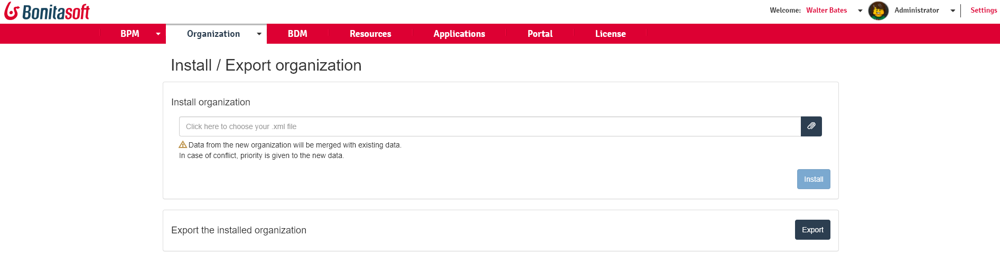

# Install/export an organization

This page explains what a user with the _Administrator_ profile in Bonita Portal or in the Bonita Administrator Application can see and do about the Organization of Bonita users (an .xml file). 

Here is a view of this page:
<!--{.img-responsive}-->

## How to install an organization

::: Warning
This will import a file containing your whole organization data. This organization data will be merged with existing data.  
In case of conflict, the priority is given to the data in the imported file. Take care not to overwrite information that has been updated in Bonita Portal since the last installation of the organization.
:::

::: info
**Note:**
In 6.3 there was a change to the structure of the .xml file. This means that you cannot install into Bonita Portal 6.3.0 or later an organization .xml file that was created in 6.2.x or earlier.  
You will need to first install the organization file into Bonita Studio and re-export it, so it is compatible.
:::

To install an organization:
1. Go to _Organization_ > _Install/Export_.
2. Click on _Click here to choose your file_. The xml file will be displayed in the import file field.
3. Click on _Install_.
4. Click on _Save_.

## How to export an organization
1. Go to _Organization_>_Install/Export_.
2. Click on _Export_.

This will export an organization from Bonita Portal. Users, groups and roles will be exported in a file in .xml format.

See the [video](images/videos-6_0/import_an_organization_into_bonita_portal.mp4).
