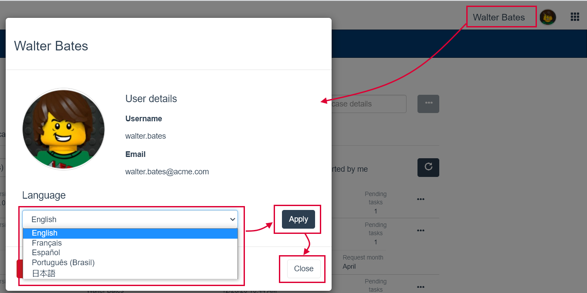

# Bonita is available in different languages

Bonita is officially released in various languages but is open to more translations from the Community.

## Languages available by default

The following languages are officially supported:

* English (US)
* French
* Spanish (Latin America)
* Japanese
* Brazilian Portuguese

Officially supported language means that:
* Translation is performed by Bonitasoft or trusted partners
* The following Bonita components are translated: Studio, UI Designer and Portal

## Language detection mechanism

Since Bonita 7.11.0, when a user accesses a page of Bonita portal or an application, the language to use to display the page is detected using the following priority order:  
1. `locale` parameter value in the URL if it is present (E.g.: `?locale=pt_BR`)
1. BOS_Locale cookie value
1. Web browser prefered language (first locale sent in the request header Accept-Language)
1. English if none of the previous ones are set and/or supported

::: info
When a language different from the one already set in the BOS_Locale cookie is passed in the URL (`locale` parameter), then the cookie value is reset with this new language.
This can be used to force the default language if needed (by simply providing a link to Bonita portal/applications with the locale parameter).
:::

## Select a language in Bonita Portal

For the web desktop version:
1. Go to the top right corner and click on _**Settings**_/_**Language**_
1. Select a language from the drop-down list.

For the web mobile version:
1. Click on the _**Tools icon**_
1. Click on _**Languages**_
1. Select a new language from the drop-down list

## Select a language in a Bonita application

To select another language, if the appliation uses the default [Bonita layout](bonita-layout.md):
  1. Click on the user name or icon in the top right corner of the application header
  1. In the modal window, go to the language section and select a language from the drop-down list
  1. Click on the "Apply" button
  1. Close the modal window
<!--{.img-responsive}-->

## Select a language in a custom application
If the appliation uses the default [Bonita layout](bonita-layout.md), the header is the same than a Bonita application, so the procedure is the same.  
If the layout has been customized, users need to refer to the internally documented procedure.

## Add a language to Bonita Portal

::: info
Instructions below assume that the language you want to add is already available in the Community translation project. If translation is not available see [Translate Bonita Portal](#Translate_BonitaB_PM_Portal) for instruction about how to collaborate to a new or ongoing translation.
:::

Instructions below explain how to add a language to Bonita Portal. Steps below involve using content created by Bonitasoft community and therefore not officially supported.

#### Download the language files

  1. Go to [Bonita translation project](http://translate.bonitasoft.org/).
  1. Select the language you are interested in.
  1. Make sure you click on the "Toggle Hidden Files" button  to see already fully translated files.
  1. Browse the file tree to `${varVersion}.x/bonita-web/portal` folder.
  1. For each file in the folder: open it and in the **_File_** menu click on **_Download_**. Each `.po/.pot` file has a language indicator and a locale indicator. For example, the files for the Brazilian Portuguese language end with `pt_BR.po`.
  1. For Subscription editions, you also need to get the files from `${varVersion}.x/bonita-web-sp/portal` folder.

#### Install the files and configure java

7. Create a new folder depending on the situation:
    * `[BUNDLE_HOME]/server/i18n/`
    * `[STUDIO_HOME]/workspace/tomcat/server/i18n/`
1. Copy all the `.po/.pot` files into the new folder just created.
1. Declare a new JVM property **`org.bonitasoft.i18n.folder`** and set the value to the full path to `i18n` folder:
    * Tomcat on Windows, edit the `[BUNDLE_HOME]\setup\tomcat-templates\setenv.bat` file: **`"-Dorg.bonitasoft.i18n.folder=C:\path_to_i18n_folder"`**
    * Tomcat on Linux, edit the `[BUNDLE_HOME]/setup/tomcat-templates/setenv.sh` file: **`-Dorg.bonitasoft.i18n.folder="/path_to_i18n_folder"`**
    * Tomcat embedded in Bonita Studio edit the appropriate .ini file and use the following syntax: **`-Dtomcat.extra.params="-Dorg.bonitasoft.i18n.folder=C:\path\to_i18n_folder"`**
        * Windows 64bit: `[STUDIO_HOME]/BonitaStudioSubscription64.ini`
        * Linux 64bit: `[STUDIO_HOME]/BonitaStudioSubscription64-linux.ini`
        * etc.
1. Restart your application server (or Click on Server in the Bonita Studio menu bar, click on Restart Web Server).
1. Check that the new language is listed in Settings menu of the Bonita Portal.

::: warning
**Warning:** The `mobile_xxxx.po/.pot` files used for the language of the [Bonita Mobile Portal](https://documentation.bonitasoft.com/bonita/7.4/mobile-portal) may contain some keys missing translation. For the Mobile Portal to be displayed correctly in the new language, these keys must not be empty.

On the other hand, some of the keys in the `mobile_xxxx.po/.pot` files are duplicates from the ones in other non-mobile `.po/.pot` files. These keys must all have the same value (whether translated or chosen to be left in English) across all the `.po/.pot` files.

For example, if you are adding the German language to the Mobile portal, the "Do it" key should be equally translated (or set to "Do it", but never left empty) in the following files:
* `mobile_de_DE.po`
* `portal_de_DE.po`
* `portal-sp_de_DE.po`
:::

<a id="Translate_BonitaB_PM_Portal" />

## Translate Bonita Portal

1. Go to [Bonita translation project](http://translate.bonitasoft.org/) hosted on Crowdin and check if the language you want to contribute to is already listed. If it's not, please request it by submitting an issue on our [community issue tracker](https://bonita.atlassian.net).

If the language you want to contribute to is already listed:

1. If you don't already have one, create a Crowdin account.
1. On the [Bonita translation project](http://translate.bonitasoft.org/) page click on the language you want to translate.
1. At the top of the page, click on the "Join" button.
1. Wait for us to validate your request to join the project.
1. Navigate to the Portal `.po/.pot` files (see information in the "Add a language to Bonita Portal" section above).
1. Click on a file to begin the translation. You can then use the filter **missing translation** to only display the strings to be translated.
