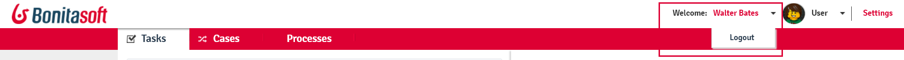
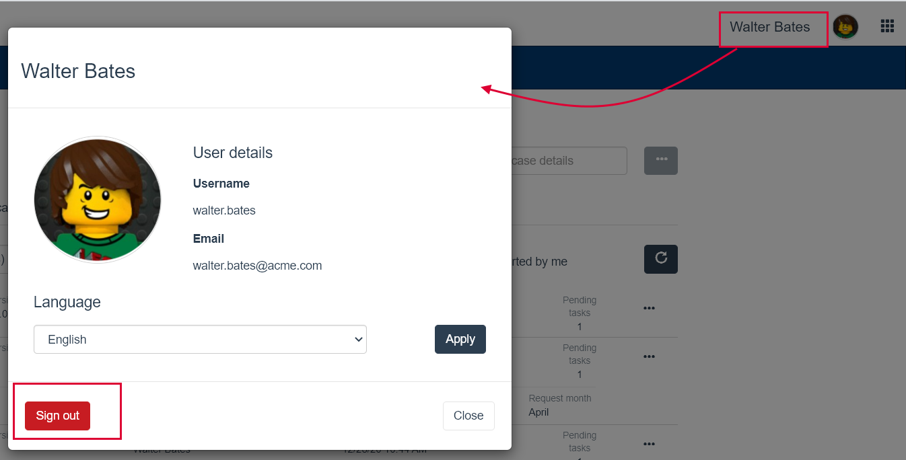

# Log in and log out

This page explains how to log in and log out of the Bonita User Interfaces.  

:::info
Note: to avoid login problems, make sure you [empty your browser cache](http://www.wikihow.com/Clear-Your-Browser's-Cache).
:::

## Log in

A user may receive an email with a link to start a case or a do task in Bonita Portal, Bonita User Application, or a custom application. 
Or a user wants to check the status of the tasklist in Bonita Portal, Bonita User Application, or business data and operations in a custom application.  
Or an administrator needs to perform monitoring or maintenance on the Bonita Platform.  
For any of this, they need to log in. To do so:

  1. Enter the login page url.
    * For Bonita Portal: `http://`_`hostname:port`_`/bonita/`. The default port number is 8080\.  
    * For Bonita User Application: `http://`_`hostname:port`_`/bonita/apps/userApp`.  
    * For Bonita Administrator Application: 
      * For the Enterprise edition: `http://`_`hostname:port`_`/bonita/apps/adminAppSP`   
      * For the Community edition: `http://`_`hostname:port`_`/bonita/apps/adminApp`  
    * For a custom application: `http://`_`hostname:port`_`/bonita/apps/yourAppName`.

  2. In the fields, enter the _username_, and the _password_
  3. Click on the **Login** button.

The default Portal profile is User. From there, the user can [navigate](navigation.md) to their other profiles.   
Each application is mapped to one profile. A user can [navigate](navigation.md) between the applications they have the permissions to access. 

## Log out

For Bonita Portal:
  1. Click on the _username_ in the portal header
  2. Click on **Logout**

<!--{.img-responsive}-->

For an application:
  1. Click on the _first name last name_ or _avatar_ in the application header
  2. Click on **Sign out**
  
<!--{.img-responsive}-->

::: info
Note: in a system that uses CAS to provide single sign-on, the administrator can remove the logout option. In this case, to log out of the portal or an application, you must log out of the CAS system or close your browser.
:::

See also [First steps after setup](first-steps-after-setup.md)

See also [Active directory/ldap authentication](active-directory-or-ldap-authentication.md)

See also [Accessing Bonita Portal and forms by URL](bonita-bpm-portal-urls.md)
