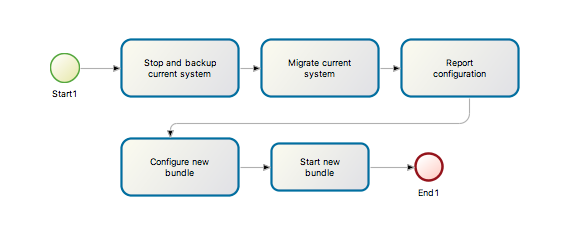

# Migrate from an earlier version of Bonita BPM

## Overview

This page explains how to migrate your platform to a newer version of Bonita BPM.

You can migrate your platform using the `Bonita BPM Migration Tool`. There is 2 version of the migration tool:
* The version 1.x that migrate the platform from version 6.0.2 or later to any version up to 7.0.0
* the version 2.x that migrate the platform from version 7.0.0 or later to any version up to the last one.

For example, if you are migrating from 6.5.3 to 7.1.0, you must migrate from 6.5.3 to 7.0.0 using version 1.x of the *Bonita BPM Migration Tool*, and then migrate from 7.0.0 to 7.1.0 using version 2.x.

::: warning
:fa-exclamation-triangle: **Caution:**
You should always migrate to the latest version of a major version. Usually, maintenance version might contain bug fixes made after the release of subsequent major or minor release.

For example, the 6.5.4 release contains fixes to certain bugs that were found in early 7.x.y versions, up to 7.1.0.
When you are ready to migrate from 6.5.4 to a 7.x.y version, make sure you migrate to at least 7.1.1 to be sure that these fixes are present in your new version after migration. 
To migrate from 6.5.4 to 7.1.1 or later there are two phases: first you upgrade to 7.0.0 then to the latest version. 
You are recommended not to start 7.0.0 after you migrate to it, but to proceed immediately with the second phase of the migration.
:::

**JRE requirements:**
Version 7 only supports JRE version 7. If you comes from older versions of Bonita supporting JRE 6, you must also upgrade your JRE to version 7. For more info, see Support Guide and Supported Environment Matrix for Server.

The tool migrates your platform bonita_home and the database. You cannot [change edition](upgrade-from-community-to-a-subscription-edition.md) while migrating. If you are running a
Bonita BPM Subscription Pack edition, you need a valid license for your target version.
If you are upgrading to a new maintenance version and not changing the minor version number (for example, you are migrating from 6.3.0
to 6.3.1), your current license remains valid after migration.

::: info
Starting from version 7.3 there is no more bonita home folder. This means that, your installation does not have custom changes, you do not need to configure the bundle to use the bonita home for an installation migrated in 7.3.

If you have customized your configuration, you will have to use the [platform setup tool](BonitaBPM_platform_setup.md#update_platform_conf) to send your customized configuration files to the database where configuration files are stored from 7.3.
:::

## How it works

The *Bonita BPM Migration Tool* contains a set of script that execute changes on the data to make it compatible with earlier version of Bonita BPM Platform.
This tool is provided as a zip archive and contains an executable script that will determine your current configuration and ask you in which version you want to migrate.

The migration is step-wise by maintenance version and the script manages the sequence of steps from your current version to the target version.
After each minor or maintenance version upgrade, you have the option to pause or continue to the next step.

The migration script migrates the following:

* Engine server
* Engine database, including all data on active and archived process instances
* Organization definition
* Business data model, and the business data database
* Runtime data in Bonita Home, *until 7.3*
* Configuration files in Bonita Home, which are replaced with the default configuration files for the new version
* Log files from the previous version are not impacted by migration

The following are not migrated automatically:

* Configuration of the platform: Before 7.3 in the Bonita Home and after 7.3 in database. Reapply your customizations manually after the migration script has finished (using [platform setup tool](BonitaBPM_platform_setup.md#update_platform_conf) if migrated to 7.3.0+).
* Deployed process definitions: The process continue to run using the definition create in the previous version.
* Process definition sources (`.bos` files): Migrate these by importing them into the new version of Bonita BPM Studio.
* Custom connectors, actor filers, data types: These might continue to work in the new version, but should be tested.
* Custom pages: These might continue to work in the new version, but should be tested.
* Reports: These might continue to work in the new version, but should be tested.

When the script has finished,
you need to complete the migration by unzipping and configuring a bundle for the new version.
See [Migrate your platform](#migrate) for step-by-step instructions.

## Constraints

If you have added indexes to certain tables in the Engine database, you must remove them before migrating from 6.2.6 to a later version.
If you do not remove these indexes, the migration will not complete.
This applies to the following tables: `arch_process_instance`, `arch_connector_instance`, `arch_flownode_instance`, `arch_data_instance` and `arch_data_mapping`.

There is no guarantee that the Look & Feel definition is compatible across maintenance versions.
For example, in 6.2.2, `jquery+` was renamed `jqueryplus` in `BonitaConsole.html`, for compatibility with more application servers.
If you are using a custom Look & Feel, [export](managing-look-feel.md) it before migration.
Then after the migration is complete, [export the default Look & Feel](managing-look-feel.md) from the new version,
modify your custom Look & Feel to be compatible with the new definition, and with the [recommendations for form footers](creating-a-new-look-feel.md).
Then [import](managing-look-feel.md) your updated custom Look & Feel into Bonita BPM Portal.

The migration script supports MySQL, Postgres, Oracle, and MS SQLServer. There is no migration for h2 databases.

::: warning
**Important:**  
The migration operation resets the BonitaBPM configuration files to default version for new settings to be applied (from the _$BONITA_HOME_ folder in <7.3.0 version or inside database in >=7.3.0). 
Therefore, you must do a [backup of your configuration files](BonitaBPM_platform_setup.md#update_platform_conf) before starting the migration.  
You will need to merge custom properties and configurations to the migrated environment.

Furthermore, from the database point of view, as any operations on a production system, a migration is not a zero risk operation.   
Therefore, it is strongly recommended to do a [backup of your database](back-up-bonita-bpm-platform.md) before starting the migration.
:::
## Estimate time required

The platform must be shut down during migration.
The time required depends on several factors including the database volume, the number of versions between the source version and the
target version, and the system configuration,
so it is not possible to be precise about the time that will be required. However, the following example can be used as a guide:
|                   |                                                                                                 |
|:-                 |:-                                                                                               |
| Database entries: | data: 22541   flownode: 22482   process: 7493   connector: 7486   document: 7476|
| Source version:   | 6.0.2                                                                                           |
| Target version:   | 6.3.0                                                                                           |
| Time required:    | 2.5 minutes                                                                                     |

<a id="migrate"/>

## Migrate your platform

This section explains how to migrate a platform that uses one of the Bonita BPM bundles.

1. Download the target version bundle and the migration tool for your Edition from the
[BonitaSoft site](http://www.bonitasoft.com/downloads-v2) for Bonita BPM Community edition
or from the [Customer Portal](https://customer.bonitasoft.com/download/request) for Bonita BPM Subscription Pack editions.
2. Unzip the migration tool zip file into a directory. In the steps below, this directory is called `bonita-migration`.
3. If you use Oracle or Microsoft SQL Server, add the JDBC driver for your database type to `bonita-migration/lib`. This is the same driver as you have installed in
your web server `lib` directory.
4. Configure the database properties needed by the migration script, by editing `bonita-migration/Config.properties`.
Specify the following information:

   | Property       | Description                                                      | Example                                                    |
   |:-              |:-                                                                |:-                                                          |
   | bonita.home    | The location of the existing bonita_home. Required only until 7.3| `/opt/BPMN/bonita` (Linux) or `C:\\BPMN\\bonita` (Windows) |
   | db.vendor      | The database vendor                                              | postgres                                                   |
   | db.driverClass | The driver used to access the database                           | org.postgresql.Driver                                      |
   | db.url         | The location of the Bonita BPM Engine database                   | `jdbc:postgresql://localhost:5432/bonita_migration`        |
   | db.user        | The username used to authenticate to the database                | bonita                                                     |
   | db.password    | The password used to authenticate to the database                | bpm                                                        |

::: info
Note: If you are using MySQL, add `?allowMultiQueries=true` to the URL. For example,
`db.url=jdbc:mysql://localhost:3306/bonita_migration?allowMultiQueries=true`.
:::

5. If you use a custom Look & Feel, [export](managing-look-feel.md) it, and then [restore the default Look & Feel](managing-look-feel.md).
6. Stop the application server and database server.
7. **IMPORTANT:**
[Back up your platform](back-up-bonita-bpm-platform.md) and database in case of problems during migration.
8. Go to the directory containing the migration tool.
9. Run the migration script:
   * For version 1.x of the migration tool, run `migration.sh` (or `migration.bat` for Windows).
   * For version 2.x of the migration tool, go to the `bin` directory and run the migration script for your edition and operating system:

     |                       |                                                                                     |
     |:-                     |:-                                                                                   |
     | Community edition     | `bonita-migration-distrib` (Linux) or `bonita-migration-distrib.bat` (Windows)      |
     | Subscription editions | `bonita-migration-distrib-sp` (Linux) or `bonita-migration-distrib-sp.bat` (Windows)|

10. The script detects the current version of Bonita BPM, and displays a list of the versions that you can migrate to. Specify the
version you require.
The script starts the migration.
11. As the script runs, it displays messages indicating progress. After each migration step, you are asked to confirm whether to
proceed to the next step. You can pause the migration by answering `no`.
To suppress the confirmation questions, so that the migration can run unattended, set the ` (-Dauto.accept=true)` system
property.
When the migration script is finished, a message is displayed showing the new platform version, and the time taken for the migration.
The `bonita_home` and the database have been migrated.
12. Reapply configuration made to the platform
    * When migrating to version before 7.3.0:
    Configure the migrated `bonita-migration/bonita_home` for your system, by reapplying the configuration settings you had in `bonita_home`
    before migration (for example by updating `bonita-platform.properties` or services configuration files).
    * When migrating to version 7.3.0:
    Configuration that was stored in the Bonita Home are now in database. You must reapply configuration settings the same way you did with the bonita home
    but in the files that are in database. Please refer to the guide on updating the configuration file using the [platform setup tool](BonitaBPM_platform_setup.md#update_platform_conf)
13. Unzip the target bundle version into a directory. In the steps below, this directory is called `bonita-target-version`.
[Install the bundle](bonita-bpm-installation-overview.md) and configure it but do not start it. 
14. *Only before 7.3.0* In your new `bonita-target-version` folder, delete the `bonita` folder. You will use the `bonita_home` that you have migrated instead.
15. *Only before 7.3.0* Set the bonita_home system property to point to the migrated `bonita_home`.
16. [Configure the bundle to use the migrated database](database-configuration.md). Do not recreate the database.
17. <a id="compound-permission-migration" /> In the case where deployed resources have required dedicated [authorizations to use the REST API](resource-management.md#permissions), these authorizations are not automatically migrated.  
    Some manual operation have to be done on files that are  located in the _$BONITA\_HOME_ folder if version <7.3.0 or in the extracted `platform_conf/current` folder in version >=7.3.0 (see [for more information](BonitaBPM_platform_setup.md#update_platform_conf) ). You need to merge file versions, the previous one and the migrated one.
    
    *`client/tenants/[TENANT_ID]/conf/compound-permissions-mapping.properties` : contains list of permissions used for each resources 
    *`client/tenants/[TENANT_ID]/conf/resources-permissions-mapping.properties` : contains permissions for REST API extensions
    *`client/tenants/[TENANT_ID]/conf/custom-permissions-mapping.properties` : contains custom permissions for users and profiles  
    *`client/tenants/[TENANT_ID]/conf/dynamic-permissions-checks.properties` : used if dynamic check on permissions is enabled
               
18. Configure License:
    Make sure there is a valid license file
    * If you have migrated from an earlier maintenance version of the same minor version, for example, from 6.3.0 to 6.3.1, your existing license is still valid and you do not need to do anything.
    * If you have have migrated from an earlier minor version, for example from 6.0.4 to 6.2.1, you need to [request a new license](licenses.md).
        * *Before 7.3.0*:
        Put your new license in `/bonita_home/server/licenses`.
        * *After 7.3.0*:
        Put your new license in database as described in [this guide](BonitaBPM_platform_setup.md#update_platform_conf).
19. Start the application server. Before you start Bonita BPM Portal, clear your browser cache. If you do not clear the cache, you might see old, cached versions of Portal pages instead of the new version. 
Log in to the Portal and verify that the migration has completed. 
If you did not set the default Look & Feel before migration and you cannot log in, you need to [restore the default Look & Feel](managing-look-feel.md) using a REST client or the Engine API.

The migration is now complete. If you were using a custom Look & Feel before migration, test it on the new version before applying it to your migrated platform.

## Migrate your cluster

A Bonita BPM cluster must have the same version of Bonita BPM on all nodes. To migrate a cluster:

1. Download the migration tool:
    * In version 1.x you need to download the tool for Performance cluster, the ordinary Performance migration tool does not support migration of a cluster.
    * In version 2.x there is only one kind of migration tool. It will work for both cluster and non cluster installation.
2. Shutdown all cluster nodes.
3. On one node, follow the procedure above to migrate the platform.
4. When the migration is complete on one node, follow steps 12 to 16 on all the other nodes.

The migration of the cluster is now complete, and the cluster can be restarted.
