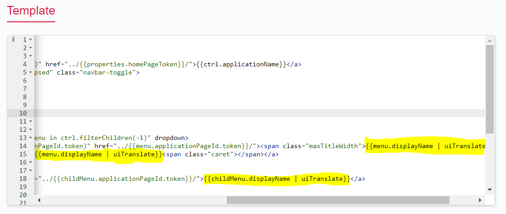
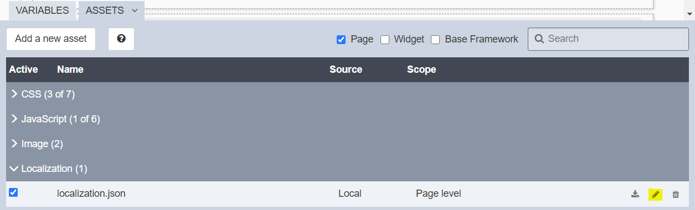
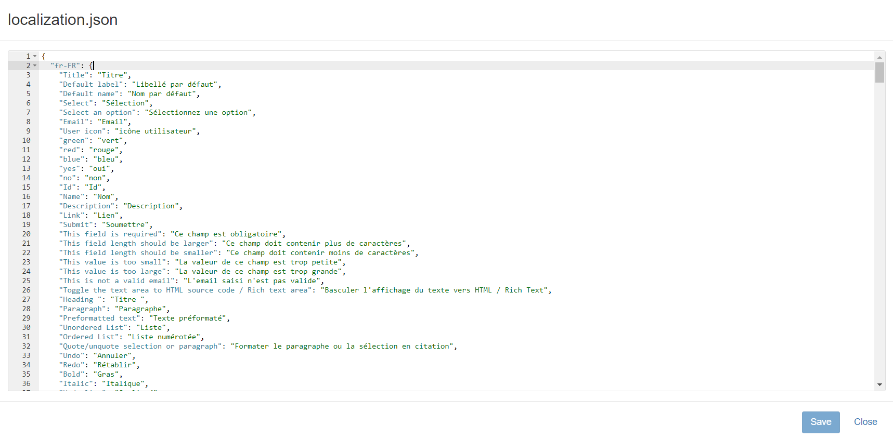
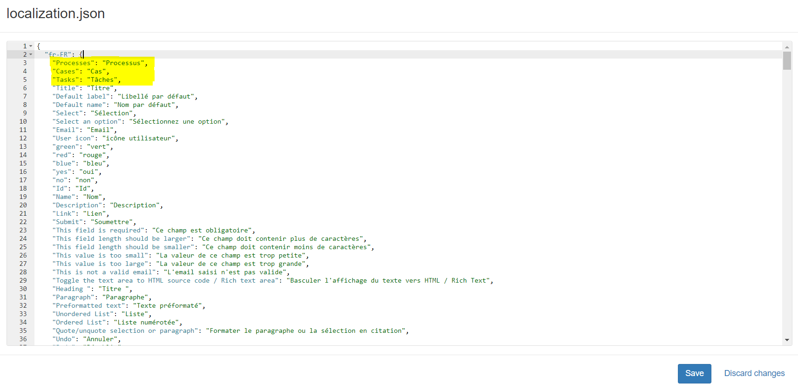

# Multi-language applications

Throughout this page, you will see how you can translate the application menus.

The menus in Bonita User and Administrator applications are available in English only by default. But, depending on your requirements, the menus can be translated into other languages too by updating Bonita layout. Using the same procedure, custom applications menus can be translated as well.
This documentation is only about the menus. For more information regarding translations at the page level, go to the [multi language pages](multi-language-pages.md) page.  

## Updating the menu widget
In order to get the menu translated, you need to ensure that the `uiTranslate` directive is present for the menu entries display names in `customLayoutMenuBonitaV_` widget. 
 
In order to do so, you can follow this procedure: 
 
1. Update your widget inside Bonita UI Designer.
2. In the *Template* section, add "| uiTranslate" after *menu.displayName* and *childMenu.displayName* wherever it is. For example, *menu.displayName | uiTranslate*.
3. Save the widget.

## Updating the layout

Note that the translation mechanism has been added to the menu, you need to modify the layout to translate the menu entries. In order to do so, you can follow this procedure: 

1. Update your layout inside Bonita UI Designer. For more information regarding customizing the layout, go to the [customize layouts](customize-layouts.md) page.

2. Make sure your layout uses the version of the menu widget you just updated (click on the menu widget in the whiteboard to check its name and version and use the replace feature at the top right corner of the properties panel if it is not the right version).

3. Inside the Localization section of the assets panel, click on the pencil icon at the right of the localizaton.json file to edit it.

4. The localization.json file shows four different sets of strings based on the languages available. 

5. Now you need to add all the new keys in English which are the menu entry display names for the application you want to translate. For example, you will add the menu entry keys of Bonita User Application such as Processes, Cases, and Tasks inside fr-FR, es-ES, jp-JP, and pt-BR objects.

6. Click on **Save** to save the changes you made in the localization.json file.
7. Click on **Close**.
8. Save and export the layout.
9. Now, deploy the layout on your target runtime and use it in your applications.
