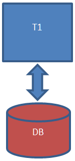

= Multi-tenancy and tenant configuration

::: info
*Note:* For Performance edition only.
:::

This page explains the architecture and configuration of a multi-tenant system using Bonita BPM.

== Platform architecture

By default, all installations of Bonita BPM create a single tenant. However multi-tenancy is possible with the Performance edition.

Multi-tenancy involves a single software installation, called a *platform*, that can serve multiple independent organizations, called *tenants*.
Each tenant is a separate, self contained configuration for a single client/company.
Artifacts are deployed at tenant level, so a tenant has its own organization (users, groups, roles), processes (apps, cases, trasks), reports, and custom pages.
Data within a tenant are completely isolated. A tenant cannot access data from any other tenant. A user logged in to a tenant cannot access any other tenant.

After the installation of any Bonita BPM version (Community or Subscription), a single default tenant is created and ready for use.

If you are using the Performance edition, you can create additional tenants, using the Platform API (through Java or REST API).
These tenants are configured with a single database. This illustration shows a platform with three tenants.

image::images/images-6_0/v6tenant.png[multi-tenancy]

== Platform configuration

The platform is the part of the system that is common to all tenants.

Before the platform has been initialized, its configuration can be customized in `setup/platform_conf/initial`. However, in order to modify the configuration on an
installation whose platform has already been initialized, you need to use the xref:BonitaBPM_platform_setup.adoc[platform setup tool] to retrieve the current
configuration and update the files in `setup/platform_conf/current/`. Then use the tool again to save your changes into the database.

The _engine_ platform configuration directory is located in sub-folder: `current/platform_engine/`. +
The _portal_ platform configuration directory is located in sub-folder: `current/platform_portal/`.

There is a separate _engine_ configuration directory for each tenant, located in: `current/tenants/<tenant_id>/tenant_engine`. +
There is a separate _portal_ configuration directory for each tenant, located in: `current/tenants/<tenant_id>/tenant_portal`. +
There is also a default tenant _engine_ configuration directory, located in: `current/tenant_template_engine`. +
There is also a default tenant _portal_ configuration directory, located in: `current/tenant_template_portal`.

== Tenant creation

A tenant can be created using the Java PlatformAPI (see the http://documentation.bonitasoft.com/javadoc/api/${varVersion}/com/bonitasoft/engine/api/PlatformAPI.html[Engine Javadoc]) or the xref:platform-api.adoc[platform REST API].

NOTE: If xref:define-and-deploy-the-bdm.adoc[business objects] will be deployed in the newly created tenant do not forget to xref:database-configuration.adoc[create the business data database and configure specific data sources].
This must be done for each tenant that will use the xref:define-and-deploy-the-bdm.adoc[Business Data] feature.

::: warning
*Important* +
Once a tenant has been created and activated, default theme is not yet loaded. +
Therefore, as long as you have not logged in to the new tenant, the login page will miss the default theme.

After the first login, default theme will be loaded and the login page will look as usual.
:::

=== REST API

The xref:platform-api.adoc[platform REST API] is a REST layer around the Java PlatformAPI to create the tenant.

==== Walk-through

===== Install `curl` command line tool

`curl` is available on Linux OS and it transfers data from or to a server with various protocols such as HTTP and HTTPS.

 $ sudo apt install curl

NOTE: this is to be done only once.

===== Start a tomcat

* Download a BonitaBPMSubscription-7.*-Tomcat-7.0.76.zip
* Unzip it
* Provide a valid license file
* Start the tomcat

===== Login

 $ curl -v -c saved_cookies.txt -X POST --url 'http://localhost:8080/bonita/platformloginservice' \
 --header 'Content-Type: application/x-www-form-urlencoded; charset=utf-8' \
 -d 'password=platform&redirect=false&username=platformAdmin' -O /dev/null

The response to this REST API call (HTTP) generates 2 cookies, which must be transfered with each subsequent calls.
One of the cookie is `X-Bonita-API-Token`.

Note that the security against CSRF attacks is enabled by default for all fresh installations; the subsequence REST API calls using DELETE, POST, or PUT HTTP methods must define the `X-Bonita-API-Token` header, with the value transmitted via the associated cookie.

The cookies have been saved on the disk, in the `saved_cookies.txt` file:

[source,console]
----
$ cat saved_cookies.txt

#HttpOnly_localhost	FALSE	/bonita/	FALSE	0	JSESSIONID	46EF8A05819B6C268EE700F3C3FC939A
localhost	FALSE	/	FALSE	0	X-Bonita-API-Token	a94cbf84-6b71-409a-981f-f91b17466929
----

===== Create the new tenant

[source,console]
----
$ curl -b saved_cookies.txt -X POST 'http://localhost:8080/bonita/API/platform/tenant' \
-H "Content-Type: application/json" \
-H 'X-Bonita-API-Token: a94cbf84-6b71-409a-981f-f91b17466929' \
-d '{"name":"MyTenant", "description":"My tenant", "username":"install", "password":"install"}'

{
  "id": "101",
  "creation": "2017-06-09 15:11:01.191",
  "icon": "/default.png",
  "username": "",
  "description": "My tenant",
  "name": "MyTenant",
  "state": "DEACTIVATED",
  "password": ""
} The new tenant has the id `101` and its state is `DEACTIVATED`
----

===== Activate the tenant with id `101`

[source,console]
----
$ curl -v -b saved_cookies.txt -X PUT 'http://localhost:8080/bonita/API/platform/tenant/101' \
-H "Content-Type: application/json" \
-H 'X-Bonita-API-Token: a94cbf84-6b71-409a-981f-f91b17466929' \
-d '{"state":"ACTIVATED"}'

* Connected to localhost (127.0.0.1) port 8080 (#0)

< HTTP/1.1 200 OK

$ curl -b saved_cookies.txt -X GET 'http://localhost:8080/bonita/API/platform/tenant/101'

{
  "password": "",
  "name": "MyTenant",
  "icon": "/default.png",
  "description": "My tenant",
  "id": "101",
  "state": "ACTIVATED",
  "creation": "2017-06-09 15:11:01.191",
  "username": ""
}
----

===== Logout

 $ curl -v -b saved_cookies.txt -X GET --url 'http://localhost:8080/bonita/platformlogoutservice?redirect=false'

=== Java PlatformAPI

This solution can be used when the portal is not needed.

The Java PlatformAPI creates the tenant by updating the database and creating configuration based on the tenant template files (in database too).
The following example code uses the Engine Java APIs to create a tenant called "myNewTenantName":

[source,java]
----
    // Get platform login API using the PlatformAPIAccessor:
    PlatformLoginAPI platformLoginAPI = PlatformAPIAccessor.getPlatformLoginAPI();
    // Log in to the platform:
    PlatformSession platformSession = platformLoginAPI.login("platformAdmin", "platform");

    // Get the platform API:
    PlatformAPI platformAPI = PlatformAPIAccessor.getPlatformAPI(platformSession);

    // Create a new tenant:
    TenantCreator tenantCreator = new TenantCreator("myNewTenantName");
    tenantCreator.setUsername("install");
    tenantCreator.setPassword("install");
    long tenantId = platformAPI.createTenant(tenantCreator);
    platformAPI.activateTenant(tenantId);

    // Log out of the platform:
    platformLoginAPI.logout(platformSession);
----

== Tenant access

A tenant is identified by an id, which is used to log in and to retrieve the tenant. A tenant also has a name. You can use the tenant name to retrieve the tenant id.

To use the newly created tenant:

[source,java]
----
    // use tenant-level api client:
    APIClient apiClient = new APIClient();

    // login on the new tenant with the only existing 'technical' user, ...
    apiClient.login(TENANT_ID, "install", "install");               // here, replace TENANT_ID by the ID of the tenant you just created above

    // ... in order to create other users:
    user = apiClient.getIdentityAPI().createUser("john", "bpm", "John", "Doe");
    apiClient.logout();

    // now login with the new user:
    apiClient.login(TENANT_ID, "john", "bpm");

    // retrieve an API to interact with the engine:
    ProcessAPI processApi = apiClient.getProcessAPI();
    // and use the processApi on the new tenant...
    [...]

    // Don't forget to logout finally:
    apiClient.logout();
----

=== Bonita BPM Portal

In order to access Bonita BPM Portal desktop and mobile application, add the parameter `tenant=TENANT_ID` (where TENANT_ID is the tenant identifier) in the URL before you login.

Example for Bonita BPM Portal desktop version and tenant 2: +
`+http://localhost:8080/bonita/login.jsp?tenant=2+`

Example for Bonita BPM Portal mobile version and tenant 2: +
`+http://localhost:8080/bonita/mobile/?tenant=2+`

=== Bonita APIs

Use the http://documentation.bonitasoft.com/javadoc/api/${varVersion}/index.html[PlatformAPI] to perform operations on tenants.

Example: retrieving a tenant from its name and log into it

[source,java]
----
    // Get platform login API using the PlatformAPIAccessor
    PlatformLoginAPI platformLoginAPI = PlatformAPIAccessor.getPlatformLoginAPI();
    // Log in to the platform
    PlatformSession platformSession = platformLoginAPI.login("platformAdmin", "platform");

    // Get the plaform API
    PlatformAPI platformAPI = PlatformAPIAccessor.getPlatformAPI(platformSession);
    // Retrieve your tenant by name
    Tenant tenant = platformAPI.getTenantByName("myTenant");

    // Log out of the platform
    platformLoginAPI.logout(platformSession);

    // Log in to the tenant using the APIClient
    APIClient apiClient = new APIClient();
    apiClient.login(tenant.getId(), "install", "install");

    // Perform some operations on the tenant...

    // Log out of the tenant
    apiClient.logout();
----

== Pause and resume a tenant

To perform certain maintenance operations (notably when updating the business data model), you must pause the BPM service of a tenant. The
TenantAdministrationAPI contains the following methods related to pausing a tenant:

* `TenantAdministrationAPI.isPaused()` returns true if the Tenant BPM service is paused.
* `TenantAdministrationAPI.pause()` pauses the tenant BPM service.
* `TenantAdministrationAPI.resume(`) resume the tenant BPM service.

For example, to resume the service in a tenant:

[source,java]
----
    TenantAdministrationAPI tenantAdministrationAPI = TenantAPIAccessor.getTenantAdministrationAPI(apiSession);
    if (tenantAdministrationAPI.isPaused()) {
    tenantAdministrationAPI.resume();
    }
----

While service is paused in a tenant, only the following methods are valid:

* IdentityAPI method calls
* ProfileAPI method calls
* themeAPI method calls
* TenantAdministrationAPI method calls

If you attempt an operation that is not permitted while a tenant is paused, a `TenantStatusException` is thrown.

You can also pause and resume a tenant using the
xref:platform-api.adoc[REST API] or xref:pause-and-resume-bpm-services.adoc[Bonita BPM Portal].
